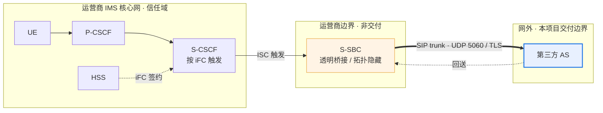

# 3rdparty-as

第三方 IMS AS（Application Server）产品。单租户、on-premises 交付，部署在运营商
IMS 网络之外，由 S-CSCF 经运营商 S-SBC 按 iFC 触发。

本项目由 POC（`../3rtparty_AS_POC`）及其抽取的库（`../as_platform`）扩展而来。
**它不是 POC 的延续，也不是它的拷贝**：运行时模型、状态模型、配置治理、部署形态
和工程治理全部重新设计，原有代码经逐文件甄别后才会进入本仓库
（[`docs/migration/triage.md`](docs/migration/triage.md)）。

## 在网络中的位置



S-SBC 对两侧都做透明桥接：对 S-CSCF 而言 AS 是网内 AS，对 AS 而言对端就是
S-CSCF。因此本系统**只实现一种接入语义 —— ISC**（ADR-0003）。

## 系统分层

| 层 | 目录 | 职责 | 有状态性 |
|---|---|---|---|
| ① 信令面 | `apps/` | 一用例一进程，承载呼叫与业务判决 | **无状态**（状态在 Redis） |
| ② 内核 | `platform/` | 进程壳、B2BUA 状态机、`decide()` 决策缝、Transport/StateStore 两个 seam | 无状态 |
| ③ 控制面 | `services/` | 规则版本库与变更单、运维控制台 | 无状态（状态在 PostgreSQL） |
| ④ 数据面 | — | Redis 运行态、PostgreSQL 治理态 | **有状态**，冗余 |
| ⑤ 横切 | — | 可观测性、安全、运维 | 无状态（后端除外） |
| ⑥ 测试平台 | `testbed/` | 契约用例集、仿真网元、真实 socket 压测 | 研发资产 |

完整设计见 [`docs/architecture/新系统整体架构.md`](docs/architecture/新系统整体架构.md)。

## 仓库导览

```
AGENT.md            ★ 先读这个：规则、分层、门禁、git 规则
pyproject.toml      uv workspace 根（虚拟 manifest）：唯一的工具配置
VERSION             产品 release 版本号
platform/           内核库，含"不反向依赖"守卫测试
apps/               translation/ · anti-fraud/
services/           config-service/ · console/
testbed/            contracts/ · simulators/ · load/
deploy/             helm/（生产唯一形态）· compose/（仅 dev）
docs/               architecture/ · adr/ · migration/ · plan.md
tests/              横切结构守卫：布局、版本、依赖方向
Makefile            make gate = 与 CI 第①层相同的检查，同样顺序
```

**分层不靠目录保证，靠测试保证**：monorepo 里任何 import 都能解析成功，所以
依赖方向由 `platform/tests/test_library_independence.py` 与
`tests/test_workspace_layout.py` 断言。

## 快速开始

```bash
uv sync            # 解析并锁定整个 workspace
make gate          # ruff format --check → ruff check → mypy → pytest
make help          # 全部 target
```

要求：`uv` 与 Python 3.10（sippy 已验证的版本，见 ADR-0001 与 `docs/plan.md` D1）。

## 当前状态

**预发布阶段。** M4b/M4 的 engineering closure 已完成；但这不等于 REQ 全量验收通过，当前仍有 acceptance gaps，且 M5 仍为 open。M6 harness 处于 WIP：当前有 loopback socket tests，并有一次 user-local SIPp 3.6.0 UAS 互操作 smoke（INVITE -> 180 -> 200 -> ACK -> BYE -> 200；SIPp: 1 success、0 failure/timeout/retransmission）。该 smoke 不是 reSIProcate/产品目标证据，也不是容量测量；选定生产目标栈的容量测量尚未开始。精确状态与里程碑开放项以 [`docs/plan.md`](docs/plan.md) 为准。

**M0 骨架阶段的历史产物（非当前仓库状态清单）：**

- 目录结构与 uv workspace（7 个成员）
- 三个结构守卫：依赖方向、布局、版本一致性
- 四层 CI 门禁
- ADR 台账：19 项已确认决策 → ADR 编号（[`docs/architecture/adr/`](docs/architecture/adr/)）
- 代码甄别清单：[`docs/migration/triage.md`](docs/migration/triage.md)

代码在结构通过评审后按里程碑迁入，计划见 [`docs/plan.md`](docs/plan.md)。

## 非目标

不做媒体、不做 CDR/计费、不做合法监听、不做 Diameter Sh、不做多租户、
配置不走 GitOps、不写 Operator、M6 实测之前不发布任何容量数字。
每一条都有对应的 ADR 记录理由。

## 文档

| 入口 | 内容 |
|---|---|
| [`AGENT.md`](AGENT.md) | 规则、分层、测试策略、门禁、git 规则 |
| [`docs/README.md`](docs/README.md) | 按读者的文档导航 |
| [`docs/architecture/新系统整体架构.md`](docs/architecture/新系统整体架构.md) | 设计基线：19 项决策、未决清单、风险登记 |
| [`docs/plan.md`](docs/plan.md) | 里程碑计划与未决清单 |
| [`docs/migration/triage.md`](docs/migration/triage.md) | POC 代码甄别方法与清单 |
| [`docs/architecture/adr/`](docs/architecture/adr/) | 架构决策记录 |

## 许可

Apache-2.0（[`LICENSE`](LICENSE)）。第三方声明见 [`NOTICE`](NOTICE)，其中含
sippy 的 BSD-2-Clause 归属。
