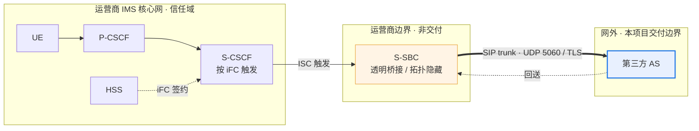
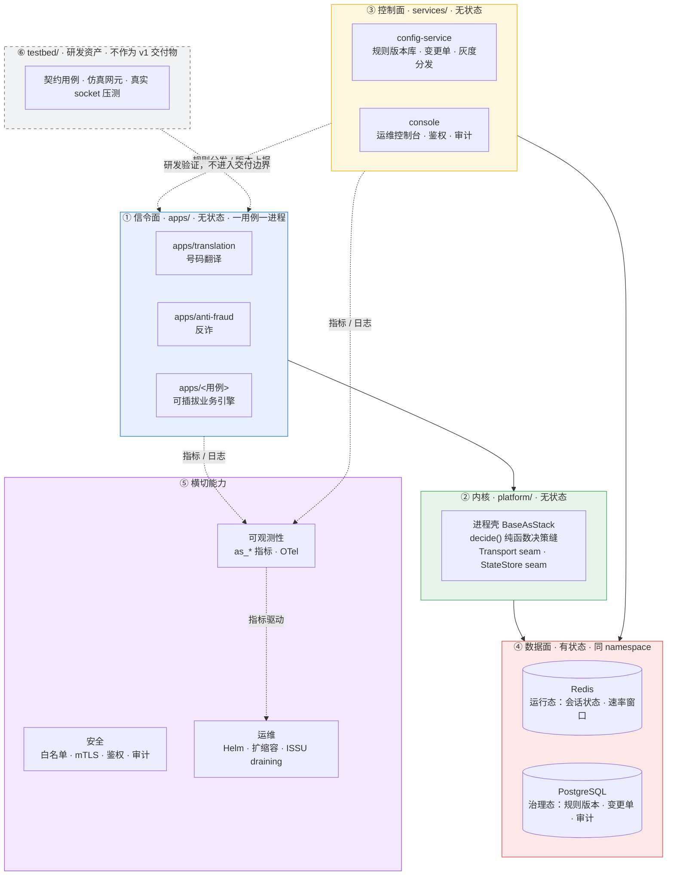

# In-house IMS Application Server（文档暂用名）

> **状态块（读这一页之前先看这里）**
>
> - **产品名是文档暂用名**。本文全篇使用 **In-house IMS Application Server（文档暂用名）**，首现处即本文标题，网络角色为 3GPP **Third-Party AS role**。该名称**不是已正式批准的产品名**；正式命名决策落点见 [`docs/plan.md`](docs/plan.md) §0「产品决策记录」。
> - **git repo 名**：按 [`docs/plan.md`](docs/plan.md) §0 决策行，git 仓库名与 remote URL 采用 `inhouse-ims-as`（**仅**仓库名 / remote URL 层面）；**chart name、镜像名、OTel 服务名保持 `3rdparty-as` 不变**（见 [`deploy/helm/Chart.yaml`](deploy/helm/Chart.yaml)）。仓库内部内容与组件命名不受此影响。
> - **目标场景**：**3HK 内部上线评审（内部评审导向）** —— 这是**当前默认方向**（来源为 `docs/discussion.md` 讨论 + 维护者 2026-10-09 确认），**尚未形成带 review record 的正式决策**，不得当作已确认的产品决策引用（评审意见 G-P0-6）。
> - **当前状态**：**M8 发布候选（RC）产物就绪，但退出签字仍搁置**（[`docs/plan.md`](docs/plan.md) §2 M8 行）。**RC 就绪 ≠ 关门**。E1（reSIProcate 生产路径行为）/ E4（TLS 证书热轮换）/ E5（状态外置与恢复）**均未验收**。
> - **本文不含任何容量/性能数字**：无 CPS / CAPS / BHCA / 并发 / 吞吐 / 时延 / 百分比容量。O1（容量目标）**未裁决**（[`AGENT.md`](AGENT.md) §2）。

一个**多业务承载平台**：每个业务用例是一个独立进程，业务引擎可插拔，**新增业务不需要改动 IMS 核心网** —— S-CSCF 按 HSS 里的 iFC 签约触发 ISC，运营商 S-SBC 做透明桥接把呼叫送到网外，核心网侧只看到标准 ISC 触发。业务逻辑跑在我们自己的进程里，因此**不被核心网厂商的业务版本绑定**。交付形态是**单租户、on-premises**：运行态与治理态数据全部留在客户机房，不出客户边界。它是**产品**，不是 POC —— POC（`../3rtparty_AS_POC`）及其抽取库（`../as_platform`）只经逐文件甄别后才进入本仓库（[`docs/migration/triage.md`](docs/migration/triage.md)）。

---

## 在网络中的位置



S-SBC 对两侧都做透明桥接：对 S-CSCF 而言 AS 是网内 AS，对 AS 而言对端就是 S-CSCF。因此本系统**只实现一种接入语义 —— ISC**（ADR-0003）。iFC 触发逻辑属于 S-CSCF / HSS，不在我方交付边界内；AS 只实现 ISC 触发后的业务判决。**计费域不在图内**：本产品与计费域无接口，标 **N/A**（不做 CDR / 计费，ADR-0017）。

## 架构大图



**决策缝（换零件不换架构）**：`decide()` 是纯函数判决缝（模块内无 socket、无时钟、无全局状态，可强制 TDD）；Transport seam 让对端准入与传输策略可替换（ADR-0016）；StateStore seam 让运行态存储可替换（ADR-0007）；`apps/` 一用例一进程 = 一个 Deployment / 一个故障域 / 一个灰度单元（ADR-0002）；缩容与升级走 **ISSU = draining**（摘流 → draining → 归零才退出，不做在途呼叫迁移，ADR-0009）。完整设计基线见 [`docs/architecture/新系统整体架构.md`](docs/architecture/新系统整体架构.md)。

## 关键 KPI（定义式，不含数值）

指标名与语义以 `platform/src/as_platform/telemetry/metrics.py` 为唯一权威；采集通路是进程的 `/metrics` 端点（`HealthServer`，需 `AS_HEALTH_PORT`）。**本页只给定义，不给阈值、不给目标值。**

| KPI | 指标名 | 当前可观测性状态（如实标注） |
|---|---|---|
| 在途呼叫数 | `as_active_calls{use_case,pod}` | 生产路径**有**生产者，但只在 SIP 运行时构建后的 dialog 事件上增减；E1 未验收 → **尚无生产环境证据** |
| 缩容可摘除标志 | `as_downscale_removable{use_case,pod}` | 生产路径**已接线**（按 guard 配置与 draining 状态周期性写入）。无阈值、无目标值 |
| 状态存储可用性 | `as_state_store_available{use_case}` | 生产路径**已接线但有条件**：仅当 `REDIS_URL` 非空时探测；未设置时该序列**不存在**（不是 0） |
| SIP 响应计数 | `as_sip_responses_total{use_case,status_class,status_code}` | 生产路径**暂无数据生产者**：只有一次性启动探针，产品 SIP adapter 的写入点仍待接线；依赖它的告警当前不会触发 |
| 规则命中计数 | `as_rule_hits_total{rule}` | 定义与写入接口已存在，但生产路径**无调用方**，且未纳入告警契约 |
| 遥测丢弃计数 | `as_telemetry_dropped_total{use_case}` | 仅当 `OTEL_EXPORTER_OTLP_ENDPOINT` 非空才启用有界队列；exporter 默认 `NoOpExporter`，**真实 OTLP 后端接线未完成** |

> **⚠️ 没有时延 / 吞吐 / CPS 类指标。** `MetricKind` 只有 `COUNTER` 与 `GAUGE`，**没有 histogram 类型**，注册表里不存在任何时延或吞吐序列；告警阈值一律是比率、相对变化或状态条件，**不含绝对容量值**。
>
> **⚠️ 标准部署下采集接线仍缺**：`/metrics` 端点存在，但 chart **没有** `prometheus.io/scrape` 注解，也**没有** ServiceMonitor / PodMonitor 模板 —— 在标准部署中 Prometheus 收不到上表序列。补齐抓取接线是 O1 裁决后的必要动作之一。
>
> **容量指标待 O1 裁决**，容量模型与测量方法学见 [`docs/product/ne-datasheet.md`](docs/product/ne-datasheet.md) §3、§5。

## 规范符合性摘要

逐条矩阵见 [`docs/product/compliance-matrix.md`](docs/product/compliance-matrix.md)（判定四态：**Fully** / **Partial** / **N/A** / **open**；每个 Fully / Partial 单元格必须给出 `file:line` 或契约场景号，**找不到证据一律不写 Fully**）。

| 规范 | 适用性 | 状态 |
|---|---|---|
| 3GPP TS 24.229（IMS SIP，ISC 触发） | 适用 | **Partial** —— 条款级符合性未逐条核对，记 open |
| RFC 3261（SIP） | 适用 | **Partial** —— forking / 3xx / REFER / PRACK-UPDATE 交错未实现 |
| RFC 4566（SDP） | 适用（仅透传） | **Partial** —— body 逐字节透传，REQ-F-4 签收未完成 |
| GSMA IR.92 / IR.94 | 适用 | **open** —— 仓库内未留存原文，无逐条实现证据 |
| 3GPP TS 29.328 / 29.329（Sh） | **不适用** | **N/A** —— 数据来自自有数据面，不与 HSS 交互 |
| 3GPP TS 32.260 / 32.299（计费 / CDR） | **不适用** | **N/A** —— 不采集、不投递、不归档、不批价（ADR-0017） |

**当前没有任何单元格标为 Fully**：所有正向能力都至少依赖 E1 / E4 / E5 之一，而这三项**尚未验收**。**生产 SIP 栈是 reSIProcate**（ADR-0019 accepted）；**sippy 仅是 `testbed/` 的行为基线参考，不进入生产依赖**（归属见 [`NOTICE`](NOTICE)）。testbed 仿真结果是研发 / 演示资产，**不得充当运营商 IOT 或现网证据**。

## 三步部署

Helm 是生产唯一交付形态（ADR-0013），chart name 为 `3rdparty-as`。参数口径以 [`deploy/helm/README.md`](deploy/helm/README.md) 为**唯一权威**，本页不复述 values 参数。

| 步骤 | 做什么 | 出口判据 |
|---|---|---|
| ① 预检环境 | `docs/delivery/preflight.sh -n as-prod -f deploy/helm/values-onprem.example.yaml` —— 校验 K8s 版本与 API、节点资源、依赖服务、Helm、RBAC、chart 渲染 fail-closed | 无 `FAIL`（`--strict` 下无 `WARN`）→ 退出码 0 |
| ② 安装 | 镜像与客户 Secret 就位后 `helm upgrade --install as deploy/helm -f deploy/helm/values-onprem.example.yaml --namespace as-prod --create-namespace`（每个业务用例渲染为独立 Deployment） | Helm release 成功；三条 fail-closed 守卫未命中 |
| ③ 接入与验证 | 与 S-SBC 对接 SIP trunk（UDP/TCP 5060、TLS 5061，mTLS + 对端白名单）；由 S-CSCF / HSS 侧 iFC 签约触发；按 `NOTES.txt` 逐项取证 `/health/live`、`/health/ready`、控制台 | Pod / Endpoint 就绪，验证项逐条留证 |

完整命令序列与交付清单见 [`docs/delivery/install-guide.md`](docs/delivery/install-guide.md)；机房无外网时见 [`docs/delivery/airgap-package.md`](docs/delivery/airgap-package.md)。**不在范围内**：生产 ingress（7.2d）与真实集群证据当前仍 **blocked**，本页不提供任何集群内验证结论。

## 我们是什么 / 不是什么

完整对照表见 [`docs/product/one-pager.md`](docs/product/one-pager.md) §2。

| 维度 | 是什么 | 不是什么 | 依据 |
|---|---|---|---|
| 网络角色 | IMS 网络**之外**的外部 AS | 不是 S-CSCF / S-SBC / HSS 的替代品 | 核心网是运营商的（`AGENT.md` §1） |
| 接入语义 | 只有 ISC 一种 | 不做「网内 / 网外」双模适配器 | ADR-0003 |
| 业务面 | 只做信令，SDP 原样透传 | **不做媒体**（无 RTP / 转码 / DTMF / MRF） | ADR-0004 |
| 呼叫记录 | 按 Call-ID 的呼叫轨迹 | **不做 CDR / 不做计费 / 不批价** | ADR-0017 |
| 合规 | 边界内安全：白名单 + mTLS + 鉴权审计 | **不做 LI**（IRI 属网内网元） | ADR-0016 |
| 接口面 | 对外只有 SIP trunk | **不做 Diameter Sh** | `AGENT.md` §2（无独立 ADR） |
| 部署形态 | 单租户、on-premises | **不做多租户** | `AGENT.md` §2（REQ-NF-9） |
| 配置治理 | 变更单 → 审批 → 写库 → 灰度 → 可回滚 | **不走 GitOps** | ADR-0006 |
| 交付物 | Helm + 标准 Deployment / ConfigMap / Secret | **不写 Operator（CRD）** | ADR-0013 |
| 容量口径 | 只声明「如何测量」 | **不发布任何容量数字** | O1 未裁决（`AGENT.md` §2） |

## 文档索引

按读者分层。全部文档导航见 [`docs/README.md`](docs/README.md)。

| 读者 | 文档 |
|---|---|
| **评审** | [`docs/product/one-pager.md`](docs/product/one-pager.md) 一页纸 · [`ne-datasheet.md`](docs/product/ne-datasheet.md) 网元档案 · [`compliance-matrix.md`](docs/product/compliance-matrix.md) 规范符合性 · [`responsibility-matrix.md`](docs/product/responsibility-matrix.md) 责任边界 RACI · [`version-lifecycle.md`](docs/product/version-lifecycle.md) 版本生命周期与 EOL · [`security-privacy.md`](docs/product/security-privacy.md) 安全与隐私（PDPO） |
| **运维** | [`docs/operations/README.md`](docs/operations/README.md) 分册总览 · [`runbook-l1.md`](docs/operations/runbook-l1.md) L1/NOC · [`runbook-l2.md`](docs/operations/runbook-l2.md) L2/二线 · [`fault-demarcation.md`](docs/operations/fault-demarcation.md) 故障定界 · [`rollback-playbook.md`](docs/operations/rollback-playbook.md) 摘流回退 · [`backup-restore.md`](docs/operations/backup-restore.md) 备份恢复 · [`alert-response-matrix.md`](docs/operations/alert-response-matrix.md) 告警-动作对照 · [`grafana-dashboards/README.md`](docs/operations/grafana-dashboards/README.md) 看板模板 |
| **交付** | [`docs/delivery/README.md`](docs/delivery/README.md) 总览 · [`install-guide.md`](docs/delivery/install-guide.md) 安装部署指南 · [`airgap-package.md`](docs/delivery/airgap-package.md) 离线安装包 · [`preflight.sh`](docs/delivery/preflight.sh) 环境预检 · [`deploy/helm/README.md`](deploy/helm/README.md) Helm 参数权威 |
| **工程** | [`AGENT.md`](AGENT.md) 协作守则（先读） · [`docs/architecture/新系统整体架构.md`](docs/architecture/新系统整体架构.md) 设计基线 · [`docs/architecture/adr/`](docs/architecture/adr/) 决策记录 · [`docs/requirements/prd.md`](docs/requirements/prd.md) 需求 · [`docs/plan.md`](docs/plan.md) 里程碑与未决 · [`docs/migration/triage.md`](docs/migration/triage.md) POC 甄别 · [`docs/acceptance/report.md`](docs/acceptance/report.md) 验收报告 · [`CONTRIBUTING.md`](CONTRIBUTING.md) · [`SECURITY.md`](SECURITY.md) · [`CHANGELOG.md`](CHANGELOG.md) · [`docs/product-packaging-plan.md`](docs/product-packaging-plan.md) 包装计划 |

## 开发与门禁

```bash
uv sync            # 解析并锁定整个 workspace（7 个成员）
make gate          # ruff format --check → ruff check → mypy → pytest unit+contract
make help          # 全部 target
make chart-check   # helm lint + template 守卫（需 helm 3.x）
make alert-check   # promtool check rules（需 promtool）
```

要求 `uv` 与 Python 3.10 —— 但 **D1（Python 3.10 生命周期）未决**：产品锁 3.10 是因为那是 sippy 验证过的版本（ADR-0001），该版本已到生命周期终点，迁移或在 ADR 中登记为已接受 risk **尚未裁决**（[`docs/plan.md`](docs/plan.md) §5.2 D1）。

CI 跑同样四层：**① 快（unit or contract）→ ② 集成 → ③ e2e → ④ 性能**（`.github/workflows/ci.yml`）。`make gate` 就是第 ① 层，四步固定；AST 扫描（REQ-G-3 ADR 标注）**不在** `make gate` 内，用 `make gate-strict` 触发（= 四步 + ADR 标注扫描），也是 CI 的阻塞步骤。**本地门禁绿不等于 CI 通过**，绝不要把本地重跑冒充 CI 结果。

## 仓库导览

```
AGENT.md            ★ 先读这个：规则、分层、门禁、git 规则
pyproject.toml      uv workspace 根（虚拟 manifest）：唯一的工具配置
VERSION             产品 release 版本号（唯一源头，ADR-0018）
platform/           内核库，含"不反向依赖"守卫测试
apps/               translation/ · anti-fraud/
services/           config-service/ · console/
testbed/            contracts/ · simulators/ · load/
deploy/             helm/（生产唯一形态）· compose/（仅 dev）· alerts/ · kind/
docs/               product/（评审）· operations/（运维）· delivery/（交付）
                    architecture/（含 adr/）· requirements/ · acceptance/ · reviews/
                    migration/ · handoff/ · agents/ + plan.md + product-packaging-plan.md
tests/              横切结构守卫：布局、版本、依赖方向
Makefile            make gate = 与 CI 第①层相同的检查，同样顺序
```

**分层不靠目录保证，靠测试保证**：monorepo 里任何 import 都能解析成功，所以依赖方向由 `platform/tests/test_library_independence.py` 与 `tests/test_workspace_layout.py` 断言；版本单一源头由 `tests/test_version_consistency.py` 守卫。ADR 台账的状态是 `accepted` / `draft` / `skeleton` 三态，引用前先看各文件头。

## 系统分层

| 层 | 目录 | 职责 | 有状态性 |
|---|---|---|---|
| ① 信令面 | `apps/` | 一用例一进程，承载呼叫与业务判决 | **无状态**（状态在 Redis） |
| ② 内核 | `platform/` | 进程壳、B2BUA 状态机、`decide()` 决策缝、Transport/StateStore 两个 seam | 无状态 |
| ③ 控制面 | `services/` | 规则版本库与变更单、运维控制台 | 无状态（状态在 PostgreSQL） |
| ④ 数据面 | — | Redis 运行态、PostgreSQL 治理态 | **有状态**，冗余 |
| ⑤ 横切 | — | 可观测性、安全、运维 | 无状态（后端除外） |
| ⑥ 测试平台 | `testbed/` | 契约用例集、仿真网元、真实 socket 压测 | 研发资产 |

完整设计见 [`docs/architecture/新系统整体架构.md`](docs/architecture/新系统整体架构.md)。

## 当前状态

**预发布阶段。** 当前产品版本 `0.2.0`（[`VERSION`](VERSION) / [`CHANGELOG.md`](CHANGELOG.md) 标 **Unreleased**）—— `v1` / `v1.1` 是范围口径，**不是发行版本**。

- **M8**：发布候选产物就绪，**退出签字仍搁置**。**RC 就绪 ≠ 关门**。
- **M2 / M6 / M7 / M7.1**：**工程完成 / 工程关门**，但工程关门**不等于** REQ 级验收（`docs/plan.md` §2）。
- **签收矩阵**（[`docs/acceptance/report.md`](docs/acceptance/report.md) §0.5，2026-10-06）：pass 9 / fail 0 / **blocked 12** / n-a 4 / **open 24** —— **不宣称全绿**。
- **E1 / E4 / E5 未验收**：reSIProcate 生产路径行为、TLS 证书热轮换、状态外置与恢复。7.2d 生产 ingress 仍 **blocked**，缺真实运营商 S-SBC 与客户 K8s 环境。
- **e2e marker 为 0**：完整呼叫 + 控制台端到端路径未落地。
- **容量数字未裁决**：O1 open；M6 dev-host 测量是内部参考，**不对外**，本文不引用。
- **testbed 是研发资产**：ADR-0014 明确 v1 不把 testbed 作为交付物。

未决与阻塞的完整清单由 [`docs/plan.md`](docs/plan.md) §5 持有（O1 / O4 / O5、D1 / D3 / D5 等）。**不要悄悄解决一个未决项**（`AGENT.md` §15）。

## 许可

Apache-2.0（[`LICENSE`](LICENSE)）。第三方声明见 [`NOTICE`](NOTICE)，其中含 sippy 的 BSD-2-Clause 归属（sippy 仅作 testbed 行为基线，不进入生产依赖）。