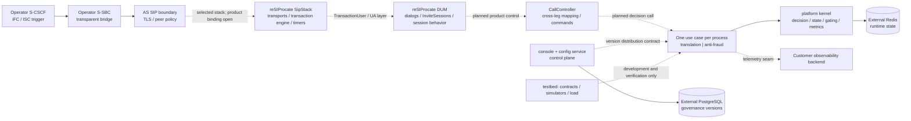

# High-Level Design (HLD) — 3rdparty-as

- **Status:** Design draft; maintainer review required. This update does not imply approval.
- **As of:** 2026-10-03
- **Scope:** Product architecture across M2–M6, with implementation status called out explicitly.
- **Normative source:** [`../requirements/prd.md`](../requirements/prd.md). Milestone and unresolved-item status: [`../plan.md`](../plan.md).
- **Baseline:** [`新系统整体架构.md`](新系统整体架构.md) and the accepted ADRs linked below.

## 1. Purpose and Status Convention

This document describes the target product boundaries and the evidence currently present in the repository. **Implemented** means code or a test exists; it does not by itself mean production integration or acceptance. **Seam/contract** means an interface or pure policy exists without its runtime adapter. **Open/unverified** means the repository or handoff does not establish the behavior. The distinction is particularly important for SIP serving, because the selected stack is not yet bound to the process.

The architecture supports a single-tenant, on-premises third-party IMS Application Server. S-CSCF triggers it over ISC through the operator's transparent S-SBC; the operator owns S-CSCF, S-SBC, and HSS. Product scope excludes media, CDR/billing, lawful interception, Diameter Sh, multi-tenancy, and GitOps configuration. (REQ-F-1, REQ-NF-5–REQ-NF-9; ADR-0003, ADR-0004, ADR-0013, ADR-0016, ADR-0017.)

## 2. Context and Boundaries



The solid business/data edges above describe intended responsibility; dotted edges do not imply an implemented production connection. The repository has SIP parsing/building and transport/adaptation contracts, but no reSIProcate product adapter, `CallController`, or end-to-end app process wiring. reSIProcate DUM is the selected protocol mechanism; the controller is a planned product layer, not code present today. ADR-0019's stack choice remains in force; E1/E4/E5 remain open. See [ADR-0022](adr/0022-resiprocate-b2bua-control.md).

| Boundary | Responsibility | Current evidence |
|---|---|---|
| `apps/` — signaling use cases | Separate process and rollout/failure unit per use case; compose policy with kernel decisions. | Translation and anti-fraud pure decision packages and contract replays exist; a SIP-serving composition is open. (REQ-NF-2; ADR-0002.) |
| `platform/` — kernel | Protocol-neutral decision contracts, state/gating seams, SIP wire helpers and operational primitives. Must not import apps, services, or testbed. | Implemented and guarded by [`../../platform/tests/test_library_independence.py`](../../platform/tests/test_library_independence.py). SIP wire helpers are not the planned DUM adapter/controller. (ADR-0001, ADR-0002, ADR-0015.) |
| reSIProcate `SipStack` + DUM + product `CallController` | `SipStack` owns transports, transaction processing, retransmission/timers, and its process loop. DUM is a `TransactionUser`/UA layer using `SipStack`; it owns dialog/`InviteSession` semantics and session-level behavior. `CallController` correlates independent UAS/UAC legs, maps session events to business decisions and commands, and coordinates call lifecycle; it does not duplicate stack transactions or timers. | Logical design only. D9 probes establish narrow native bridge/DUM→Python feasibility, not a product binding, adapter, or controller. Full E1 and product integration remain open. (REQ-F-1–REQ-F-5, REQ-F-8–REQ-F-11; ADR-0019, proposed ADR-0022.) |
| `services/` — control plane | Configuration versioning/change workflow and console access policy. | Login/session shell, same-origin ASGI asset serving, runtime factory/CLI, and existing ChangeOrder submit/approve/reject UI are engineering slices. 7.2c adds a dedicated config-service image recipe and default-disabled Helm Deployment/ClusterIP Service/optional ingress-nginx same-origin Ingress template; no Helm render, image build, deployment, HTTPS, trusted-proxy, or browser proof exists. Draft [ADR-0025](adr/0025-managed-rule-runtime-bundle.md) plus `runtime_bundle.py` define the pure ManagedRule→`ConfigBundle` compiler (v1 called/prefix subset); HTTP CRUD wiring remains open. 7.2d, live trace, fleet notification/health/distribution/rollback, full browser workflow, and M4b-8 acceptance remain open. [ADR-0024](adr/0024-console-password-sessions.md) remains draft pending maintainer signoff; no REQ-S-4/M4b acceptance is claimed. (REQ-F-12–REQ-F-15, REQ-NF-10, REQ-S-4; ADR-0006, ADR-0016, draft ADR-0024.) |
| Data stores | Redis runtime state; PostgreSQL governance state. They are not replicas of one another and have no cross-store transaction. | Redis store and PostgreSQL version-store implementations exist; production Redis Sentinel wiring/topology is open. (ADR-0002, ADR-0007.) |
| `deploy/` | Helm is the only production delivery form; Compose is development-only. | Config-service Helm templates are optional and default-disabled. Deployment reads only the external runtime Secret (`AS_CONFIG_DSN`, audit HMAC key) and a pre-provisioned runtime role; it performs no DDL or provisioning. ingress-nginx annotations fix HTTPS redirect, but actual controller behavior must retain the default `nginx.ingress.kubernetes.io` prefix and must not exempt `/` via `no-tls-redirect-locations`. The config-service chart has no render/image-build/deployment proof; HTTPS and trusted-proxy behavior remain unverified. (REQ-NF-9; ADR-0013.) |
| `testbed/` | Language-neutral contracts, simulators/probes, and real-socket load harness engineering track. Never a runtime dependency and not a runtime asset. | Decision contracts and SIP baseline/probe harness exist. Maintainer-authorized M6 load harness engineering is WIP since 2026-10-03 with loopback socket tests plus one local SIPp 3.6.0 UAS interop smoke; real selected target-stack measurement has not started. This does not provide reSIProcate/product-target measurement or any capacity result. reSIProcate probes did not run. testbed remains a non-runtime research asset. (ADR-0012, ADR-0014.) |

Dependencies point inward: apps may use platform; services may use platform contracts; testbed may exercise platform and apps. Platform must not depend outward, and one app must not import another (AGENT.md §4; REQ-NF-12; ADR-0001, ADR-0015).

## 3. Runtime Design

The intended INVITE path is:

1. The SIP transport accepts an operator peer using TLS/mTLS and a fail-closed peer allowlist. There is one ISC service semantic; the S-SBC is transport/topology mediation, not a second business mode. (REQ-NF-5, REQ-S-1–REQ-S-3; ADR-0003, ADR-0016.) **The policy/configuration seam exists; real handshake and stack integration are unverified.**
2. reSIProcate `SipStack` owns transports, SIP transaction processing, retransmission/timers, and the process loop. DUM is a `TransactionUser`/UA layer over `SipStack`; it owns dialogs, `InviteSession` semantics, and session-level behavior. The product controller must not duplicate stack transactions or timers. (REQ-F-1–REQ-F-5, REQ-F-8–REQ-F-11; ADR-0019, proposed ADR-0022.) **The product stack/DUM adapter is not implemented.**
3. The planned `CallController` correlates an inbound UAS leg and an independent outbound UAC leg, including their distinct Call-IDs. It maps DUM session events to business decisions/outbound commands and coordinates provisional/final responses, CANCEL/BYE, in-dialog requests, non-2xx outcomes, cancellation/final-response races, and cleanup. Request-URI, SDP handling, and Route/Record-Route behavior follow the referenced requirements. Callbacks remain nonblocking. **This is design, not implemented runtime behavior.**
4. The app invokes existing Python decision policy against one loaded configuration version. No rule match produces 404; a block produces 603; a translation rule produces a translated target; anti-fraud applies its injected rate-window count. Decisions are pure and do not themselves send SIP. (REQ-F-6, REQ-F-7, REQ-F-16; ADR-0002.) **The functions are implemented and contract-tested; wire behavior is not established.**
5. Runtime business context belongs in Redis with a TTL and a per-use-case namespace. While running, `SipStack` owns live transaction runtime and DUM owns live dialog/session runtime; the controller owns the semantic cross-leg mapping and recoverable business context. Redis storage does not make either runtime reconstructible. A two-process UAC `DialogSetId` re-INVITE recreation hook succeeded after manually restoring dialog fields, but a fresh DUM returned 481 for a same-dialog UAS BYE after restart; no public UAS rehydrate API was found. The UAS result fails the current ACK-established-dialog D10 baseline because the replacement does not handle the required new BYE transaction. Recovery of a pre-crash in-flight `SipStack` transaction is a separate, untested extension; the baseline INVITE transaction has completed before restart. Product cross-leg mapping recovery also remains unproven. ADR-0002's all-session-state externalization statement and REQ-NF-1's no-active-call-loss-on-restart requirement are not reconciled: D10 is not passed / unresolved, and REQ-NF-1 remains a hard acceptance requirement. (REQ-NF-1–REQ-NF-3; ADR-0002, ADR-0007, ADR-0019.)

The process model is one use case per process and Deployment. It isolates failures and rollout units; it does not establish that live DUM protocol state can be moved or recovered after process loss. In-service upgrade and safe removal use draining: stop new work, let existing calls finish, exit at zero active calls, and force exit only at the configured deadline. (REQ-NF-2–REQ-NF-4; ADR-0002, ADR-0009, ADR-0010.) `ProcessShell` implements this policy, but the current executable supplies an `active_calls` callback that always returns zero; traffic integration and live-cluster validation remain open. Proving restart recovery against REQ-NF-1/E5 or documenting the design gap is a separate blocker (plan D10).

Source-verified reSIProcate layering and DUM behavior (1.14.0, commit `632e215c2ca9aee5416bfe1808851ea6fa380044`): `SipStack` owns transports, transaction processing/timers, and the process loop; DUM is a `TransactionUser` constructed with and holding a `SipStack&`, and supplies UA/dialog/`InviteSession` and session-level behavior. Inbound initial UAS INVITE CANCEL handling on that leg sends 200 for CANCEL and 487 for INVITE, then reports `RemoteCancel` through termination; the product controller still coordinates the opposite UAC leg, race resolution, and cleanup. `InviteSession::end()` means BYE, not CANCEL. DUM includes RFC session-timer support; transaction timers/retransmissions belong to `SipStack`, while product policy and non-protocol retries remain controller concerns. The handler has no `onCancel` virtual, and callback signatures are leg/overload-specific. `makeInviteSession(...)` returns a message to send, with handles delivered through callbacks; this is a fact about an unselected bridge, not a product API specification.

REQ-F-4 requires byte-for-byte SDP body preservation on the product wire. Bounded exploratory native DUM captures now show exact identity for 230-, 143-, and 233-byte offers and one distinct 238-byte answer. This is not complete product-adapter acceptance: broader stack-accepted variants, the full route, and review remain pending. Neither `Contents` use nor unchanged callbacks alone establish byte identity.

### Exploratory Evidence Boundary (2026-10-01; Non-Acceptance)

Isolated D9 probes show native CPython callbacks, a real DUM `onNewSession`→Python decision path returning 404 (and 500 on injected exception), one two-leg 486 branch, and one early CANCEL branch. They establish feasibility only: no product API/adapter, forking, final-response race, or full E1 is implemented or accepted. D10's UAC recreation hook is narrow; the default-DUM UAS restart probe returns 481 to the post-restart BYE required by the current baseline, so REQ-NF-1 remains blocking. Recovery of a transaction already in flight at process failure and complete cross-leg mapping recovery remain unproven; only the former is outside the current baseline and an optional extension. D11 byte equality covers only the bounded samples above, not REQ-F-4 acceptance. Exact temporary evidence paths are recorded in [`../acceptance/report.md`](../acceptance/report.md) and [`../handoff/2026-09-30.md`](../handoff/2026-09-30.md); all probes were outside the repository.

## 4. Configuration and Control-Plane Flow

Configuration changes use one governed path for rules and feature toggles:

```mermaid
sequenceDiagram
   actor Operator
   participant Console
   participant Config as config-service
   participant PG as PostgreSQL version store
   participant Fleet as AS instances
   Operator->>Console: edit and submit change
   Console->>Config: change order
   Config->>Config: validate; submit; approve/reject
   Config->>PG: append immutable configuration version after approval
   Config->>Fleet: distribute by batches
   Fleet-->>Config: applied version + health report
   alt a batch is unhealthy or rollout is aborted
      Config->>PG: retain history; select previous version for rollback
   else all batches healthy
      Config->>Config: mark applied
   end
```

The seven-state change-order policy and staged distribution are implemented as pure logic; `PostgresVersionStore` is the database adapter for immutable configuration version rows. The live console has submit/approve/reject actions for existing ChangeOrders, and acceptance evidence records a real-PostgreSQL integration exercise of approval, persistence, distribution, automatic rollback, and previous-version retrieval. This does **not** establish production HTTPS ingress, complete browser workflow acceptance, complete persistence of all workflow/audit state, or a fleet notification transport. (REQ-F-12, REQ-F-14, REQ-F-15, REQ-NF-10, REQ-S-4; ADR-0006, ADR-0007.)
The pure console access policy remains in `services/console/src/as_console/access.py`; session/account persistence is in `auth.py`, HTTP/auth/audit wiring in `api.py`, the audit store in `audit_store.py`, and the one-time bootstrap CLI in `bootstrap_admin.py`. The console has a login/session shell and existing-order decision UI; ManagedRule write UI/API remains open. Same-origin ASGI asset serving and the explicit `as_config_service.runtime:create_runtime_app` / `as-config-service` Uvicorn factory CLI are engineering slices. Runtime reads `AS_CONFIG_DSN`, `AS_CONFIG_RUNTIME_ROLE`, and `AS_AUDIT_RESOURCE_HMAC_KEY_B64`, uses one pre-provisioned least-privilege PostgreSQL connection with `SET ROLE`, and performs no startup DDL, migration, or provisioning. Bootstrap separately requires `AS_CONFIG_OWNER_DSN` and shares `AS_CONFIG_SCHEMA`; owner credentials are not part of the runtime Deployment. The optional Helm Deployment references only the external runtime Secret and the pre-provisioned runtime role. Its optional ingress-nginx Ingress fixes `ssl-redirect` and `force-ssl-redirect`, but does not configure the external controller: actual redirect proof requires the default annotation prefix and a controller configuration whose `no-tls-redirect-locations` does not exempt `/`. No Helm render, image build, deployment, HTTPS, trusted-proxy, or browser proof is available; 7.2d remains open. M4b-6b records actor/action/resource/outcome/time and bounded before/after snapshots; detail is excluded. Credential-key/value and PEM private-key rejection is heuristic, so producer allow-list/redaction remains required. The store needs explicit owner/migration setup in a dedicated non-public schema and validates an allow-listed catalog, exact table shape/constraints/triggers, no partition/publication, and a monotonic retained-history-guarded sequence. Runtime role is NOLOGIN, has no CREATEROLE/memberships, and receives schema USAGE, table SELECT plus column INSERT excluding `id`, and sequence USAGE/SELECT only; startup validates the role. A separate login role must `SET ROLE` to the runtime role. These are implementation controls, not proof of deployed DB configuration.

When configured, session auth is primary and fail-closed. Unaudited callback mode requires explicit opt-in and is forbidden with session auth. Audited domain writes stage using `commit=False` and commit with the audit append in one transaction; request failures roll back mutations before recording DENIED with null snapshots, and unavailable audit returns generic 500. Login/logout snapshots contain only safe user/session timestamps, never password/token. Unmatched `/internal/v1` GET/HEAD and POST/PUT/PATCH/DELETE/OPTIONS/TRACE/CONNECT routes are audited while identity, permission, and CSRF guards remain in force. Session audit stores route template plus sorted parameter-name HMAC-SHA256 full digest, never raw path/query; it requires an externally provisioned stable 32-byte key, and rotation breaks cross-period correlation. Distribution completion/report audit and ManagedRule+ChangeOrder APPLIED/audit remain two PostgreSQL transactions, not distributed atomicity. Existing ChangeOrder decisions are live engineering UI actions; ManagedRule create/edit/delete and lossless runtime bundle compilation remain blocked by unresolved mapping and regex semantics. Distribution still lacks AS inventory, notifier, real health, and live rollback integration. Login requires HTTPS according to ASGI `request.url.scheme`, but production ingress/trusted-proxy behavior is unverified. Latest local evidence is in [`../acceptance/report.md`](../acceptance/report.md); no CI, PG16, production ingress, full browser workflow, or REQ-S-4/M4b acceptance is claimed. Application rate limiting remains open. Live Call-ID trace query/storage is not implemented; retention (O4) and storage (D5) remain open. (REQ-F-13, REQ-NF-7, REQ-S-4; ADR-0005–ADR-0007, ADR-0016, draft ADR-0024, ADR-0017.)

Each loaded bundle carries a version, rules, and optional toggles. An instance's applied-version report is the intended means of observing runtime version, rather than inferring it from database write time. A production report transport is not evidenced. The pure console access policy remains in `services/console/src/as_console/access.py`; session/account persistence is in `auth.py`, HTTP/auth/audit wiring in `api.py`, with the bootstrap CLI in `bootstrap_admin.py`. When configured, session auth is primary and fail-closed; callback mode is explicit opt-in and is not fallback authentication. A login/session shell and existing ChangeOrder decision UI are present. The `create_runtime_app` factory and `as-config-service` CLI provide a code-level runtime entry point using the configured DSN/runtime role/HMAC key, one shared connection with `SET ROLE`, and no startup provisioning or migration. The login HTTPS check uses ASGI `request.url.scheme`; deployed ingress/trusted-proxy configuration has not been verified. M4b-6b audit and these UI/runtime changes are engineering slices, not REQ-S-4 or M4b acceptance. ManagedRule CRUD/compiler, live trace, fleet notifier/health/distribution/rollback, full browser workflow, and M4b-8 remain open. Application rate limiting also remains open. Call-trace query/storage is separate and not implemented; retention (O4) and storage (D5) remain open. (REQ-F-13, REQ-NF-7, REQ-S-4; ADR-0005–ADR-0007, ADR-0016, draft ADR-0024, ADR-0017.)

## 5. Feature Enablement

Feature gates control capability availability, not interface shape. Disabled behavior must follow the established default path. Every introduced toggle must have an explicit default (off), rollout policy, and removal condition; license gating is out of scope. (REQ-G-1; ADR-0006, ADR-0020.)

| Layer | Design | Implemented evidence / limitation |
|---|---|---|
| Deployment-wide | A versioned value in the approved configuration bundle; distribute and roll back through the same PostgreSQL/change-order path as rules; hot-load without process restart. Missing/unregistered name is off. | `ToggleDTO`, `ConfigBundle.toggles`, and deployment-value folding exist. Runtime control-plane delivery/hot-load is not established. |
| Runtime override | Number prefix (empty means all numbers), optional stable percentage based on FNV-1a 32-bit of Call-ID; longest matching prefix wins; explicit disabled override wins; no matching override defers to deployment value. No user or persisted per-call override. | Pure evaluator exists under `platform/gating/overrides.py` and is tested. A production Redis-backed source/refresh path is not established. (ADR-0021.) |

No named product capability is evidenced as currently enabled through a production toggle bundle. The framework has open/closed unit coverage; rollout and removal conditions must be supplied for each future named toggle. No schema or open item is resolved here beyond ADR-0021.

## 6. State, Transport, and Observability

- **Runtime/governance split:** Redis owns expiring call/runtime keys; PostgreSQL owns immutable configuration versions and governance records. No cross-store transaction or replication is designed. Redis Sentinel client wiring, split-brain behavior, and topology remain open (D3, O5; risk R5). (ADR-0002, ADR-0007.)
- **Transport/security:** SIP peer policy is fail-closed; TLS settings and immutable hot-reload values have a pure seam. Actual certificate loading, handshake, peer identity extraction, and certificate-rotation probe remain unverified. Console role/password/session and durable audit are engineering slices under draft ADR-0024, but do not establish REQ-S-4 or M4b acceptance. Login requires the ASGI request scheme to be HTTPS; deployed proxy/ingress trust has not been verified. Audit secret filtering is heuristic; application rate limiting remains open. (REQ-S-1–REQ-S-4; ADR-0016, draft ADR-0024.)
- **Observability:** call-path events enter a bounded non-blocking queue; full queues drop events and count drops; an independent background worker calls an exporter. Metrics currently define per-instance `as_active_calls`, `as_sip_responses_total`, `as_rule_hits_total`, and `as_telemetry_dropped_total`. OTel three-signal semantics are the target; complete OTel SDK/exporter wiring, end-to-end spans/structured logs, and customer backend integration are not established. Call traces remain a separate product query channel and are not a substitute for sampled traces. (REQ-NF-13, REQ-NF-14, REQ-F-13; ADR-0005, ADR-0017.)

<a id="call-state-recovery-contract"></a>
### 6.1 Call-State Recovery Contract

 Call-state recovery is a product target, not only a future research question. REQ-NF-1 remains a hard acceptance requirement. Accepted ADR-0002 remains unchanged; choosing Redis for runtime data does not by itself make `SipStack` transaction state or DUM dialog/session state reconstructible. The production persistence and recovery mechanism is unresolved; see the [source-backed options comparison](call-state-recovery-options.md).

**Scope note:** The current D10/REQ-NF-1 [acceptance check](../acceptance/test-plan.md) is exactly the ACK-established-dialog baseline: establish a basic two-leg call through the ACK exchange; kill and restart the AS; send an upstream in-dialog BYE; then assert that the replacement restores the UAS/UAC mapping, forwards the BYE over the already-established UAC leg to the peer, and that Redis still contains the complete dialog record. The post-restart BYE is a new transaction; the check does not require restoring the completed INVITE transaction or any transaction that was in flight at process failure. A downstream/UAC-initiated in-dialog re-INVITE or BYE after restart is not part of this baseline; the UAC `DialogSetId` re-INVITE probe is exploratory evidence only. REQ-NF-1 remains a hard acceptance requirement. This AS does not carry or anchor RTP (REQ-NF-6; ADR-0004), and the baseline does not test media interruption or resumption. The fresh-DUM 481 to the same-dialog BYE is a SIP control-state recovery failure against this baseline, not evidence of RTP interruption. No media blocker or new media requirement is introduced.

 The recovery design distinguishes the current acceptance baseline from a possible future extension:

 - **Current baseline — established dialog:** restore enough state to route the post-restart upstream BYE across both independent B2BUA legs and retain the required Redis dialog record.
- **Optional future recovery extension — broader requests and in-flight transactions:** cover requests initiated from the downstream/UAC leg after restart (such as in-dialog re-INVITE or BYE) and process loss while INVITE/CANCEL, final-response, or 2xx/ACK processing is pending. These are outside current D10 acceptance. Recovering or safely reconciling pre-crash transaction obligations is distinct from restoring an established dialog. Making any of these behaviors a gate requires separate or expanded REQ/test-plan changes and explicit maintainer approval.

For the current baseline, the minimum state categories to evaluate are one logical call key; both leg identities (per-leg Call-ID, local tag, and remote tag); each leg's remote target and route set; the CSeq values needed to construct and process the new in-dialog BYE; and the `CallController` cross-leg mapping, business state, and configuration context/version. Together, these must restore the UAS-to-UAC mapping needed to forward the upstream BYE over the already-established UAC leg. Recovery generation/owner fencing must also be considered where needed to prevent conflicting SIP actions. This is a category list, not a schema. Exact fields and checkpoint boundaries must be derived from the baseline flow and tested; no store, schema, or DUM restoration API is selected here. Recovery of pending INVITE/CANCEL/final-response correlation and next action belongs only to the optional future extension. None of this promises that the fields can be serialized into, or restored through, reSIProcate's public DUM API.

 The two legs must be checkpointed and transferred coherently enough that no process generation can own only one side of a logical call. Before a new owner serves either leg, the previous owner must be fenced from further SIP actions; peer routing must follow the authoritative owner rather than relying only on transport affinity. How that ownership and fencing are implemented remains open.

The current D10 acceptance checkpoint is exactly the test-plan flow: establish a basic two-leg call and complete the ACK exchange; kill and restart the AS; send an upstream in-dialog BYE; verify that the replacement restores the UAS/UAC mapping and forwards the BYE over the existing UAC leg to the remote peer; and verify that Redis contains the complete dialog record. The replacement handles a new BYE transaction, not the completed INVITE transaction. Downstream/UAC-initiated in-dialog re-INVITE/BYE after restart and process loss during pending INVITE/CANCEL/final-response/2xx-ACK processing are optional future coverage, not current acceptance checkpoints; adding any of them as a gate requires separate or expanded REQ/test-plan changes and explicit maintainer approval. Current evidence is narrower: the UAC `DialogSetId` re-INVITE/re-association hook is exploratory only, while default-DUM UAS recovery returned 481, so the current baseline fails. `SipStack`/DUM transaction-state restoration may matter for those other restart points, but remains untested and is not a current D10 gate.

## 7. Deployment and Operations

Helm is the sole production form, using standard Kubernetes objects; Compose is for development. Redis and PostgreSQL are external to the chart. The chart renders one Deployment and Service per enabled use case, enables ClientIP session affinity, mounts customer TLS material, and configures preStop/termination grace for draining. Autoscaling defaults off. Capacity-bearing values and PDB minimums remain unset rather than guessed; rendering guards require capacity inputs when HPA is enabled. The replica-count rendering fallback of one is explicitly not a capacity claim. (REQ-NF-3, REQ-NF-4, REQ-NF-9; ADR-0002, ADR-0009, ADR-0010, ADR-0013.)

The scale-down guard is a pure per-instance selector: HPA determines desired scale, the guard only proposes instances at or below its safety threshold, and actual draining/deletion is an operations responsibility. Do not infer that an actuator/controller is implemented from the pure function or chart. Site-internal redundancy is an accepted design direction; customer-level N+1 versus N+M and Redis topology remain open (O5). Cross-site RTO/RPO are unspecified. (ADR-0008, ADR-0010.)

M5 evidence includes Helm lint/render checks, an image build, container SIGTERM/drain check, PostgreSQL integration, and alert-rule artifacts. A real Kubernetes rolling upgrade and scale-down have not been run; no capacity result exists. M6 capacity research must use real sockets before any CPS, concurrency, latency budget, or HPA capacity threshold is published. (ADR-0009, ADR-0010, ADR-0013, ADR-0014; plan §4–§5.)

### Amendment 2026-10-06 — M5 (2026-10-04, ADR-0026 stateStores)

The two "have not been run / external to the chart" statements above are M5-pre history and are kept for traceability; current state differs: the chart optionally renders in-cluster stateStores (PostgreSQL StatefulSet + Redis + NetworkPolicy + migrate Job, `stateStores.enabled=true`, ADR-0026), and kind evidence covers rollout restart, scale, draining/ISSU and 7.2d ingress on `kind-as-m5` (see `docs/acceptance/m5-evidence-summary.md`, plan §4.5–§4.6). Limitation: ISSU/scale-down evidence is driven by the simulated `AS_M5_SIMULATED_ACTIVE_CALLS` mechanism seam, proving guard/drain wiring only — proof of "no dropped real calls" belongs to M7 (REQ-NF-1/REQ-NF-3/REQ-NF-4). This amendment does not constitute REQ-level acceptance; see `docs/reviews/m5-req-acceptance-review-2026-10-06.md`. (REQ-NF-3, REQ-NF-4, REQ-NF-9; ADR-0026.)

## 8. Verification and Traceability

`testbed/contracts/decision/cases.json` is language-neutral decision data replayed by both app packages (ADR-0012). SIP baselines and simulators constrain protocol behavior; capacity testing must include real sockets and belongs to M6 (ADR-0014). Testing layers and CI markers follow ADR-0015. As of 2026-10-04 evidence, native probe loopback smoke passed for S1 over UDP/TLS, S2 (404), S3 (603), and S4 CANCEL/487; S4 ACK is protocol-expected but was not independently wire-captured. One external raw SIP INVITE over TLS observed 100/180/200 responses, but that client did not send ACK/BYE. One testbed-only full-TLS active S1 cert-swap smoke (after the TLS Contact routing correction) observed BYE over TLS, with post-reload new connection trust succeeding for cert-B and failing for old cert-A-only trust. The earlier native TLS S1 `503 Certificate Validation Failure` + timeout exit 124 result is preserved as an initial pre-fix snapshot before local self-test trust initialization was added. These are bounded testbed/probe observations, not product-adapter or operator-facing acceptance: E1 remains open, E4/REQ-S-3 remain unverified/unaccepted (including dual-cert overlap/operator PKI/product adapter acceptance), and E5/restart recovery remains unverified. See [`../acceptance/report.md`](../acceptance/report.md), [`../acceptance/test-plan.md`](../acceptance/test-plan.md), and [`../handoff/2026-09-30.md`](../handoff/2026-09-30.md).

| Requirement scope | Design mapping | Current limit |
|---|---|---|
| REQ-F-1–REQ-F-5, REQ-F-8–REQ-F-11 | SIP boundary, two-leg B2BUA, routing/body/dialog semantics; ADR-0003, ADR-0004, ADR-0019 | D9 has narrow bridge and DUM→Python feasibility evidence, not product adapter/E1 acceptance. D11 bounded native DUM body comparisons passed, but broader product-path evidence/review is pending; REQ-F-4 is not accepted. |
| REQ-F-6, REQ-F-7, REQ-F-16 | Pure route/block/translation policy; ADR-0002 | Decision behavior tested; SIP response/wire integration open. |
| REQ-F-12, REQ-F-14, REQ-F-15, REQ-NF-10 | Versioned rules/toggles, approval, staged rollout, rollback; ADR-0006, ADR-0020 | Workflow and DB integration evidence exists; production API/fleet transport incomplete. |
| REQ-F-13, REQ-NF-7 | Complete Call-ID queryable call trace, separate from telemetry; ADR-0005, ADR-0017 | Trace product path, storage, retention, and query are open (O4, D5). |
| REQ-NF-1–REQ-NF-4 | External runtime state, per-use-case isolation, scale and draining; ADR-0002, ADR-0007, ADR-0009, ADR-0010, proposed ADR-0022 | REQ-NF-1 remains hard; the ACK-established-dialog BYE/Redis recovery baseline fails at the fresh-DUM UAS BYE (481), and product cross-leg recovery/serving integration are unverified. Recovery of a pre-crash in-flight `SipStack` transaction is outside this baseline and remains an optional, untested extension. |
| REQ-NF-9, REQ-NF-11–REQ-NF-14 | Helm-only single-tenant delivery, version governance, telemetry and alerts; ADR-0005, ADR-0013, ADR-0018 | No capacity results; OTel full-stack and cluster alert exercise remain unverified. |
| REQ-S-1–REQ-S-4 | Peer allowlist/TLS and console authorization/audit; ADR-0016, draft ADR-0024 | SIP handshake remains unverified. Console password/session and durable audit integrations are engineering slices, but ADR-0024 remains draft; M4b UI/browser acceptance, application rate limiting, and deployed trusted-proxy proof remain open. No REQ-S-4 or M4b acceptance is claimed. |
| REQ-G-1–REQ-G-4 | Feature enablement and test/change traceability; ADR-0006, ADR-0012, ADR-0015, ADR-0020, ADR-0021 | ADR-0014 maps to REQ-NF-15 (D8 closed 2026-10-05). |

**Open items preserved:** D3 (Redis/Sentinel and idempotence), O4 (call-trace retention), D5 (trace storage), O5 (disaster-recovery topology), D6 (testbed as customer deliverable), O1 maintainer targets / HPA values, and M5 cluster validation beyond engineering closure. `docs/acceptance/criteria.md` is absent; acceptance evidence lives in `test-plan.md` and `report.md`. This document does not replace either artifact or decide their gaps.
