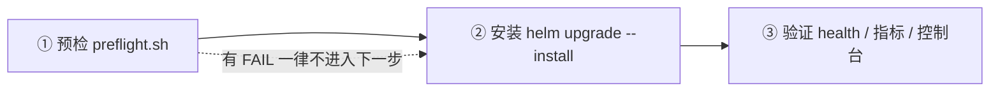

# `docs/delivery/` — 交付文档与脚本

> **产品**：In-house IMS Application Server（文档暂用名，3GPP Third-Party AS role；命名状态见 [`../product-packaging-plan.md`](../product-packaging-plan.md) §4.3）。
>
> **本目录状态**：**新增**交付文档目录。交付物 **3.1 Preflight 环境校验脚本** 与 **3.2 离线安装包（air-gapped）** 已落盘；安装指南 [`install-guide.md`](./install-guide.md) 为交付命令序列的入口。
> **生产形态**：**Helm-only** —— Helm + 标准 K8s 资源是唯一生产交付形态，不写 Operator，**不产生第二套安装形态**（ADR-0013；评审 G-P1-7）。
> **air-gapped 场景**：客户机房普遍无外网。3.2 的目标就是"联网侧做一次镜像同步 + `helm package`，离线侧校验后导入"，**不含在线安装器**。
> **零容量数字**：`AGENT.md` §2 —— O1 容量目标未裁决（`docs/plan.md` §5.1），本目录任何文件都不给 CPS / 并发 / 时延 / 资源规格推荐值。`useCases[].resources` 默认空，脚本只提示、不发明。
> **未在真实集群验证**：M8 真实集群证据 7.2d blocked（`docs/plan.md` §5.4）。本目录脚本的语法与本地行为已验证，**真实客户环境结论需现场留证**。

---

## 1. 三步交付流程

| 步骤 | 做什么 | 用哪个文件 | 出口判据 |
|---|---|---|---|
| ① 预检 | K8s 版本与 API、节点资源、存储、依赖服务、Helm、RBAC、chart 渲染 fail-closed、镜像与端口提示 | [`preflight.sh`](./preflight.sh)（交付物 3.1） | 无 `FAIL`（`--strict` 下无 `WARN`）→ 退出码 0 |
| ② 安装 | 镜像就位 + 客户 Secret 就位 + `helm upgrade --install`（air-gapped 时先做镜像同步） | [`airgap-package.md`](./airgap-package.md)、[`install-guide.md`](./install-guide.md) | Helm release 成功；chart 三条 fail-closed 守卫未命中 |
| ③ 验证 | Pod/Endpoint、`/health/live`、`/health/ready`、`as_state_store_available`、控制台 HTTPS | [`../../deploy/helm/templates/NOTES.txt`](../../deploy/helm/templates/NOTES.txt)、[`../operations/`](../operations/) | 按 NOTES.txt 的命令逐项取证 |

参数口径不在本目录重复：**Helm 参数与行为以 [`../../deploy/helm/README.md`](../../deploy/helm/README.md) 为唯一权威**。

---

## 2. 目录内容

| 文件 | 用途 | 读者 | 前置条件 |
|---|---|---|---|
| [`preflight.sh`](./preflight.sh) | 部署前一键环境校验；每项打印 `PASS`/`FAIL`/`WARN`/`SKIP` + 证据 + 修复指引；支持 `--dry-run` / `--strict` / `--skip-network` | 交付实施、K8s 管理员 | `kubectl`、`helm` 3.x |
| [`airgap-package.md`](./airgap-package.md) | 离线包**制作与使用**说明：范围、联网侧流程、离线侧流程、校验和与供应链、镜像清单、已知缺口 | 交付实施、客户运维 | 无（阅读类） |
| [`install-guide.md`](./install-guide.md) | 交付清单 + 镜像同步 + `helm install` 命令序列 | 交付实施、客户运维 | 无（阅读类） |
| [`scripts/bundle-images.sh`](./scripts/bundle-images.sh) | **联网侧**：读镜像清单 → `docker pull/tag/save` → `SHA256SUMS` → `helm package` → `MANIFEST.txt` | 交付实施（联网侧） | `docker`、可访问上游 registry、`helm` 3.x |
| [`scripts/load-images.sh`](./scripts/load-images.sh) | **离线侧**：先校验 `SHA256SUMS`（不匹配中止）→ 导入镜像 → chart / helm / context / Secret 前置检查 → 打印安装命令骨架 | 交付实施、客户运维 | `sha256sum`；`--load` 需 `docker`（或按提示用 `ctr` / `crictl`） |
| [`scripts/images.txt`](./scripts/images.txt) | 依赖镜像清单模板（格式、占位符、按 digest 固定的写法先例） | 交付实施 | 按客户 registry 与交付版本改写 |

> `install-guide.md` 是同一交付批次的安装指南入口（交付清单 + 命令序列），已落盘。其中的命令序列与 [`airgap-package.md`](./airgap-package.md) §3/§4 一致；Helm 参数口径以 [`../../deploy/helm/README.md`](../../deploy/helm/README.md) 为准。

三个脚本均：只依赖基础工具（`bash` / `awk` / `grep` / `sed` / `sort` / `sha256sum`），**不要求 `jq` / `yq` / `python`**；不打印任何 Secret 内容、token 或证书；不含任何真实主机名、IP、registry 凭据（一律 `registry.example.com` 占位）；失败即中止并指出是哪一条。

---

## 3. 前置条件汇总

| 类别 | 要求 | 备注 |
|---|---|---|
| K8s | 默认按 **1.23** 下限校验（`preflight.sh --min-k8s` 可覆盖） | chart **没有** `kubeVersion` 声明；该下限由模板实际使用的 API 推导，依据写在 `preflight.sh` 头部注释（引自 Kubernetes 官方 Deprecated API Migration Guide 的 "available since" 条目） |
| 工具 | `kubectl`、`helm` 3.x（chart `apiVersion: v2`）；离线侧还需 `sha256sum` | `KUBECTL_BIN` / `HELM_BIN` / `DOCKER` / `HELM` 可覆盖二进制路径 |
| 镜像 | 客户内网 registry 中的产品镜像，或用本目录离线包导入到节点 | `registry.example.com` 是占位地址；air-gapped 走 [`airgap-package.md`](./airgap-package.md) |
| 依赖服务 | 外部 PostgreSQL（`postgres.host` + 凭据 Secret）或内建 `stateStores.enabled=true`；Redis 同理 | 内建 PG 默认 `postgres:12.22`、内建 Redis 默认 `redis:7-alpine`；Sentinel HA 仍是 O5/D3 未决 |
| Secret | TLS（客户 PKI）、PostgreSQL 凭据、config-service 运行时（`AS_CONFIG_DSN` + `AS_AUDIT_RESOURCE_HMAC_KEY_B64`）、migrate owner DSN（`AS_CONFIG_OWNER_DSN`） | chart **只引用不创建**客户凭据；owner DSN 绝不入 runtime Pod；运行时登录是 `as_config_web`，运行时角色由 DBA 预置 |
| chart | 能通过 `make chart-check`（`deploy/helm/scripts/chart-check.sh`） | 打包前先跑；`helm package` 失败通常意味着 chart 本身渲染不过 |
| 权限 | 安装账号需能创建 Deployment / StatefulSet / Service / ConfigMap / Secret / ServiceAccount / Job / NetworkPolicy / PVC / PDB / HPA | 本 chart **不创建** Role/RoleBinding，权限由客户 K8s 管理员授予（`preflight.sh` 用 `kubectl auth can-i` 核对） |

---

## 4. 与权威文档的边界

| 主题 | 权威文档 | 本目录 |
|---|---|---|
| Helm 参数、values 语义、渲染守卫、fail-closed 行为 | [`../../deploy/helm/README.md`](../../deploy/helm/README.md) | **不重复参数表**，只引用 |
| 交付清单与命令序列 | [`install-guide.md`](./install-guide.md) | 概览 + 链接 |
| 迁移 / owner DSN / 备份恢复 | [`../acceptance/m5-state-stores-runbook.md`](../acceptance/m5-state-stores-runbook.md) | 引用 |
| 告警处置、故障定界、巡检 | [`../operations/`](../operations/) | 引用 |
| 定位 / 容量模型 / 合规 | [`../product/`](../product/) | 不重复 |

---

## 5. 尚未交付 / 未验证事项

| # | 事项 | 状态 |
|---|---|---|
| 1 | 真实集群证据（7.2d HTTPS ingress / trusted-proxy / 浏览器工作流） | **blocked**（`docs/plan.md` §5.4）；`preflight.sh` 与离线包流程**未在真实客户环境跑过** |
| 2 | M8 退出签字 | **仍搁置**；M8 RC 产物就绪 ≠ 验收关门 |
| 3 | chart 无 `kubeVersion` 声明 | 已知缺口；`preflight.sh` 用推导下限兜底，但 Helm 自身不拦 |
| 4 | Chart `version` / `appVersion` 与根 `VERSION` 不同步 | 已知缺口；打包时人工核对（`bundle-images.sh` 会打印三者） |
| 5 | Pod 无 `prometheus.io/scrape` 注解 | 已知缺口；AS 指标抓取接线未闭环，见 [`../operations/grafana-dashboards/README.md`](../operations/grafana-dashboards/README.md) |
| 6 | `useCases[].resources` 默认空 | 容量规格待 O1 裁决后由 NE datasheet 给出；本目录不给推荐值 |
| 7 | e2e = 0、REQ-S-4 / M4b 未整体验收 | 见 `docs/acceptance/test-plan.md`、`docs/plan.md` §5.4 |
| 8 | 依赖 S-CSCF / HSS 侧配合的事项 | iFC 触发与灰度在 S-CSCF/HSS 侧；AS 侧只实现 ISC 触发后的判决（G-P1-10） |

---

## 6. 追溯

- 交付物 3.1 / 3.2：[`../product-packaging-plan.md`](../product-packaging-plan.md) §1 第三批（A 类，不被 O1 / O4 / D5 阻塞）。
- 范围收窄：**G-P1-7**（镜像同步脚本 + `helm package` + 依赖镜像清单 + 离线加载脚本，不产生第二套安装形态）；评审记录 [`../reviews/product-packaging-plan-review-2026-10-09.md`](../reviews/product-packaging-plan-review-2026-10-09.md)。
- Helm-only：**ADR-0013**。
- 工程事实约束：[`../product-packaging-plan.md`](../product-packaging-plan.md) §0.3。