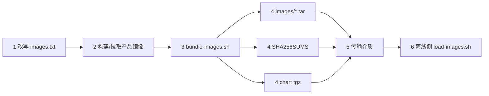

# 离线安装包（air-gapped）— 交付物 3.2

> **产品**：In-house IMS Application Server（文档暂用名，3GPP Third-Party AS role；命名状态见 [`../product-packaging-plan.md`](../product-packaging-plan.md) §4.3）
>
> **交付物**：3.2 离线安装包（air-gapped）
> **状态**：脚本与本文已落盘；**未在真实客户环境执行过**（M8 真实集群证据 7.2d blocked，`docs/plan.md` §5.4）。本文不含任何容量数字 —— O1 容量目标未裁决（`AGENT.md` §2）。
> **生产形态**：**Helm-only**（ADR-0013）；范围按评审 **G-P1-7**（[`../reviews/product-packaging-plan-review-2026-10-09.md`](../reviews/product-packaging-plan-review-2026-10-09.md)）收窄。
> **目标环境**：客户机房（air-gapped，无外网）。镜像与 chart 通过介质人工传递。

## 1. 范围与非范围

### 范围（只做这五件事）

镜像同步（`docker pull` + `docker save` → `images/*.tar`）、依赖镜像清单（`scripts/images.txt`）、校验和（`SHA256SUMS` + `MANIFEST.txt`）、`helm package`（`<chart>-<version>.tgz`）、离线加载脚本（`scripts/load-images.sh`：校验和 → 导入镜像 → 安装前置检查）。

### 非范围（明确不做）

| 非范围声明 | 原因 / 依据 |
|---|---|
| **不产生 Helm 之外的第二套安装形态**（没有在线安装器、没有独立 `install.sh`、没有第二套 manifest 模板） | ADR-0013；评审 G-P1-7。安装形态只有 `helm upgrade --install` 一种 |
| **不走 CI 私有 registry 自动同步** | 本仓库没有 CI 侧的镜像同步流水线；镜像同步是交付团队在受控联网侧的一次性动作 |
| **不替代客户内网 registry** | 若客户已有内网 registry，正确做法是把镜像推进客户 registry 再让 values 指向它；本包是"没有 registry 时的兜底路径" |
| **不做配置数据迁移 / 不做数据库初始化** | 配置版本是 PostgreSQL 里的行（ADR-0006），schema 迁移由 `as-config-migrate` 走 owner DSN 完成（见 [`../acceptance/m5-state-stores-runbook.md`](../acceptance/m5-state-stores-runbook.md)） |
| **不含任何容量 / 性能数字** | O1 未裁决（`AGENT.md` §2）。本包不声明 CPS、并发、时延、资源规格 |
| **不含测试床 / 仿真器；不做备份恢复方案** | ADR-0014：testbed 不是 v1 交付物；备份恢复属交付物 2.5（`docs/operations/backup-restore.md`），依赖真实集群演练，当前 blocked |
| **不替代部署前环境校验** | 那是交付物 3.1 [`preflight.sh`](./preflight.sh) |

## 2. 交付物清单

| 文件 | 位置 | 用途 | 前置条件 |
|---|---|---|---|
| `preflight.sh` | `docs/delivery/` | 部署前一键环境校验（交付物 3.1） | `kubectl` + `helm` 3.x |
| `airgap-package.md` | `docs/delivery/` | 本文：离线包制作与使用说明 | 无 |
| `install-guide.md` | `docs/delivery/` | 交付清单 + 镜像同步 + `helm install` 命令序列 | 无（与本文互链） |
| `scripts/images.txt` | `docs/delivery/scripts/` | 依赖镜像清单模板 | 按客户 registry 与交付版本改写 |
| `scripts/bundle-images.sh` | `docs/delivery/scripts/` | **联网侧**：镜像同步 + 校验和 + `helm package` | `docker`、可访问上游 registry、`helm` 3.x |
| `scripts/load-images.sh` | `docs/delivery/scripts/` | **离线侧**：校验和验证 + 镜像导入 + 安装前置检查 | `sha256sum`；`--load` 需 `docker`，否则按提示在节点侧用 `ctr` / `crictl` |
| `<chart>-<version>.tgz` | `bundle-images.sh` 产出 | Helm chart 包（唯一安装形态） | chart 能通过 `make chart-check` |

Helm 参数与渲染行为的唯一权威是 [`../../deploy/helm/README.md`](../../deploy/helm/README.md)。本文**不重复**参数表。

## 3. 联网侧制作流程



### 步骤

1. **改写 `scripts/images.txt`**：把 `registry.example.com` 换成实际来源（或用 `--repository` 在脚本侧重打标签），把 `<VERSION>` 换成交付版本（与根 `VERSION` 一致，`AGENT.md` §8）。禁止在清单里写凭据。
2. **准备产品镜像**：本仓库不发布镜像，需先构建（context 为**仓库根目录**）：

   ```sh
   docker build -t <registry>/3rdparty-as:<VERSION> -f deploy/docker/Dockerfile .
   docker build -t <registry>/3rdparty-as-config-service:<VERSION> -f deploy/docker/config-service.Dockerfile .
   ```

   或直接 `docker pull` 已发布到（客户可达的）registry 的镜像。
3. **执行打包**：

   ```sh
   docs/delivery/scripts/bundle-images.sh \
     --images docs/delivery/scripts/images.txt \
     --out ./airgap-out
   ```

   常用变体：按客户 registry 重打标签 `--repository registry.customer.internal/as --tag-prefix rel-`（加 `--push` 才推 registry，否则目标标签只存在于制作机本地并写进 tar）；指定平台 `--platform linux/amd64`；只做镜像不做 chart `--skip-helm-package`。加 `--dry-run` 先看计划。
4. **产物**（`./airgap-out`）：

   ```text
   airgap-out/
   ├── images/<image>-<tag>-<platform>.tar   docker save 归档
   ├── 3rdparty-as-<version>.tgz             helm package 产物
   ├── SHA256SUMS                            每个 tar 与 tgz 的 sha256
   └── MANIFEST.txt                          镜像/tag/digest/tar/sha256/生成时间(UTC)/工具版本
   ```

5. **传输介质与校验要求**：
   - 整个 `airgap-out` 目录一起拷贝（缺任一文件都会让离线侧中止）；介质按客户安全规范处理（加密介质、离线登记）。本包**不含**任何凭据、证书或私钥，Secret 由客户侧按 §4 单独准备。
   - 传输后在**联网侧**再跑一次 `cd airgap-out && sha256sum -c SHA256SUMS`，把输出随介质一起交给客户，用于区分"传输损坏"与"制作错误"。

## 4. 离线侧安装流程

1. **核验 `SHA256SUMS`（第一步，不匹配必须中止）**：

   ```sh
   cd airgap-in && sha256sum -c SHA256SUMS
   ```

   或直接用脚本（它把校验和放在所有动作之前）：

   ```sh
   docs/delivery/scripts/load-images.sh --bundle ./airgap-in --verify-only \
     --namespace as-prod --context <customer-cluster-context>
   ```

2. **导入镜像**：

   ```sh
   docs/delivery/scripts/load-images.sh --bundle ./airgap-in --load --namespace as-prod
   ```

   - 目标机有 `docker`：`docker load -i`（多节点集群需在**每个会调度 AS Pod 的节点**导入，或把镜像推进客户内网 registry 后让 values 指向它）。
   - 目标机只有 containerd：脚本不代跑节点命令，会打印逐节点指令，由客户执行：
     `sudo ctr -n k8s.io images import airgap-in/images/<tar>` 或 `sudo crictl images import ...`。
   - 导入后确认 tags 与 `values.image.tag` / `services.configService.image.tag` 完全一致，`image.pullPolicy` 为 `IfNotPresent`（chart 默认值）。
3. **准备值文件与 Secret**（chart 只引用、不创建客户凭据；键名口径见 [`../../deploy/helm/README.md`](../../deploy/helm/README.md)）：

   | Secret | 键 | 何时需要 |
   |---|---|---|
   | 客户 PKI TLS Secret | `tls.crt` / `tls.key` / `ca.crt` | `tls.enabled=true`（默认）→ **必需** |
   | PostgreSQL 凭据 Secret | `CONFIG_DB_USER`、`CONFIG_DB_PASSWORD`、`CONFIG_DB_OWNER_PASSWORD`、`POSTGRES_SUPERUSER_PASSWORD`、`REDIS_PASSWORD` | `stateStores.enabled=true` 且 `bootstrapDevCredentials=false` → **必需** |
   | config-service 运行时 Secret | `AS_CONFIG_DSN`（**`as_config_web` 登录**）、`AS_AUDIT_RESOURCE_HMAC_KEY_B64` | `services.configService.enabled=true` → **必需** |
   | migrate owner DSN Secret | `AS_CONFIG_OWNER_DSN` | `stateStores.migrateJob.enabled=true` → **必需** |

   `AS_CONFIG_OWNER_DSN` **只**用于人工/Job 执行的迁移，**绝不**进入 Helm values、chart 管理的 Secret 或 web Pod；`AS_CONFIG_DSN` 的登录必须能被 `SET ROLE` 到预置的 `NOLOGIN` 运行时角色（角色由 DBA 预置，chart 不建角色）。
4. **安装**（参数口径以 [`../../deploy/helm/README.md`](../../deploy/helm/README.md) 为准；完整命令序列见 [`install-guide.md`](./install-guide.md)）：

   ```sh
   helm upgrade --install as ./airgap-in/<chart>.tgz \
     --namespace as-prod --create-namespace \
     -f <customer-values.yaml> \
     --set image.repository=<customer-registry>/3rdparty-as \
     --set image.tag=<release-tag> \
     --set tls.secretName=<tls-secret> \
     --set sip.peerAllowlist=<s-sbc-cidrs>
   ```

   提示：chart 有三条 **fail-closed** 守卫（[`../../deploy/helm/templates/validate-install.yaml`](../../deploy/helm/templates/validate-install.yaml)）：`tls.enabled` 无 `secretName`、`sip.peerAllowlist` 为空、`stateStores.enabled` 时缺 `postgres.secretName` —— 缺项会在**渲染阶段**失败，而不是带着空证书上线。
5. **schema 迁移（启用 config-service / 内建状态存储时）**：按 [`../acceptance/m5-state-stores-runbook.md`](../acceptance/m5-state-stores-runbook.md) 执行 `as-config-migrate`（owner DSN）+ `as-config-bootstrap-admin`；用 `stateStores.migrateJob` 时按 runbook 等待 Job 完成。
6. **验收检查**：Pod 与 Endpoint 就绪、`/health/live` 与 `/health/ready`、`as_state_store_available`（仅当 `REDIS_URL` 非空时产出；序列不存在 ≠ 0）、控制台 HTTPS 与同源 `/internal/v1`。

## 5. 校验和与供应链

校验风格沿用 [`../../deploy/kind/m5-lib.sh`](../../deploy/kind/m5-lib.sh) 的 `m5_verify_ingress_manifest` 守卫：校验清单（`SHA256SUMS`）与被校验对象分离，不匹配即 `exit 1`，不做"警告后继续"。

| 步骤 | 校验什么 | 不校验的后果 |
|---|---|---|
| 联网侧产出 | `sha256sum` 写入 `SHA256SUMS`；`MANIFEST.txt` 记录来源、工具版本、生成时间 | 制作错误无法与传输损坏区分 |
| 传输交接 | 双方各跑一次 `sha256sum -c` | 把损坏的镜像装进客户环境，且事后难以定界 |
| 离线侧第一步 | `load-images.sh` 先校验再导入 | 损坏镜像进入节点 containerd 镜像库，之后无法追责 |
| chart 包 | 与镜像 tar 同进 `SHA256SUMS` | chart 被替换等于换了一套未评审的安装形态 |

**离线无外网时 tag 与 digest 的处理**：

- **tag 仍要写对**：离线环境无法 pull，`image.tag` 与实际导入的 tag 必须逐字一致；不一致只会得到 `ImagePullBackOff`。
- **优先按 digest 固定**：`images.txt` 支持 `repository:tag@sha256:...`。写法先例见 [`../../deploy/kind/manifests/ingress-nginx-kind-deploy.yaml`](../../deploy/kind/manifests/ingress-nginx-kind-deploy.yaml)（`image: registry.k8s.io/...@sha256:...`）。生产请按客户实际使用的版本与 digest 填写；kind 那份是开发用清单，不是生产取值来源。
- **重打标签会改变 digest**：用 `--repository` / `--tag-prefix` 重打标签后 digest 会变（内容相同、引用不同）。此时以 `MANIFEST.txt` 中 `docker inspect` 记录的 `RepoDigests` 为准，并记录本次交付的映射关系。
- **多架构**：`docker save` 的一个 tar 只承载一个平台。按平台分别打包（`--platform linux/amd64`、`--platform linux/arm64`），文件名带平台后缀，逐平台各自校验。

## 6. 依赖镜像清单（`images.txt`）

| 条目 | 需要条件 | 默认值依据 |
|---|---|---|
| `<registry>/3rdparty-as:<VERSION>` | 始终需要 | `values.yaml` 的 `image.repository` 默认 `registry.example.com/3rdparty-as` |
| `<registry>/3rdparty-as-config-service:<VERSION>` | 启用 `services.configService` | `values.yaml` 的 `services.configService.image.repository` 默认 `registry.example.com/3rdparty-as-config-service` |
| `postgres:12.22` | `stateStores.enabled=true`（内建治理库） | 与 `values.yaml` 的 `stateStores.postgres.image` 默认值一致 |
| `redis:7-alpine` | `stateStores.enabled=true`（内建运行态存储） | 与 `values.yaml` 的 `stateStores.redis.image` 默认值一致 |
| ingress-nginx controller / kube-webhook-certgen | 集群无 ingress-nginx 且启用 config-service Ingress | 本 chart 的 Ingress 模板只支持 ingress-nginx（`className` 必须为 `nginx`）；**生产按客户 ingress 版本与 digest 填写**，kind 开发用固定清单见上 |

清单格式：每行 `repository:tag[@sha256:...]`，`#` 起注释（可到行尾），空行忽略。模板头部注释写明"禁止提交真实凭据/地址"与两种改写方式（改文件 / 用 `--repository` 重打标签）。

## 7. 已知缺口与注意

| # | 缺口 / 注意 | 影响与处置 |
|---|---|---|
| 1 | **Chart 版本与根 `VERSION` 不同步** | `VERSION` 是 release 版本唯一来源（`AGENT.md` §8）；chart 的 `version` / `appVersion` 当前仍是骨架值，打包后人工核对，必要时在打包分支对齐 |
| 2 | **chart 无 `kubeVersion` 声明** | Helm 不会替你挡住太老的集群。`preflight.sh` 按模板实际使用的 API 推导下限（默认 1.23，依据见该脚本注释）并探测 API 可用性 |
| 3 | **镜像仓库地址需客户内网 registry** | `registry.example.com` 是占位地址，不可拉取；air-gapped 场景要么用本包导入节点，要么把镜像推进客户内网 registry |
| 4 | **镜像 digest 与多架构** | 见 §5；跨架构需分别打包并分别校验 |
| 5 | **离线机需自带 `helm`（3.x）、`kubectl`、`sha256sum`** | 本包不提供这些二进制的离线分发；`load-images.sh` 会明确报缺哪个 |
| 6 | **`useCases[].resources` 默认为空** | chart 不渲染 requests/limits。本包不做容量校验，也不给推荐值（O1 未裁决） |
| 7 | **`stateStores.bootstrapDevCredentials` 是 dev/kind 专用** | 生产 values 必须为 `false` 且使用客户托管 Secret，否则等于把开发口令带上生产 |
| 8 | **Sentinel HA 未决（O5 / D3）** | 内建 Redis 是单副本，不是 HA；本包不解决 |
| 9 | **本包未经真实客户环境验证** | 7.2d 真实集群证据仍 blocked（`docs/plan.md` §5.4）。首次交付建议先在客户 lab 集群走一遍完整流程并留证 |

## 8. 与其它文档的边界

| 主题 | 权威文档 | 本文 |
|---|---|---|
| Helm 参数、values 语义、渲染守卫、fail-closed 行为 | [`../../deploy/helm/README.md`](../../deploy/helm/README.md) | 只引用，不复制参数表 |
| 交付清单、镜像同步、`helm install` 命令序列 | [`install-guide.md`](./install-guide.md)（同批次交付物；未落盘时用本文 §3/§4） | 给出离线包制作/使用流程 |
| 部署前环境校验 | [`preflight.sh`](./preflight.sh) + [`README.md`](./README.md) | §4 第 1 步引用 |
| 迁移 / owner DSN / 备份恢复 | [`../acceptance/m5-state-stores-runbook.md`](../acceptance/m5-state-stores-runbook.md) | §4 第 5 步引用 |
| 故障定界与告警处置 | [`../operations/`](../operations/) | 不重复 |

**追溯**：交付物 3.2（[`../product-packaging-plan.md`](../product-packaging-plan.md) §1 第三批）；范围收窄依据 G-P1-7；Helm-only 依据 ADR-0013；评审记录 [`../reviews/product-packaging-plan-review-2026-10-09.md`](../reviews/product-packaging-plan-review-2026-10-09.md)。