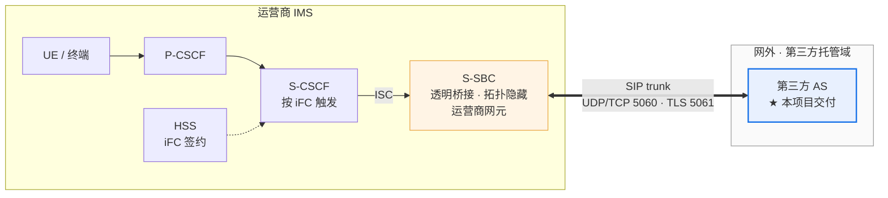
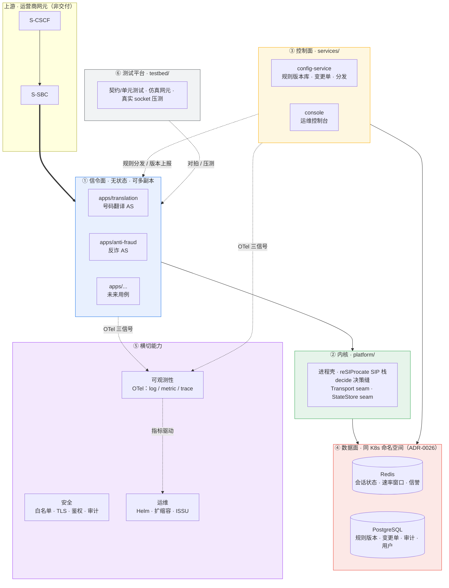
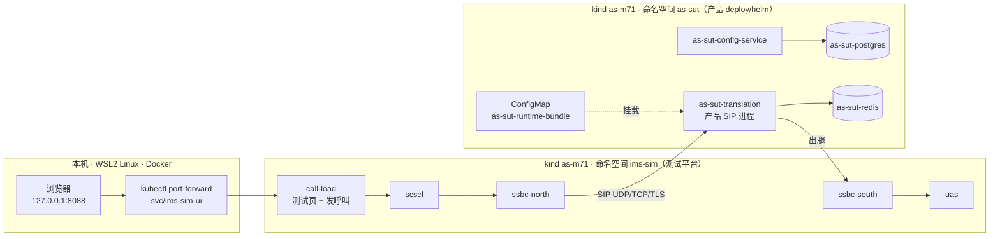
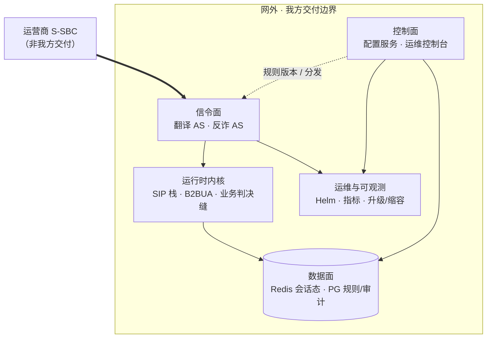

# Pre-M8 产品 Demo / Review 计划

> **状态（2026-10-08）**：故事 A/B 的现场走 kind `as-m71` 测试页。判决规则来自 config-service 编译 bundle。故事 C 的集群镜头已改到 `as-m71`，仍是 L1；7.2d 留在 `kind-as-m5`。故事 D/E 只补了口播。执行单是 [`2026-10-07-demo-on-m71-platform-plan.md`](2026-10-07-demo-on-m71-platform-plan.md)。
>
> **对象**：运营商业务配置人员、运维负责人、信令/集成工程师（**客户与干系人**）。  
> **目的**：在正式 M8 验收前，用可重复场景说明**产品做了什么**、边界在哪里。  
> **不是**：内部里程碑走读、研发过程汇报、test-plan 签收会。  
> **依据**：[`architecture/新系统整体架构.md`](../architecture/新系统整体架构.md)、[`requirements/prd.md`](../requirements/prd.md)。

证据目录（办方自用）：`artifacts/demo-review/<YYYY-MM-DD>/`。

---

## 1. 客户应带走的三句话

1. **我们是什么**：部署在 IMS **网外**的第三方 AS；S-CSCF 经运营商 **S-SBC** 按 iFC 触发；我们执行业务判决并把 SIP 结果送回（**不碰媒体、不做 CDR**）。
2. **我们交付什么**：可配置的 **号码翻译 / 反欺诈** 等用例进程 + **规则治理控制台** + **Kubernetes 部署与运维能力**（扩缩容、升级、可观测性接缝）。
3. **客户怎么用起来**：业务人员在 **HTTPS 控制台** 改规则并走 **审批**；信令面 **多副本无状态**，会话必要状态在 **Redis**；规则与审计在 **PostgreSQL**。

---

## 2. 产品介绍

产品由哪些单元组成，演示环境长什么样。对客户开场用 §2.6。架构全文在 [`新系统整体架构.md`](../architecture/新系统整体架构.md)。

### 2.1 在 IMS 网络中的位置

第三方 AS 仍由 S-CSCF 按 iFC 触发（3GPP TS 24.229）。运营商 S-SBC 做透明桥接：

- 对 S-CSCF，第三方 AS 就是网内 AS，消息由 S-CSCF 送出网。
- 对 AS，从 S-SBC 来的消息就是 S-CSCF 来的，AS 认为自己仍在网内。

AS 只实现一种接入语义：ISC（被 S-CSCF 触发）。S-SBC 是运营商网元，不是我方交付物。演示里用仿真器代替它。



产品不碰媒体（SDP 原样透传），不做 CDR、计费和合法监听（LI）。

### 2.2 整体架构



| 层 | 职责 | 有状态性 |
|---|---|---|
| ① 信令面 `apps/` | 用例进程，承载 SIP 呼叫与业务判决 | 无状态（必要状态外置 Redis） |
| ② 内核 `platform/` | 进程壳、SIP 栈与 B2BUA 控制、决策缝、两个可插拔 seam | 无状态 |
| ③ 控制面 `services/` | 规则治理（版本、审批、分发）、运维控制台 | 无状态（状态在 PG） |
| ④ 数据面 | Redis 存运行态，PG 存治理态 | 有状态，需冗余 |
| ⑤ 横切 | 可观测性、安全、运维 | 无状态（后端除外） |
| ⑥ testbed | 三层测试资产与仿真网元 | 研发资产，v1 不交付 |

部署形态是 Kubernetes + Helm，单租户 on-prem。compose 只用于开发和控制台演示。冗余目标是站点内 N+1、跨站点 1+1 温备，不做双活。

### 2.3 各单元

**产品（交付物）**

| 单元 | 代码位置 | 做什么 | 现状（2026-10-08） |
|---|---|---|---|
| 号码翻译 AS | `apps/translation` + `platform` | 接 S-SBC 来的 INVITE，按被叫前缀判决：翻译、转发、阻止或无匹配。翻译后以新 Call-ID 起出腿，接通后把入腿 BYE 转到出腿 | kind 上 UDP、TCP、TLS 都跑通。T1 `+8613800138000` 出腿用户 `013800138000`，T4 404，T5/F1 200，F2 603。TLS 出腿用 `sips:` |
| 运行时内核 | `platform/src/as_platform` | 进程壳、`SipStackService`、原生扩展 `_resip_runtime`（reSIProcate DUM）、`decide()` 决策缝、对端白名单、`/metrics` 与 `/health`（8080）、draining | 判决规则读 `AS_CONFIG_BUNDLE_PATH` 指向的已激活 bundle；`AS_RULESET_JSON` 非空时优先。进程不主动拉包 |
| 翻译出腿钩子 | `apps/translation/.../outbound.py` | 由 `AS_SIP_ROUTE_HOOK` 加载。按 `AS_TRANSLATION_RULES_JSON` 改号（去 `+86` 加 `0`），拼出腿 URI，下一跳是 S-SBC 南向 | bundle 带不了去前缀、加前缀，所以改号表仍走这个环境变量 |
| 反诈 AS | `apps/anti-fraud` | 主叫甄别，单腿拒绝 608（RFC 8688） | 判决模块和单测在。kind 上不起这个进程：它会和翻译抢 SIP 5060。F1/F2 由翻译进程内核转发或阻止 |
| config-service | `services/config-service` | 规则、变更单、审批（提交人不能自批）、编译 ConfigBundle、激活、分发通知、用户与会话、HMAC 审计。API 在 `/internal/v1` | kind 上由 lab values 打开，演示前用它走完四条规则的提案、审批、分发、激活。生产默认 `services.configService.enabled` 是 false |
| 运维控制台 | `services/console` | 纯 HTML/JS，由 config-service 从 `/` 提供。视图：Rules、Change orders、Call traces、Operations | 登录要求 HTTPS。演示在 compose（Caddy，`https://localhost:8443`）上看。kind `as-m71` 不提供控制台登录 |
| PostgreSQL | Helm `stateStores` | 规则版本、变更单、审计、控制台用户 | kind 上是 `as-sut-postgres` StatefulSet，由迁移 Job 建表 |
| Redis | Helm `stateStores` | 呼叫必要状态 checkpoint 的方向、速率窗口 | kind 上 `as-sut-redis` 在跑。进程重启后恢复呼叫（REQ-NF-1）没有签收 |
| Helm chart | `deploy/helm` | 用例 Deployment/Service、config-service、Ingress 模板、PG/Redis、迁移 Job、NetworkPolicy、HPA、PDB | 生产默认 fail-closed：TLS 开启时必须给证书 Secret，对端白名单不能为空 |
| 告警模板 | `deploy/alerts/as-alerts.yaml` | 比例类和状态类告警 | 没有 CPS 或并发的绝对值阈值，等容量研究 |
| 发布镜像 | `deploy/docker/Dockerfile` | 交付用的产品镜像 | 现在是进程壳，不带 SIP 监听。重开 M8 之前补上 |

**测试平台（不交付）**

| 单元 | 代码位置 | 做什么 |
|---|---|---|
| 仿真 S-CSCF | `testbed/simulators`，角色 `scscf` | 接测试页发出的呼叫，转给北向 S-SBC |
| 仿真 S-SBC 北向 / 南向 | 角色 `ssbc-north`、`ssbc-south` | 透明桥接：北向把呼叫送进产品 AS，南向把 AS 的出腿送到被叫。每跳在 Via、Record-Route、Contact 里写自己的 headless Service 名 |
| 仿真被叫 | 角色 `uas` | INVITE 回 200（带最小 SDP），BYE 回 200 |
| call-load 与测试页 | 角色 `ui` + `testbed/load` | 标准库 HTTP 页，不登录。选呼叫类型（T1、T4、T5、F1、F2）、传输、CPS、时长、保持时间、并发上限，点启动。显示每类的发出、接通、失败、响应码、建立时延、未拆除数。只向仿真 S-CSCF 发 SIP |
| 测试 CA | `python -m as_simulators issue-certs` | 安装时临时生成。不是运营商 PKI，页面横幅写「非运营商 PKI」 |
| 契约与对拍 | `testbed/contracts`、`testbed/probe` | 决策契约、SIP 基线（S1–S4 等）对拍 |
| 本机压测 harness | `testbed/load` | 真实 socket 发 SIP，统计响应码和 BYE。故事 E 的内部容量研究用它 |
| 本机控制台环境 | `deploy/compose` | PG、config-service、Caddy（HTTPS 8443）、迁移、初始管理员。故事 A 的控制台在这里 |

测试页统计的是本轮次数，不是容量承诺。直接从 call-load 打产品 SIP 会被网络策略丢掉（超时），这是期望行为。

### 2.4 当前演示的 infra



`ims-sim` 里的 `scscf`、`ssbc-north`、`ssbc-south`、`uas`、`call-load` 各是一个 Deployment（1 副本、1 容器、1 进程，镜像 `ims-sim:dev`，`--role` 区分）。浏览器打开的是测试页，不是产品控制台。产品控制台在 compose 的 `https://localhost:8443`，不在这个集群上。

一个 kind 节点，两个 namespace 共用 Calico Pod 网段 `192.168.0.0/16`。NetworkPolicy：call-load 只能连 `scscf`；产品翻译 Pod 的 SIP 只和两个仿真 S-SBC 通。ConfigMap `as-sut-runtime-bundle` 挂到翻译进程的 `/etc/as/bundle/bundle.json`。

| 项 | 值 |
|---|---|
| 主机 | WSL2 Linux，Docker 引擎 |
| 工具 | `kind` v0.29.0、`kubectl`、`helm`，放在 `.tools/m71-bin` |
| 集群 | kind `as-m71`，context `kind-as-m71`，一个 control-plane 节点 `kindest/node:v1.33.1` |
| 网络 | Calico v3.28.2。两个 namespace 共用 Pod 网段 `192.168.0.0/16` |
| 镜像 | `ims-sim:dev`（`testbed/sim-platform/Dockerfile`）；`as-sut:dev`（`testbed/sim-platform/Dockerfile.product`，把本机编好的 `_resip_runtime` 和 reSIProcate 库拷进去）；`as-config-service:m71-lab`（`deploy/docker/config-service.Dockerfile`）。都用 `kind load` 装进节点 |
| Helm | `ims-sim` 用 `testbed/sim-platform/chart`；`as-sut` 用产品 chart `deploy/helm`，叠加 `values-product-as.yaml` 和 `values-product-as-bundle.yaml` |
| Secret | `ims-sim-test-ca`（两个命名空间）、`as-sut-test-tls`（产品 TLS）、`as-sut-config-runtime`（lab 数据库与审计密钥） |
| 规则 | 判决规则：ConfigMap `as-sut-runtime-bundle`，四条 `t1-plus86`、`t5-forward`、`f1-allow`、`f2-block`。改号表：`AS_TRANSLATION_RULES_JSON` 里的 `t1-plus86` |
| 网络策略 | call-load 只能连 `scscf`。产品 SIP 只收北向 S-SBC 的 5060/5061 和南向 S-SBC 的回包；出向只到两个 S-SBC、Redis 和 DNS。指标端口 8080 放开 |
| 访问 | 只有测试页经 `port-forward` 到本机 `8088`。没有 Ingress |
| 安装 / 清理 | 安装见 §4「会前」，清理见 §4「下场」。干净的定义见 §4「干净」 |

kind `as-m5` 是另一个集群，只放 7.2d 的 Ingress 登录证据，不属于本场环境。

### 2.5 讲解时值得带上的几点

- **规则怎么到进程。** 控制台或 API 改规则 → 变更单 → 另一人审批 → config-service 编译不可变版本 → 分发通知（只带 change id、版本号）→ 激活。本场由脚本把已激活的 bundle 写进 ConfigMap 挂进 Pod，进程启动时读文件。进程不主动拉包。
- **一种接入语义。** 只做 ISC；trunk 是承载，不是第二种业务。
- **一进程一用例。** 每个用例是独立进程、故障域和扩缩容边界。这也是反诈进程本场不起的原因：两个进程会抢同一 SIP 端口。
- **SIP 结果码。** 无匹配 404，让 S-CSCF 继续 iFC 链；阻止 603；反诈进程的拒绝是 608。本场 F2 是 603。
- **安全边界。** 对端白名单 + TLS + 网络策略三层。控制台登录要求 HTTPS，提交人不能自批，操作写审计。不参与 LI。
- **扩缩容。** 指标 `as_active_calls`；缩容先 draining，活跃呼叫归零才删 Pod。HPA 阈值等容量研究，现在不填。
- **本场不签的东西。** REQ-S-2 / REQ-S-3（测试 CA）、REQ-S-4（测试页不是控制台）、REQ-NF-1（呼叫恢复）、容量数字。M8 仍搁置。

### 2.6 演示开场一张图

对客户只讲五块交付，不讲仓库目录名：



| 对客户说的块 | 做什么 | 本场看什么 |
|--------------|--------|-------------|
| **信令面** | 接住 trunk INVITE，按规则翻译、拒绝、转发 | 测试页经仿真 S-CSCF / S-SBC 打到产品 AS：T1 200、T4 404、F2 603 |
| **运行时内核** | reSIProcate、双腿语义、UDP/TCP/TLS、白名单 | 三种传输各跑一轮，BYE 拆干净；TLS 出腿 `sips:` |
| **控制面** | 规则、变更单、审批、分发、用户与会话 | compose 上的 HTTPS 控制台；kind 上判决规则来自 config-service 编译的 bundle |
| **数据面** | Redis checkpoint 方向；PG 治理与审计 | `as-sut-redis`、`as-sut-postgres` 在跑；呼叫恢复不签 |
| **运维** | 容器化、Helm、draining、指标、告警模板 | `as-m71` 两个命名空间的 Deployment、`as_active_calls`、告警 YAML |

testbed 只在对技术观众解释「怎么验证行为」时提及，不作为产品交付物对外陈述。

---

## 3. 交付能力地图（按「做了什么」组织）

下列能力与 PRD 用户故事 / REQ 族对应；演示按 **能力** 选场，不按研发阶段。

### 3.1 呼叫与业务判决（信令 + 内核）

| 能力 | 客户价值 | 典型 SIP 结果 | 演示方式（本地） |
|------|----------|---------------|------------------|
| **基本呼叫接通** | iFC 触发后 AS 能完成对话建立 | 100/180/200… | 契约对拍 S1 形状（见附录 A-信令） |
| **无匹配业务** | S-CSCF 可继续 iFC 链 | **404** | 空规则集进程壳或 S2 对拍 |
| **策略拒绝（反诈形状）** | 命中阻止号段立即拒绝 | **603** | 反诈/翻译 `decide()` + S3 对拍 |
| **号码翻译（双腿）** | 新 Call-ID 出腿，被叫改写 | 200 + 第二腿 INVITE | 决策演示 + FORWARD 集成测 |
| **下游忙** | 合理映射忙信号 | **486** | FORWARD 第二腿 486 映射 |
| **主叫取消** | 早 cancel 不挂死 | **487** | S4 对拍（故事 B 步骤 5 一键；见 `test_e1_s4_*`） |
| **SDP 透传** | 不碰媒体，offer 字节一致 | SDP body 不变 | SDP 字节对比集成测 |
| **反诈单腿** | 主叫甄别拒绝 | **608**（RFC 8688） | `apps/anti-fraud` 判决用例（可无 socket） |

### 3.2 配置治理（控制面）

| 能力 | 客户价值 | v1 范围 | 演示方式 |
|------|----------|---------|----------|
| **规则管理（被叫 + 前缀）** | 按号段绑定翻译/拒绝等 | **不含**主叫/正则（v1.1） | 控制台创建/变更 + PG 管道集成测 |
| **变更单与审批** | 防误操作 | 提交人不可自批 | 双账号浏览器：draft → submit → approve/reject |
| **规则编译与激活** | 运行时可消费的 ConfigBundle | `runtime_bundle` 纯函数 + 激活 API | 展示激活后 bundle 形态（可导出 JSON） |
| **分发与回滚** | 多实例一致版本 | Fleet 通知 + 健康占位 | Operations UI + fleet API 测 |
| **身份与会话** | 控制台安全登录 | 密码会话、HTTPS、CSRF | compose 登录 +（可选）kind Ingress 登录 |
| **操作审计** | 谁改了什么 |  append-only 审计 | API/库表说明 + 集成测摘要 |

### 3.3 安全与接入

| 能力 | 客户价值 | 演示方式 | 现场限制 |
|------|----------|----------|----------|
| **控制台 HTTPS 同源** | 浏览器与 API 同域 | `deploy/compose` + Caddy | 自签证书 |
| **SIP 对端约束** | 只信运营商 trunk | peer allowlist / TLS 缝 | loopback 策略测；**非**运营商 PKI 实网 |
| **SIP TLS** | trunk 加密 | TLS runtime smoke | 本地证书 |
| **证书轮换接缝** | 运维可热更证 | 文档 + 单测 | 完整双证重叠窗 → 运营商环境 |

### 3.4 可靠性与会话

| 能力 | 客户价值 | 演示方式 | 现场限制 |
|------|----------|----------|----------|
| **会话 checkpoint（方向）** | 进程重启后恢复对话 | Redis + establish 回调 + D10 harness | **非**客户 K8s 正式 NF-1 签收 |
| **优雅下线 / ISSU** | 升级少掉话 | draining + readiness 503 | kind 证据（可模拟 `active_calls`） |
| **缩容保护** | 不在有活呼叫时缩掉实例 | downscale runbook + 判据 | 运维脚本层，非全自动 actuator |
| **Redis Sentinel 接线** | 站点内 Redis HA | 客户端解析与单测 | 可不拉真 Sentinel 集群 |

### 3.5 运维、容量与可观测

| 能力 | 客户价值 | 演示方式 | 话术 |
|------|----------|----------|------|
| **Kubernetes 部署** | 标准 on-prem 交付 | Helm chart、kind Pod Running | 对照 `deploy/helm/README.md` |
| **指标** | 容量与故障发现 | `/metrics` 中 `as_active_calls` 等 | M5 可为模拟值；真呼叫计数走信令路径 |
| **告警规则集** | 开箱监控模板 | `deploy/alerts/as-alerts.yaml` | **无** CPS 绝对值阈值（待容量研究填） |
| **容量研究方法** | 为 HPA/扩容提供依据 | 产品路径 as_load + 内部 O1 报告 | **仅内部研究**，不对外 SLA |

---

## 4. 现场步骤（M7.1 之后）

现场是 kind `as-m71`。在仓库根目录执行。`kubectl` 不在 PATH 上时，把 `.tools/m71-bin` 加进去。脚本与日志：[`scripts/demo-review/README.md`](../../scripts/demo-review/README.md)，`artifacts/demo-review/<date>/story-*/`。执行记录：[`2026-10-07-demo-on-m71-platform-plan.md`](2026-10-07-demo-on-m71-platform-plan.md)。

每步三栏：**做什么**是操作，**看什么**是通过标准，**说明什么**是对客户说的话。本场不签 REQ-S-2 / REQ-S-3 / REQ-S-4。

开场之前必须是下面定义的干净环境。Pod 由会前两条安装脚本创建，不是开场命令创建的。下场把环境收回干净。

### 干净

**前置，清理脚本不碰**

| 项 | 说明 |
|---|---|
| Docker 引擎 | 在跑。基础镜像缓存留下，例如 `kindest/node`、`python`、`postgres`、`redis` |
| `kind`、`kubectl`、`helm` | 在 PATH 上，或在仓库 `.tools/m71-bin` |
| `uv`、Python 3.10、`make`、C 工具链 | 会前要编原生 SIP 模块 |
| 本机 reSIProcate 缓存 | `.cache/m2-resiprocate` 和已编好的 `_resip_runtime*.so`。没有 `.so` 时，会前的 `make m2-platform-resip-build` 会编 |
| 网络 | 能拉镜像。本机走代理时，自己导出 `http_proxy` / `https_proxy` |
| 别的 kind 集群 | 例如 `as-m5` 上的 7.2d。本场只删 `as-m71` |

**干净：demo 开始前和结束后都要这样**

- `kind get clusters` 里没有 `as-m71`
- 本机没有镜像标签 `ims-sim:dev`、`as-sut:dev`、`as-config-service:m71-lab`
- 没有把 `ims-sim-ui` 转到本机 `8088`、或把 Postgres 转到本机 `15432` 的 `kubectl port-forward`
- 没有名为 `as-d10-redis` 的本机容器

```bash
bash scripts/demo-review/reset-m71-between-demos.sh --check
```

打印 `as-m71 demo environment is clean` 并以 0 退出。

### 会前：把环境带起来

这一步不对客户展示。先确认干净。不干净就先跑下场的清理，再装。

**做什么**

```bash
bash scripts/demo-review/reset-m71-between-demos.sh --check
uv sync
make m2-platform-resip-build
bash testbed/sim-platform/kind-up.sh
bash scripts/demo-review/publish-m71-bundle.sh
```

`make m2-platform-resip-build` 编出产品 SIP 用的原生模块，`kind-up.sh` 把它拷进实验镜像。`kind-up.sh` 创建 kind 集群 `as-m71`（Pod 从这里出现），装 Calico 和网络策略，发测试证书，构建并加载 `ims-sim:dev`、`as-sut:dev`、`as-config-service:m71-lab`，再用 Helm 装 `ims-sim` 和 `as-sut`。`publish-m71-bundle.sh` 在 config-service 里走完四条判决的提案、批准、分发、激活，把 bundle 挂进翻译进程。

两条安装脚本把 `http_proxy` / `https_proxy` 传给 `docker build`。第一次构建镜像要十几分钟。

**看什么**

`--check` 先通过。`kind-up.sh` 以 0 退出，并打印测试页的 `port-forward` 提示。`publish-m71-bundle.sh` 以 0 退出，并打印 `translation is reading the compiled bundle`。只跑了 `kind-up.sh`、没跑发布脚本时，翻译进程仍读 `AS_RULESET_JSON`，开场检查失败。

**说明什么**

会前不向客户讲。集群、三个实验镜像和编译 bundle 都是这场拉起来的，结束时删掉。

### 开场

**做什么**

```bash
kubectl --context kind-as-m71 -n ims-sim get deploy
kubectl --context kind-as-m71 -n as-sut get deploy
kubectl --context kind-as-m71 -n as-sut exec deploy/as-sut-translation -- python -c '
import os
path = os.environ.get("AS_CONFIG_BUNDLE_PATH", "")
rules = os.environ.get("AS_RULESET_JSON", "")
rewrite = os.environ.get("AS_TRANSLATION_RULES_JSON", "")
print("AS_CONFIG_BUNDLE_PATH", path)
print("AS_RULESET_JSON", repr(rules))
print("AS_TRANSLATION_RULES_JSON", rewrite)
assert path.endswith("/etc/as/bundle/bundle.json"), path
assert not rules.strip(), rules
assert "t1-plus86" in rewrite and "strip_prefix" in rewrite and "+86" in rewrite and "add_prefix" in rewrite
'
if kubectl --context kind-as-m71 -n as-sut get deploy as-sut-anti-fraud >/dev/null 2>&1; then
  echo "anti-fraud deployment is present" >&2
  exit 1
fi
echo "anti-fraud deployment absent"
kubectl --context kind-as-m71 -n ims-sim port-forward svc/ims-sim-ui 8088:8088
```

浏览器打开 `http://127.0.0.1:8088`。

**看什么**

`ims-sim` 的 `scscf`、`ssbc-north`、`ssbc-south`、`uas`、`call-load` 为 Ready。`as-sut` 的 `as-sut-translation`、`as-sut-redis`、`as-sut-config-service` 为 Ready。Python 以 0 退出：`AS_CONFIG_BUNDLE_PATH` 以 `/etc/as/bundle/bundle.json` 结尾，`AS_RULESET_JSON` 为空，改号表里有 `t1-plus86`、`strip_prefix`、`+86`、`add_prefix`。打印 `anti-fraud deployment absent`。页标题是「IMS 模拟平台」，横幅是「非运营商 PKI」，并写明测试工具不登录。

`printenv AS_RULESET_JSON` 不能用来判断：变量未设置时 `printenv` 自己退出 1。

**说明什么**

这是仿真 IMS 加产品 Helm AS 的实验室。测试页没有登录，证书是测试 CA，横幅写的是非运营商 PKI。这不是产品控制台。

### 故事 A — 开通翻译号段

**做什么**

控制台是可选项，在 compose 的 `https://localhost:8443`（自签证书）：管理员登录，建审批员，打开被叫前缀规则、变更单、审批、分发。`bash scripts/demo-review/story-a.sh --with-compose` 只在 `.env` 和证书齐全时跑 `smoke-https`。

信令在测试页：勾选 T1、T4、T5、F1、F2。持续时间 3 秒，目标 CPS 5，保持时间 0.2 秒，最大并发呼叫 8。传输选 UDP，点启动，等到「当次结果」不再运行。脚本替身：`make demo-story-a`（可加 `--skip-pg`）。

**看什么**

T1 的响应码里有 200，T4 有 404。产品日志里有出腿用户 `013800138000`：

```bash
log="$(kubectl --context kind-as-m71 -n as-sut logs deploy/as-sut-translation --since=3m)"
printf '%s\n' "$log" | grep -F '013800138000'
printf '%s\n' "$log" | grep -F 'OUTBOUND_BYE_FORWARD'
```

两条 `grep` 都以 0 退出。页脚未拆除是 0。次数不必是 200×9。

**说明什么**

四条判决（T1 翻译、T5/F1 转发、F2 阻止）来自 config-service 编译并挂上的 bundle，进程读 `AS_CONFIG_BUNDLE_PATH`。`+86` 改成 `0` 开头仍是翻译应用的 `AS_TRANSLATION_RULES_JSON`，bundle 带不了 strip/add。进程不拉包。控制台 HTTPS 登录不在这个集群；compose 那一页才是控制台。

### 故事 B — 拦截诈骗号段

**做什么**

同一页、同一组参数，传输改成 TCP，再改成 TLS，各启动一轮。UDP 已在故事 A 看过就可以不再跑；三轮都要留记录时再跑 UDP。脚本替身：`make demo-story-b`。

主叫取消 487 和反诈进程的 608 不在这页上打。脚本后半是本机单测：`test_e1_s4_*`、`apps/anti-fraud/tests/test_decision.py`。

**看什么**

| 类型 | 响应码 |
|---|---|
| T1 | 200 |
| T4 | 404 |
| T5 | 200 |
| F1 | 200 |
| F2 | 603，不出现 608 |

页脚未拆除是 0。页上写明这不是容量承诺。次数不必每轮都是 200×9、404×3、603×3。TLS 那一轮之后：

```bash
log="$(kubectl --context kind-as-m71 -n as-sut logs deploy/as-sut-translation --since=3m)"
printf '%s\n' "$log" | grep -F 'sips:013800138000'
```

这条 `grep` 以 0 退出。三条检查要分开做；用 `|` 把两句合成一条 `grep` 时，只命中一句也会退出 0。

**说明什么**

F2 被叫前缀 `+15550003` 得到 603。这条阻止规则在编译 bundle 里。608 属于另一个反诈进程，这条网上没起，因为它会和翻译抢 5060。487 只是契约形状，不是第一版呼叫类型，不在这个集群上演示。

### 故事 C — 平台能运维

**做什么**

开场的两个 `get deploy` 就是集群镜头。再读翻译进程的指标。脚本替身：`make demo-story-c`。

```bash
kubectl --context kind-as-m71 -n as-sut exec deploy/as-sut-translation -- \
  python -c 'import urllib.request; t=urllib.request.urlopen("http://127.0.0.1:8080/metrics").read().decode(); print([l for l in t.splitlines() if l.startswith("as_active_calls")])'
```

7.2d 的 Ingress 登录留在 `kind-as-m5`。设了 `M5_7_2D_E2E_PASSWORD` 且那个 context 还在时，才跑 `make m5-7.2d-evidence`。没有就跳过。

chart-check、draining 单测、告警 YAML 头部由 `story-c.sh` 带出。人工只看集群和这一行指标即可。

**看什么**

`ims-sim` 五个仿真 Deployment 和 `as-sut` 的翻译、Redis、config-service 为 Ready。反诈 Deployment 不存在。指标打出一行 `as_active_calls`。告警文件 `deploy/alerts/as-alerts.yaml` 里没有 CPS 绝对值。

**说明什么**

这是 L1：Helm 契约、指标和告警模板的形态。反诈进程没起，F1/F2 的 603 在翻译进程上。这一行 `as_active_calls` 只说明指标在。生产告警和缩容没有在这里闭环。测试页不是 7.2d 的控制台登录。详见 [`m5-full-chain-review-2026-10-05.md`](../reviews/m5-full-chain-review-2026-10-05.md) 与 F10 对账。

### 故事 D — 通话不随便丢

**做什么**

看开场里 `as-sut-redis` 已是 Ready。测量脚本不改，需要时另跑：`AS_REDIS_URL=redis://127.0.0.1:6379/0 make demo-story-d`。那条用的是本机 Redis，不是客户集群。

**看什么**

`as-sut-redis` 为 Ready。本机 harness 若跑了，日志在 `artifacts/demo-review/<date>/story-d/`。

**说明什么**

多副本无状态，必要会话状态 checkpoint 到 Redis。`as-sut` 里 Redis 在跑。正式杀 Pod 和上游 BYE 在客户 K8s 上做，Close 前不做，这不是 REQ-NF-1 签收。

### 故事 E — 我们能扛多少

**做什么**

打开 [`m6-o1-measurement-report-2026-10-05.md`](../acceptance/m6-o1-measurement-report-2026-10-05.md) 前 45 行。测试页上刚跑的次数不抄进这份报告。完整批次是可选项：`make demo-story-e` 加 `--full-o1`。

**看什么**

报告写的是 dev-host 样本和研究方法。正文里没有本场 `as-m71` 测试页的几秒计数。

**说明什么**

这是内部容量研究方法，不是对外 CPS 或并发 SLA。HPA 阈值等 O1 结论之后再填。

### 下场

**做什么**

```bash
bash scripts/demo-review/reset-m71-between-demos.sh
```

**看什么**

脚本以 0 退出，并打印 `as-m71 demo environment is clean`。`kind get clusters` 里没有 `as-m71`。三个实验镜像标签没有了。`8088` 和 `15432` 的端口转发停了。`as-m5` 和其他基础镜像还在。

**说明什么**

环境回到会前的干净状态。下一场要从「会前：把环境带起来」重新装，不能从开场接着查 Pod。

## 5. 场次套餐（按观众选能力包）

| 套餐 | 时长 | 故事 | 观众 |
|------|------|------|------|
| **业务半天** | 3–4 h | A + B（控制台为主，信令桥接） | 运营商业务配置 |
| **信令半天** | 3–4 h | B + A-5 + SDP/486/487 | 核心网/集成 |
| **运维半天** | 3–4 h | C + D（轻） | 平台 SRE |
| **全景日** | 6–8 h | A → B → C →（可选 E） | 联合评审 |
| **远程 90 min** | 1.5 h | §2.6 开场图 + 故事 A 精简（仅控制台 + 一条 404/603 对拍录屏） | 管理层 |

---

## 6. 环境怎么选（对客户怎么说）

| 环境 | 代表什么 | 适合故事 |
|------|----------|----------|
| **`deploy/compose`** | 单机 dev：**真实** PG + config-service + HTTPS 控制台 | A、B 控制面 |
| **Loopback + 进程壳** | 信令行为，仿真 S-SBC | A-5、B、D 信令部分 |
| **kind `as-m71`** | 仿真 IMS + 产品 Helm AS。测试页不是控制台 | A 的信令、B、C 的集群镜头 |
| **kind `as-m5`** | 7.2d Ingress 登录证据。不搬到 `as-m71` | C 的可选登录步 |
| **内部 O1 报告** | 容量 **研究**证据 | E |

会前技术准备见 **附录 B**；脚本说明见 [`scripts/demo-review/README.md`](../../scripts/demo-review/README.md)。

---

## 7. 演示边界（必须主动说明）

对客户 **不要** 暗示已验收或未交付的能力：

| 话题 | 怎么说 |
|------|--------|
| **S-SBC / 运营商 PKI** | 我方在 kind `as-m71` 的仿真 S-SBC 和测试 CA 上验证行为；与贵司 S-SBC 对接是集成项目 + M8 环境证据。 |
| **Call-ID 全轨迹查询（US-3）** | 产品设计方向有；**控制台 live trace 未交付**，投诉追溯 M8/后续版本。 |
| **主叫/正则规则** | v1 仅 **被叫 + 前缀**；主叫/正则列入 v1.1。 |
| **规则自动推到 SIP Pod** | 治理与编译已交付；**到场联调**可用 bundle 文件注入；生产拉取方式由部署约定闭合。 |
| **HPA 数字 / CPS SLA** | 仅有内部测量方法学与 dev-host 样本，**不**作商业容量承诺。 |
| **CDR / LI / 媒体** | 明确非目标（PRD）。 |

---

## 8. Review 记分表（按能力，非里程碑）

| 能力域 | 问题 | 1–3 |
|--------|------|-----|
| 定位 | 网外 AS + S-SBC 语义是否清晰？ | |
| 翻译 | 双腿与号段规则是否符合预期？ | |
| 反诈 | 603/608 策略是否可接受？ | |
| 治理 | 审批与审计是否满足运维制度？ | |
| 安全 | HTTPS/TLS/白名单叙述是否可信？ | |
| 可靠性 | 升级/缩容/checkpoint 预期是否对齐？ | |
| 部署 | K8s/Helm 形态是否满足采购预期？ | |
| 容量 | 是否理解「研究 vs SLA」区分？ | |
| 缺口 | §7 中哪几条需写入合同/集成计划？ | |

---

## 附录 A — 办方速查

```bash
# 全会前冒烟（有 Redis 时含 D）
AS_REDIS_URL=redis://127.0.0.1:6379/0 make demo-review-all

# 分故事
make demo-story-a    # 加 --with-compose：见 scripts/demo-review/story-a.sh
make demo-story-b
make demo-story-c
AS_REDIS_URL=redis://127.0.0.1:6379/0 make demo-story-d
make demo-story-e
```

浏览器控制台：[`m4b-8-runbook.md`](../acceptance/m4b-8-runbook.md)（compose，不是 `as-m71` 测试页）。本场集群镜头：[`m71-sim-platform-evidence.md`](../acceptance/m71-sim-platform-evidence.md)。7.2d 仍见 [`m5-7.2d-ingress-runbook.md`](../acceptance/m5-7.2d-ingress-runbook.md)。

---

## 附录 B — 会前检查（办方自用）

| 检查项 | 命令/条件 |
|--------|-----------|
| 依赖 | `uv sync` |
| 一键验证 | `AS_REDIS_URL=redis://127.0.0.1:6379/0 make demo-review-all` |
| Native SIP | `make m2-platform-resip-build`（A/B/D/E 脚本会按需构建） |
| Compose（故事 A 现场 UI） | `deploy/compose` + `story-a.sh --with-compose` |
| Kind（故事 C 集群镜头） | `kubectl` context `kind-as-m71` |
| 7.2d 浏览器 | `M5_7_2D_E2E_PASSWORD`，且 context 仍是 `kind-as-m5` |
| Redis（故事 D） | `docker run -d --name as-d10-redis -p 6379:6379 redis:7`。下场脚本会删掉这个容器 |

---

## 附录 C — 文档索引（内部追溯）

| 文档 | 用途 |
|------|------|
| [`prd.md`](../requirements/prd.md) | 用户故事与 REQ |
| [`新系统整体架构.md`](../architecture/新系统整体架构.md) | 分层与部署 |
| [`m4b-8-runbook.md`](../acceptance/m4b-8-runbook.md) | 控制台步骤 |
| [`test-plan.md`](../acceptance/test-plan.md) | M8 正式验收（非本场） |
| [`plan.md`](../plan.md) §4 | 仅内部：工程关门记录 |

**维护**：能力或 PRD 变更时更新 §3 表格与故事步骤；附录命令随脚本改名而改。
