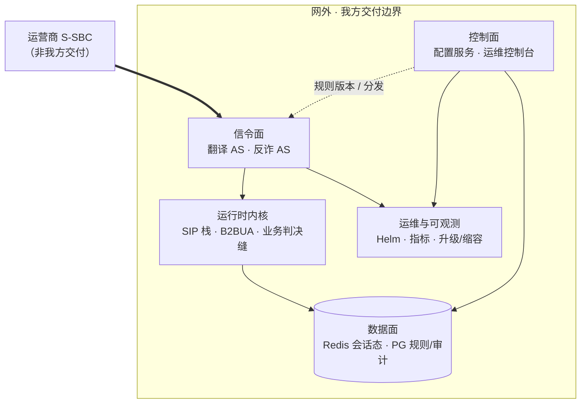

# Pre-M8 产品 Demo / Review 计划

> **状态（2026-10-07）**：M7.1 已工程关门。本文和 `scripts/demo-review/` 尚未改接到那个 kind 平台。重评是下一步，这次还没开始。
>
> **对象**：运营商业务配置人员、运维负责人、信令/集成工程师（**客户与干系人**）。  
> **目的**：在正式 M8 验收前，用可重复场景说明**产品做了什么**、边界在哪里。  
> **不是**：内部里程碑走读、研发过程汇报、test-plan 签收会。  
> **依据**：[`architecture/新系统整体架构.md`](../architecture/新系统整体架构.md)、[`requirements/prd.md`](../requirements/prd.md)。

证据目录（办方自用）：`artifacts/demo-review/<YYYY-MM-DD>/`。

---

## 1. 客户应带走的三句话

1. **我们是什么**：部署在 IMS **网外**的第三方 AS；S-CSCF 经运营商 **S-SBC** 按 iFC 触发；我们执行业务判决并把 SIP 结果送回（**不碰媒体、不做 CDR**）。
2. **我们交付什么**：可配置的 **号码翻译 / 反欺诈** 等用例进程 + **规则治理控制台** + **Kubernetes 部署与运维能力**（扩缩容、升级、可观测性接缝）。
3. **客户怎么用起来**：业务人员在 **HTTPS 控制台** 改规则并走 **审批**；信令面 **多副本无状态**，会话必要状态在 **Redis**；规则与审计在 **PostgreSQL**。

---

## 2. 架构视角（演示开场一张图）

与 [`新系统整体架构.md`](../architecture/新系统整体架构.md) §2 一致，对客户只讲 **五块交付**，不讲仓库目录名：



| 对客户说的块 | 做什么 | v1 演示侧重 |
|--------------|--------|-------------|
| **信令面** | 接住 trunk INVITE，按规则翻译/拒绝/转发 | loopback 或 testbed 仿真 S-SBC |
| **运行时内核** | reSIProcate + 双腿/单腿语义、TLS、白名单缝 | 真 UDP/TLS socket 行为 |
| **控制面** | 规则 CRUD、变更单、审批、分发、用户与会话 | compose 同源 HTTPS 控制台 |
| **数据面** | Redis checkpoint 方向；PG 治理与审计 | 控制台 + Redis 恢复 harness |
| **运维** | 容器化、Ingress HTTPS、draining、告警规则模板 | kind 集群（可选半场） |

**testbed** 仅在对技术观众解释「如何验证行为」时提及，**不作为产品交付物**对外陈述。

---

## 3. 交付能力地图（按「做了什么」组织）

下列能力与 PRD 用户故事 / REQ 族对应；演示按 **能力** 选场，不按研发阶段。

### 3.1 呼叫与业务判决（信令 + 内核）

| 能力 | 客户价值 | 典型 SIP 结果 | 演示方式（本地） |
|------|----------|---------------|------------------|
| **基本呼叫接通** | iFC 触发后 AS 能完成对话建立 | 100/180/200… | 契约对拍 S1 形状（见附录 A-信令） |
| **无匹配业务** | S-CSCF 可继续 iFC 链 | **404** | 空规则集进程壳或 S2 对拍 |
| **策略拒绝（反诈形状）** | 命中阻止号段立即拒绝 | **603** | 反诈/翻译 `decide()` + S3 对拍 |
| **号码翻译（双腿）** | 新 Call-ID 出腿，被叫改写 | 200 + 第二腿 INVITE | 决策演示 + FORWARD 集成测 |
| **下游忙** | 合理映射忙信号 | **486** | FORWARD 第二腿 486 映射 |
| **主叫取消** | 早 cancel 不挂死 | **487** | S4 对拍（故事 B 步骤 5 一键；见 `test_e1_s4_*`） |
| **SDP 透传** | 不碰媒体，offer 字节一致 | SDP body 不变 | SDP 字节对比集成测 |
| **反诈单腿** | 主叫甄别拒绝 | **608**（RFC 8688） | `apps/anti-fraud` 判决用例（可无 socket） |

### 3.2 配置治理（控制面）

| 能力 | 客户价值 | v1 范围 | 演示方式 |
|------|----------|---------|----------|
| **规则管理（被叫 + 前缀）** | 按号段绑定翻译/拒绝等 | **不含**主叫/正则（v1.1） | 控制台创建/变更 + PG 管道集成测 |
| **变更单与审批** | 防误操作 | 提交人不可自批 | 双账号浏览器：draft → submit → approve/reject |
| **规则编译与激活** | 运行时可消费的 ConfigBundle | `runtime_bundle` 纯函数 + 激活 API | 展示激活后 bundle 形态（可导出 JSON） |
| **分发与回滚** | 多实例一致版本 | Fleet 通知 + 健康占位 | Operations UI + fleet API 测 |
| **身份与会话** | 控制台安全登录 | 密码会话、HTTPS、CSRF | compose 登录 +（可选）kind Ingress 登录 |
| **操作审计** | 谁改了什么 |  append-only 审计 | API/库表说明 + 集成测摘要 |

### 3.3 安全与接入

| 能力 | 客户价值 | 演示方式 | 现场限制 |
|------|----------|----------|----------|
| **控制台 HTTPS 同源** | 浏览器与 API 同域 | `deploy/compose` + Caddy | 自签证书 |
| **SIP 对端约束** | 只信运营商 trunk | peer allowlist / TLS 缝 | loopback 策略测；**非**运营商 PKI 实网 |
| **SIP TLS** | trunk 加密 | TLS runtime smoke | 本地证书 |
| **证书轮换接缝** | 运维可热更证 | 文档 + 单测 | 完整双证重叠窗 → 运营商环境 |

### 3.4 可靠性与会话

| 能力 | 客户价值 | 演示方式 | 现场限制 |
|------|----------|----------|----------|
| **会话 checkpoint（方向）** | 进程重启后恢复对话 | Redis + establish 回调 + D10 harness | **非**客户 K8s 正式 NF-1 签收 |
| **优雅下线 / ISSU** | 升级少掉话 | draining + readiness 503 | kind 证据（可模拟 `active_calls`） |
| **缩容保护** | 不在有活呼叫时缩掉实例 | downscale runbook + 判据 | 运维脚本层，非全自动 actuator |
| **Redis Sentinel 接线** | 站点内 Redis HA | 客户端解析与单测 | 可不拉真 Sentinel 集群 |

### 3.5 运维、容量与可观测

| 能力 | 客户价值 | 演示方式 | 话术 |
|------|----------|----------|------|
| **Kubernetes 部署** | 标准 on-prem 交付 | Helm chart、kind Pod Running | 对照 `deploy/helm/README.md` |
| **指标** | 容量与故障发现 | `/metrics` 中 `as_active_calls` 等 | M5 可为模拟值；真呼叫计数走信令路径 |
| **告警规则集** | 开箱监控模板 | `deploy/alerts/as-alerts.yaml` | **无** CPS 绝对值阈值（待容量研究填） |
| **容量研究方法** | 为 HPA/扩容提供依据 | 产品路径 as_load + 内部 O1 报告 | **仅内部研究**，不对外 SLA |

---

## 4. 演示故事（详细步骤 + 一键脚本）

脚本目录：[`scripts/demo-review/`](../../scripts/demo-review/README.md)（`make demo-story-a` … `make demo-review-all`）。  
每场日志与摘要：`artifacts/demo-review/<date>/story-*/`。

**验证状态（本机 2026-10-05）**：A/B/D/E 全自动路径已跑通；A 在 compose PG + `--with-compose` 下 pipeline 集成绿；C 在无 `kind-as-m5` 时降级为 chart-check + 单测 + 文档摘要（集群段需 kind）。

---

### 故事 A — 「开通翻译号段」

**PRD**：US-1、US-4。**一键**：`make demo-story-a` 或 `bash scripts/demo-review/story-a.sh [--with-compose] [--skip-pg]`

| 步 | 做什么 | 对客户展示什么 | 执行方式 |
|----|--------|----------------|----------|
| 1 | 控制台双角色 | HTTPS 同源 UI、用户/审批分离 | **人工**：`https://localhost:8443`；脚本 `--with-compose` 仅跑 `smoke-https` |
| 2 | 规则全生命周期 | 被叫+前缀 → 变更单 → 审批 → 分发 → 激活 | **人工** 或 **自动**：PG 集成测 `test_managed_rule_proposal_submit_approve_distribute_and_activate_compiled_bundle`（需 compose Postgres `:55432`） |
| 3 | 规则编译 | ManagedRule → ConfigBundle JSON | 自动：`test_runtime_bundle.py`；样例 `fixtures/bundle-forward-86755.json` |
| 4 | 信令桥接 | 激活 bundle 如何进翻译 AS | **话术**：生产走分发通道；演示 `AS_CONFIG_BUNDLE_PATH=<bundle> AS_ENABLE_SIP_RUNTIME=1 uv run python -m as_platform` |
| 5 | SIP 验证 | 无匹配 **404**；双腿 **FORWARD/486** | 自动：`test_e1_s2_*`、`test_m7_forward_two_leg_integration.py` |

---

### 故事 B — 「拦截诈骗号段」

**PRD**：US-2。**一键**：`make demo-story-b`

| 步 | 做什么 | 对客户展示什么 | 执行方式 |
|----|--------|----------------|----------|
| 1 | 阻止策略 | `+86168*` → 603 | 打印 `fixtures/bundle-block-86168.json`（代表激活结果） |
| 2 | 603 形状 | 命中 block → **603 Decline** | 自动：`test_e1_s3_block_rule_from_contract_shape` |
| 3 | 对比 | 404 vs 200（无规则 / 基本接通） | 自动：`test_e1_s2_*`、`test_e1_s1_*` |
| 4 | 反诈单腿 | 主叫甄别 vs 翻译双腿 B2BUA | 自动：`apps/anti-fraud/tests/test_decision.py`（608 由 adapter 应答） |

---

### 故事 C — 「平台能运维」（L1 机制演示）

**架构**：K8s 交付、ISSU/draining、监控模板。**一键**：`make demo-story-c`（`--require-kind` 强制集群）

> **F10 对账（2026-10-05）**：在 [`m5-full-chain-review-2026-10-05.md`](../reviews/m5-full-chain-review-2026-10-05.md) 结论仍为「不通过」期间，故事 C **仅**展示 chart-check、健康/指标单测、告警 YAML **形态**与 kind 证据摘要；**不得**对客户表述为「M5 全链已验收」或「生产告警/缩容已闭环」。`cur` 上 M5.1 Remediation 闭合后更新本段。

| 步 | 做什么 | 对客户展示什么 | 执行方式 |
|----|--------|----------------|----------|
| 1 | Helm 交付物 | Chart 可 lint/template | 自动：`make chart-check` |
| 2 | 集群健康 | translation / anti-fraud / config Pod | 有 kind：`deploy/kind/m5-verify.sh`；无 kind：读 `m5-evidence-summary.md` |
| 3 | Ingress HTTPS | 7.2d 控制台登录 | 设 `M5_7_2D_E2E_PASSWORD` + kind → `make m5-7.2d-evidence` |
| 4 | 指标与 draining | `as_active_calls`、`/health/ready` 503 | 自动：`test_health_server.py`、`test_metrics.py`；可选 curl Pod `/metrics` |
| 5 | 缩容/ISSU | `plan_scale_down` 判据 | 自动：`test_downscale_guard.py` + runbook 摘要 |
| 6 | 告警模板 | 比例/状态告警，**无 CPS 绝对值** | 展示 `deploy/alerts/as-alerts.yaml` 头部 |

---

### 故事 D — 「通话不随便丢」

**能力**：Redis checkpoint + 恢复方向（非 NF-1 正式签收）。**一键**：`AS_REDIS_URL=redis://127.0.0.1:6379/0 make demo-story-d`

| 步 | 做什么 | 对客户展示什么 | 执行方式 |
|----|--------|----------------|----------|
| 1 | 架构 | 无状态多副本 + Redis 必要状态 | 脚本内话术 |
| 2 | Redis | 状态存储可达 | `redis-cli ping` / 容器 `as-d10-redis` |
| 3 | 原生恢复模块 | recovery TU 已构建 | `make m7-platform-recovery-build` |
| 4 | 工程 harness | 建立 → checkpoint → 重启链 | `./scripts/d10-req-nf1-harness.sh` |
| 5 | Redis 集成 | save/reload/BYE 路径 | `test_d10_req_nf1_redis_integration.py` |

**对客户收尾**：正式杀 Pod + 上游 BYE 在 **客户 K8s** M8 验收。

---

### 故事 E — 「我们能扛多少」

**能力**：容量**研究方法**，非 SLA。**一键**：`make demo-story-e`（`--full-o1` 跑完整 O1 批次）

| 步 | 做什么 | 对客户展示什么 | 执行方式 |
|----|--------|----------------|----------|
| 1 | 方法论 | dev-host 样本、非对外 CPS | 打印 O1 报告前 45 行 |
| 2 | 真 socket 烟雾 | 产品栈 UDP、as_load | `m6-product-runtime-smoke.sh` |
| 3 | 结果数字 | established、CPS 配置 | 复制 `summary.json` 到 artifacts |
| 4 | 正式批次（可选） | 30s/60s × cps10/20 | `m6-o1-formal-report.sh` |

---

## 5. 场次套餐（按观众选能力包）

| 套餐 | 时长 | 故事 | 观众 |
|------|------|------|------|
| **业务半天** | 3–4 h | A + B（控制台为主，信令桥接） | 运营商业务配置 |
| **信令半天** | 3–4 h | B + A-5 + SDP/486/487 | 核心网/集成 |
| **运维半天** | 3–4 h | C + D（轻） | 平台 SRE |
| **全景日** | 6–8 h | A → B → C →（可选 E） | 联合评审 |
| **远程 90 min** | 1.5 h | 架构 §2 + 故事 A 精简（仅控制台 + 一条 404/603 对拍录屏） | 管理层 |

---

## 6. 环境怎么选（对客户怎么说）

| 环境 | 代表什么 | 适合故事 |
|------|----------|----------|
| **`deploy/compose`** | 单机 dev：**真实** PG + config-service + HTTPS 控制台 | A、B 控制面 |
| **Loopback + 进程壳** | 信令行为，仿真 S-SBC | A-5、B、D 信令部分 |
| **kind `as-m5`** | 与客户交付一致的 **Helm/K8s** 形态 | C、部分 A（Ingress 登录） |
| **内部 O1 报告** | 容量 **研究**证据 | E |

会前技术准备见 **附录 B**；脚本说明见 [`scripts/demo-review/README.md`](../../scripts/demo-review/README.md)。

---

## 7. 演示边界（必须主动说明）

对客户 **不要** 暗示已验收或未交付的能力：

| 话题 | 怎么说 |
|------|--------|
| **S-SBC / 运营商 PKI** | 我方在 testbed/loopback 验证行为；与贵司 S-SBC 对接是集成项目 + M8 环境证据。 |
| **Call-ID 全轨迹查询（US-3）** | 产品设计方向有；**控制台 live trace 未交付**，投诉追溯 M8/后续版本。 |
| **主叫/正则规则** | v1 仅 **被叫 + 前缀**；主叫/正则列入 v1.1。 |
| **规则自动推到 SIP Pod** | 治理与编译已交付；**到场联调**可用 bundle 文件注入；生产拉取方式由部署约定闭合。 |
| **HPA 数字 / CPS SLA** | 仅有内部测量方法学与 dev-host 样本，**不**作商业容量承诺。 |
| **CDR / LI / 媒体** | 明确非目标（PRD）。 |

---

## 8. Review 记分表（按能力，非里程碑）

| 能力域 | 问题 | 1–3 |
|--------|------|-----|
| 定位 | 网外 AS + S-SBC 语义是否清晰？ | |
| 翻译 | 双腿与号段规则是否符合预期？ | |
| 反诈 | 603/608 策略是否可接受？ | |
| 治理 | 审批与审计是否满足运维制度？ | |
| 安全 | HTTPS/TLS/白名单叙述是否可信？ | |
| 可靠性 | 升级/缩容/checkpoint 预期是否对齐？ | |
| 部署 | K8s/Helm 形态是否满足采购预期？ | |
| 容量 | 是否理解「研究 vs SLA」区分？ | |
| 缺口 | §7 中哪几条需写入合同/集成计划？ | |

---

## 附录 A — 办方速查

```bash
# 全会前冒烟（有 Redis 时含 D）
AS_REDIS_URL=redis://127.0.0.1:6379/0 make demo-review-all

# 分故事
make demo-story-a    # 加 --with-compose：见 scripts/demo-review/story-a.sh
make demo-story-b
make demo-story-c
AS_REDIS_URL=redis://127.0.0.1:6379/0 make demo-story-d
make demo-story-e
```

浏览器 runbook：[`m4b-8-runbook.md`](../acceptance/m4b-8-runbook.md)。集群：[`m5-evidence-summary.md`](../acceptance/m5-evidence-summary.md)。

---

## 附录 B — 会前检查（办方自用）

| 检查项 | 命令/条件 |
|--------|-----------|
| 依赖 | `uv sync` |
| 一键验证 | `AS_REDIS_URL=redis://127.0.0.1:6379/0 make demo-review-all` |
| Native SIP | `make m2-platform-resip-build`（A/B/D/E 脚本会按需构建） |
| Compose（故事 A 现场 UI） | `deploy/compose` + `story-a.sh --with-compose` |
| Kind（故事 C 集群） | `kubectl` context `kind-as-m5` |
| 7.2d 浏览器 | `M5_7_2D_E2E_PASSWORD` |
| Redis（故事 D） | `docker run -d -p 6379:6379 redis:7` 或现有 `as-d10-redis` |

---

## 附录 C — 文档索引（内部追溯）

| 文档 | 用途 |
|------|------|
| [`prd.md`](../requirements/prd.md) | 用户故事与 REQ |
| [`新系统整体架构.md`](../architecture/新系统整体架构.md) | 分层与部署 |
| [`m4b-8-runbook.md`](../acceptance/m4b-8-runbook.md) | 控制台步骤 |
| [`test-plan.md`](../acceptance/test-plan.md) | M8 正式验收（非本场） |
| [`plan.md`](../plan.md) §4 | 仅内部：工程关门记录 |

**维护**：能力或 PRD 变更时更新 §3 表格与故事步骤；附录命令随脚本改名而改。
