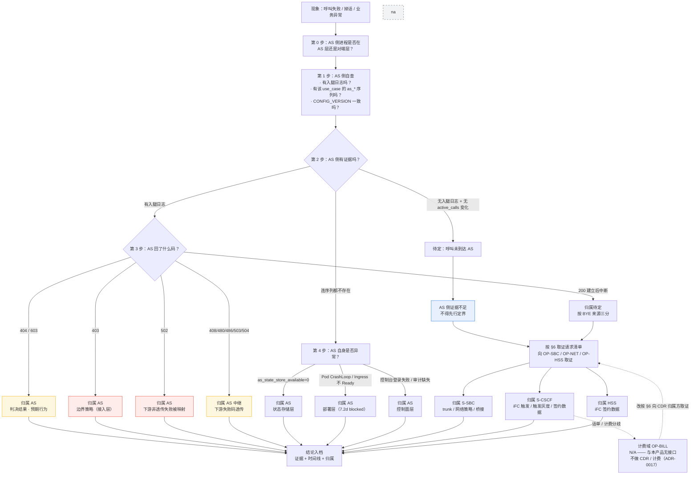

# 故障定界手册（Fault Demarcation）— In-house IMS Application Server（文档暂用名）

> **交付物归属**：[`../product-packaging-plan.md`](../product-packaging-plan.md) §1 第一批 **1.4 故障定界手册**。按该计划 §3.2，本交付物属 **A 类**（文档本身不依赖未决项）；但**真实集群 / 真实对端证据仍 blocked**（见 §8）。
>
> **互链**：与 [`../product/responsibility-matrix.md`](../product/responsibility-matrix.md)（RACI，本文 §3 的归属结论以该文 §4 为准绳）、[`runbook-l1.md`](runbook-l1.md)、[`runbook-l2.md`](runbook-l2.md)（分层故障树）、[`rollback-playbook.md`](rollback-playbook.md)（回退）互链。
>
> **状态说明**：上游文档中的过期「未创建」标注已于 2026-10-10 统一清理；本文件所述的 blocked 状态（**真实集群证据 / 演练记录**）**仍然成立**。
>
> **⚠️ iFC 触发在 S-CSCF / HSS 侧（评审 G-P0-5已裁决）**。本产品**只实现 ISC 触发之后的业务判决、摘流与回退**，**不实现 iFC**。AS 侧既不持有 iFC 触发上下文，也不持有 iFC 触发日志。凡「呼叫为什么没到 AS」类问题的**触发侧**证据，一律只能由 OP-NET / OP-HSS / OP-SBC 提供。
>
> **本文不提供 LI / IRI**（ADR-0016：**不为其预留任何采集点**；IRI 属网内网元职能，第三方 AS 介入会引入跨法域暴露）。**TLS 解密各方自理，密钥不跨方共享** —— AS 侧**不接受**为解密而复制对端私钥（`AGENT.md` §11 / §13）。
>
> **testbed 仿真不是现网证据**。`testbed/` 是研发 / 演示资产，ADR-0014 明确 v1 不把 testbed 作为交付物；kind / compose 上的抓包与日志**不得**充当运营商 IOT 或现网证据。
>
> **证据口径**：M8 RC 产物就绪但**退出签字仍搁置**（RC 就绪 ≠ 通过）；**E1 / E4 / E5 未验收**；**e2e marker = 0**；**7.2d（M4b-7.2d / M8-7.2d）仍 blocked**；签收矩阵 pass 9 / fail 0 / **blocked 12** / n-a 4 / **open 24**（[`../acceptance/report.md`](../acceptance/report.md) §0.5）。
>
> **零容量数字**：本文无 CPS / CAPS / BHCA / 并发 / 吞吐 / 时延 / 百分比容量，也不引用 M6 dev-host 数字。O1 容量目标**未裁决**（`AGENT.md` §2）。**不得用容量数字定界** —— 任何「到某个量级就应该是对方的问题」的推断在本文口径下**不成立**。
>
> **计费域全程 N/A**：不做 CDR、不投递、不归档、不批价（ADR-0017）；以按 Call-ID 的呼叫轨迹替代话单，且**呼叫轨迹不是话单**。Diameter Sh 不做（数据来自自有数据面）；媒体不做（ADR-0004）。

---

## 1. 定界总原则

**顺序固定：先分层，再定责。** 分层顺序与 [`runbook-l2.md`](runbook-l2.md) §1 一致：部署层 → 接入层 → 控制面层 → 判决层 → 状态存储层。反向排（先怀疑判决）是最常见的浪费。**先问「这一层有没有证据」，再问「是谁的锅」**。

**「5 分钟自证不是你的锅」—— AS 侧能自证的**

| 能自证 | 取证方式 |
|---|---|
| 进程是否 ready | `/health/live`、`/health/ready`（端口来自 `AS_HEALTH_PORT`） |
| 收到 / 发出过哪些 SIP 消息 | 按 Call-ID 的运行时日志（§4.2 字段契约） |
| 各副本生效的配置版本是否一致 | `printenv CONFIG_VERSION` |
| Redis 是否可达 | `as_state_store_available{use_case}` |
| 哪些实例允许摘除 | `as_downscale_removable{use_case,pod}` |
| 判决路径本身 | `decide()` 是纯函数（无 socket / 无时钟 / 无全局状态），可重放 |

**AS 侧不能自证的（必须向对方取证，见 §6）**：① S-CSCF → S-SBC 段的 **iFC 触发上下文与结果**（该段**完全不经过 AS**）；② S-SBC → AS trunk 段**对端**侧的信令落地结果（双方**各自抓本侧**）；③ 出腿信令在**下游网元**侧收到了什么；④ **容量边界**（O1 未裁决，任何容量数字都不成立）；⑤ 呼叫轨迹的长期保留与查询（O4 / D5 未裁决）。

**三条纪律**：① **AS 侧证据不足时不得先行定界** —— 先与 OP-NOC 拉双方时间线联合对齐（RACI §4，⑧ 行的 A角是 OP-NOC）；② **404 / 603 不是故障**，是判决结果（§3、§5.3、§5.4）；③ **「没查过」不等于「已排除」**，求助与升级时必须写明已做过什么、结果如何（[`runbook-l1.md`](runbook-l1.md) §4 证据清单）。

---

## 2. 四方归属判断流程



**读图要点**

1. 第 1 步是**分水岭**：AS 侧有没有证据，决定了后面是「定责」还是「取证」。**没有证据就不要走到定责**。
2. `404 / 603` 走的是**业务结果**分支，不是故障分支。
3. 虚线的计费域**没有连线即无责任**：与本产品无接口。若投诉涉及话单/计费，改按 §6 向客户 CDR 归属方取证，不在 AS 侧定责。

---

## 3. 归属判断速查表

> 归属口径与 [`../product/responsibility-matrix.md`](../product/responsibility-matrix.md) §4 一致；file:line 证据在 [`../product/compliance-matrix.md`](../product/compliance-matrix.md) 与本文 §5。

| # | 现象 | AS 侧证据特征 | 归属 | 我方动作 | 需对方提供的证据 |
|---|---|---|---|---|---|
| 1 | **呼叫未到 AS** | 无入腿日志；`as_active_calls` 无变化；`as_downscale_removable` 全为 0（draining 中被保护） | **先分三支**：① Pod / Endpoints 异常 → AS；② 边界策略拒收 → AS；③ 以上都正常 → **对方** | 查 Pod、`/health/ready`、`AS_PEER_ALLOWED_ADDRESSES` / `AS_PEER_ALLOWED_CERT_FINGERPRINTS` 是否命中 | S-SBC trunk 侧是否发出 INVITE、是否被其本侧策略丢弃；**S-CSCF 侧 iFC 触发上下文与结果**（该段不经过 AS） |
| 2 | **AS 返 403** | 三条共用同一码：明文在要求 TLS 时被拒 / 对端白名单未命中 / 证书校验失败 | **AS（接入层 · 边界策略）** | 确认对端是否以 TLS 发起；`AS_TLS_CA_PATH` 是否含对端签发链；对端地址 / 指纹是否在白名单内。空策略**fail-closed**（`transport.py:272-273`） | 对端证书与握手细节（**密钥不跨方共享**）；⚠️ 宿主机 `http_proxy` 造成的 `403/000` 是**采证路径**问题，不是产品 403 |
| 3 | **AS 返 404 / 603** | `404` = **无匹配规则**；`603` = **策略拒绝**（如反诈超限） | **AS，但属预期判决，不是故障** | 先问「预期判决是什么」，再问「为什么没命中」；本应命中 → 走**变更单**（不走GitOps） | 无需对方证据 |
| 4 | **AS 返 502** | 下游失败码**不在**透传集合 `{408, 480, 486, 503, 504}`，被映射为 `502`（`call_controller.py:19-21,98-104`） | **AS 中继**：AS 收到了下游失败并做了映射 | 看运行时日志的 `RESIP_RUNTIME_UAS_FAILURE_MAPPED` 的 `downstream_status` / `upstream_status` | 下游网元侧该`downstream_status` 的成因 |
| 5 | **下游失败码透传** | 入腿回了 `408/480/486/503/504`，与下游一致 | **下游网元**（AS 只做透传） | 用 `RESIP_RUNTIME_UAC_FAILURE` 的 `status` 与 `RESIP_RUNTIME_UAS_FAILURE_MAPPED` 对照证明「AS 未改码」 | 下游拒绝/失败原因。⚠️ native 产品路径**只对 `486` 有端到端测试**，其余四码在产品路径上**无证据**，先不要当已验证行为上报缺陷 |
| 6 | **呼叫建立后中断** | 三种BYE 来源：入腿远端 BYE / 下游 BYE / 本地主动 end；`RESIP_RUNTIME_OUTBOUND_CANCEL_FORWARD` 只覆盖 CANCEL 转发 | **按 BYE 来源三分**，不得默认归AS | 以 §4.1 的两腿关联法把入腿 `inbound_call_id` 与出腿 `outgoing_call_id` 对上，再判断谁先发 BYE | 入腿远端 BYE → S-SBC / 主叫侧；下游 BYE → 下游网元 |
| 7 | **CANCEL / 487 分支异常** | `RESIP_RUNTIME_OUTBOUND_CANCEL_FORWARD inbound_call_id=...`（`direction=inbound`, `method=CANCEL`）；487 通常是**主叫放弃** | **先当预期行为**；异常计数才升级 | 与契约场景 S4 对齐。⚠️ native DUM 语义仍在 **E1 未验收**范围内，不得据此下产品结论 | 主叫放弃的发起侧记录 |
| 8 | **状态存储不可用** | `as_state_store_available{use_case}` 持续 `0` → `ASCallStateStoreUnavailable`（critical）。在途呼叫状态全在 Redis | **AS（状态存储层）** | 会话 / dialog / 反诈速率窗口都在 Redis，**Redis 不可用 = 在途呼叫无法维持**。⚠️ 未配置 `REDIS_URL` 时**序列不存在（不是 0）**，规则永不触发 | Redis 若为客户自建，需客户提供其侧可达性与拓扑（**Sentinel 拓扑仍是 O5 / D3 未决**） |
| 9 | **config-service CrashLoop / Ingress 不 Ready** | DSN 主机名是占位 `postgres:5432`；Ingress 注解 prefix 被改写；`empty reply`（curl 52）；admission webhook Job WARN | **AS（部署层）**，但**真实集群证据 blocked** | 按 [`runbook-l2.md`](runbook-l2.md) §4.6 的对照表逐条排；**empty reply 视为未过关**，不得在 plan 里勾 7.2d 关门 | 客户 ingress 规范与 LB 侧采证配合（**7.2d 当前 blocked**） |
| 10 | **控制台登录失败 / 审计缺失** | 角色矩阵 `viewer`/`approver`/`admin`；审计表 append-only（`BEFORE UPDATE OR DELETE` / `BEFORE TRUNCATE` 触发器） | **AS（控制面层）** | 越权与审计完整性事件**同时通知 OP-SEC** | 无 |
| 11 | **缩容或升级期间掉话（draining 不收敛）** | `as_active_calls` 不降；`as_downscale_removable` 长期为 `0`；readiness 不是 `503` | **AS（draining / 编排）**，机制见 ADR-0009 / ADR-0010 | 按 [`runbook-l1.md`](runbook-l1.md) §3.1 四步；**不得 SIGKILL**；检查 `preStop sleep` + SIGTERM 路径 | 无。⚠️ 现有 draining 证据来自 `AS_M5_SIMULATED_ACTIVE_CALLS` **模拟**在途呼叫（G-P1-1），**真实 SIP 负载下不掉呼叫未验收**，**不得**用模拟证据向对方承诺「生产不掉话」 |

---

## 4. 抓包与日志对齐方法

### 4.1 逐段抓包责任方

权威表见 [`../product/responsibility-matrix.md`](../product/responsibility-matrix.md) §3。要点：

| 链路段 | 谁抓 | AS 侧能提供什么 |
|---|---|---|
| S-CSCF → S-SBC（iFC 触发） | **对方** | **不提供** —— 该段完全不经过 AS |
| S-SBC → AS trunk（SIP over TLS `5061`） | **双方各自抓本侧** | Call-ID 关联的 JSON 日志字段契约 + `/metrics` 的 `as_*` 序列 |
| AS → 下游（出腿） | **对方** | 入腿 / 出腿双向的 `inbound_call_id` / `outgoing_call_id` |
| AS 内部 | **我方** | 判决结果、状态存储交互、配置版本 |
| `testbed/` 仿真链路 | **我方** | 全部 —— ⚠️ **不是现网证据** |

**方法**：① 双方各自在**本侧**抓包，**TLS 下解密属各方责任，密钥不跨方共享**；② **两腿 Call-ID 不同**（B2BUA 两侧独立，REQ-F-2），跨腿关联用「**时间戳 + Route / Record-Route**」——以入腿 `inbound_call_id` 为起点，沿 `route_uri` 与下游返回的 `Record-Route` 走，再对齐出腿 `outgoing_call_id`；③ 先对齐时间基准再比对，窗口不足时**不要**用「看起来同时」当证据；④ **绝不提交真实抓包**（`AGENT.md` §11 / §13），只提交脱敏后的字段 / 文本行。

### 4.2 AS 侧日志字段契约（取证口径）

REQ-NF-13 的取证挂载点是 JSON 日志，字段固定为 **`timestamp` / `level` / `trace_id` / `call_id` / `direction` / `method`**（`trace_id` 即 Call-ID）。权威文件是**字段契约**（不是 runbook）：[`../acceptance/m8-resip-runtime-log-contract.md`](../acceptance/m8-resip-runtime-log-contract.md)。解析器 `platform/src/as_platform/sip/resip_runtime_log_contract.py`，由 `platform/tests/test_resip_runtime_log_contract.py`（`contract` marker）守卫 —— **C++ 改名或改键即红**。

**示例行（原文照抄，可直接用于检索）**

```text
RESIP_RUNTIME_LISTENING address=127.0.0.1 advertised=127.0.0.1 udp_port=5060
RESIP_RUNTIME_UAC_INVITE_SENT outgoing_call_id=out-1@127.0.0.1 inbound_call_id=in-1@127.0.0.1 route_uri=sip:downstream@127.0.0.1:5070
RESIP_RUNTIME_UAC_NEW_SESSION outgoing_call_id=out-1@127.0.0.1
RESIP_RUNTIME_UAC_FAILURE outgoing_call_id=out-1@127.0.0.1 status=486
RESIP_RUNTIME_UAS_FAILURE_MAPPED outgoing_call_id=out-1@127.0.0.1 downstream_status=486 upstream_status=486
RESIP_RUNTIME_OUTBOUND_CANCEL_FORWARD inbound_call_id=in-1@127.0.0.1
RESIP_RUNTIME_UAS_ANSWER_RELAYED outgoing_call_id=out-1@127.0.0.1
```

**读法**：① `RESIP_RUNTIME_UAC_INVITE_SENT` 是**跨腿关联的唯一入口**（唯一同时带 `inbound_call_id` 与 `outgoing_call_id` 的事件）；② 只有 `inbound_call_id` → 出腿未发出；③ 只有 `outgoing_call_id` → 关联缺失，查 `*_CORRELATION_MISS`；④ 含空格的 `message=` 行按格式漂移 **fail-closed**（解析器返回 `None`），**不要**手工拼字段去凑。

> ⚠️ **JSON 富化的边界**：native 行本身不经过 Python logging，富化发生在**采集转发侧**；集群没做这一步时 Pod 日志里仍是 `key=value` 原生行、**不是** JSON。**这不是完整的 OTel 三信号** —— traces 没有，OTLP exporter 当前为 `NoOpExporter`，**不要**用「trace 视图里没有」推断「调用路径没发生」。

### 4.3 AS 侧取证命令（命令原文）

```sh
# Pod 与 ready 状态
kubectl -n <ns> get pods -l app.kubernetes.io/part-of=3rdparty-as

# 各副本生效的配置版本（不一致 → 控制面层）
kubectl -n <ns> exec deploy/<release>-<use-case> -- printenv CONFIG_VERSION

# 运行时日志（按 Call-ID 检索；示例行见 §4.2）
kubectl -n <ns> logs deploy/<release>-<use-case> --since=30m | grep 'RESIP_RUNTIME_'

# 指标（镜像内无 curl 时走 port-forward，见下行）
kubectl -n <ns> exec deploy/<release>-<use-case> -- curl -s :8080/metrics | grep '^as_'
kubectl -n <ns> port-forward deploy/<release>-<use-case> 8080:8080
```

**取证时的三个已知坑**

- **chart 未接线抓取**：Pod 模板无 `prometheus.io/scrape` 注解，chart 内无 ServiceMonitor / PodMonitor → 标准部署下 Prometheus **收不到** `as_*` 序列。「Prometheus 里没有」≠「进程没产出」。
- **`as_state_store_available` 的「没数据」不是 `0`**：仅当 `REDIS_URL` 非空时才探测并写序列。
- **`as_rule_hits_total` 无生产调用方**（定义在 `telemetry/metrics.py`，不在告警契约表内）→ **不能靠它判断规则命中**；用 `call_id` + 生效规则版本 + 判决路径（纯函数，可重放）判断。

---

## 5. 常见故障剧本

每条结构：**触发观察 → 判定步骤 → 处置 → 回退 → 证据留存**。

### 5.1 呼叫未到达 AS

- **触发观察**：用户侧呼叫失败；AS 侧按该号码检索**无入腿日志**；`as_active_calls` 无对应变化。
- **判定步骤**：① Pod / Service Endpoints 是否异常 → 是则 AS；② `/health/ready` 是否为 `503`（draining 中正常摘流）→ 是则 AS（转§5.7）；③ `as_downscale_removable` 是否全为 `0` → 是则 AS；④ ingress / 网络策略是否拒收对端，或 `AS_PEER_ALLOWED_ADDRESSES` / `AS_PEER_ALLOWED_CERT_FINGERPRINTS` 未命中 → 是则 AS；⑤ `/metrics` 中该 `use_case` **有序列但无入腿日志** → **对方**。
- **处置**：AS 侧命中①–④ 就地处置；命中⑤ **立即停止定界**，转§6 取证。
- **回退**：若因我方边界策略误配（fail-closed 拒收），按变更流水线恢复策略 ——配置**不走 GitOps**，走变更单（[`rollback-playbook.md`](rollback-playbook.md) L1）。
- **证据留存**：时间线（含时区）、Pod 列表、ready 状态、该 `use_case` 的 `as_*` 序列、策略配置快照（**脱敏**，不保存任何 Secret）。

### 5.2 AS 返 403

- **触发观察**：入腿被AS 以 `403 Forbidden` 拒绝，或 TLS 握手失败。
- **判定步骤**：① 对端是否以 TLS 发起（要求 TLS 时，`tls` / `sips` 之外的 transport 一律拒）→ 明文发起则 AS；② `AS_TLS_CA_PATH` 指向的 CA 是否包含对端签发链；③ 对端地址 / 证书指纹是否在白名单内（空策略 **fail-closed**，授权 nobody）；④ 若是宿主机 `curl` 得到的 `403 / 000` → 检查 `http_proxy`，用 `NO_PROXY=127.0.0.1,localhost kubectl port-forward` 重采 —— 这是**采证路径**问题，不是产品 403。
- **处置**：策略正确而对端仍被拒 → 转客户 PKI / 网络部联合处理；**不得**为通过联调把白名单改成 `*`（安全控制不是可用性开关）。
- **回退**：策略变更走变更单；证书轮换是**配置热更新**，**绝不重启进程、绝不丢在途呼叫**（ADR-0016 / `AGENT.md` §13）。
- **证据留存**：`AS_TLS_*` / `AS_PEER_*` 的**变量名与取值来源**（不保存证书内容）；`403` 出现的时间窗。⚠️ **E4 / REQ-S-2 / REQ-S-3 当前无实验室证据**，本剧本是操作纪律，**不是**已验证流程。

### 5.3 AS 返 404（不是故障）

- **触发观察**：入腿被 `404 Not Found` 拒绝。
- **判定步骤**：`404` = **无匹配规则**，是判决链的默认结果。查号段 / 前缀规则是否覆盖该被叫。
- **处置**：本应命中 → 规则问题，走**变更单**提交（编辑草稿 → 提交 → 审批 → 灰度分发）；**不是**运维直接 UPDATE 数据库。
- **回退**：变更单回滚到 `vN-1`（`rolled_back` 终态），见 [`rollback-playbook.md`](rollback-playbook.md) L1。
- **证据留存**：`call_id`、生效的 `CONFIG_VERSION`、规则版本号、判决路径重放结果。⚠️ live Call-ID trace（REQ-F-13）当前 **BLOCKED**（无 live trace source / API），所以轨迹**拿不出来**，只能用上述三项替代判定。

### 5.4 AS 返 603（不是故障）

- **触发观察**：入腿被 `603 Decline` 拒绝。
- **判定步骤**：`603` = **策略拒绝 / 策略判决拒绝**（如反诈超限）。查生效规则版本与命中的策略。
- **处置**：判决符合预期 → 不是故障，记录即可；与预期不符 → 走变更单调整规则或回滚。
- **回退**：同 §5.3。
- **证据留存**：同 §5.3。⚠️ 产品路径**当前只发 `603 Decline`**；`608 Rejected` 只出现在 POC 抓包基线的运营商侧对端声明中，**不要**把它当产品拒绝码。

### 5.5 AS 返 502

- **触发观察**：入腿收到 `502 Bad Gateway`。
- **判定步骤**：查运行时日志的 `RESIP_RUNTIME_UAS_FAILURE_MAPPED`：`downstream_status` 不在 `{408, 480, 486, 503, 504}` 内 → 被映射为 `502`。**AS 没有改码，是映射规则**。
- **处置**：按下游失败处理 —— 需要下游网元给出 `downstream_status` 的成因；AS 侧不重试、不改判决。
- **回退**：若映射本身被判为不合理 → 走文档链改判决映射，**不得**在故障处置中热改代码。
- **证据留存**：`downstream_status` / `upstream_status` 对照行、时间戳、`outgoing_call_id`。

### 5.6 下游失败码透传（486 / 480 / 408 / 503 / 504）

- **触发观察**：入腿回了透传集合中的码。
- **判定步骤**：用 `RESIP_RUNTIME_UAC_FAILURE status=<code>` 与 `RESIP_RUNTIME_UAS_FAILURE_MAPPED downstream_status=… upstream_status=…` 对照，证明 `upstream_status == downstream_status` → AS **未改码**。
- **处置**：归属下游网元；AS 侧不背这个码。
- **回退**：不适用（AS 未做变更）。
- **证据留存**：上述两行日志 + 下游侧取证请求（§6）。⚠️ **native 产品路径只对 `486` 有端到端测试**，其余四码在产品路径上**无证据**。

### 5.7 缩容或升级期间掉话（draining 不收敛）

- **触发观察**：Pod 已 cordon / 已删，但 `as_active_calls` 不降、`as_downscale_removable` 长期为 `0`。
- **判定步骤**：① readiness 是否为 `503`；② Endpoint 是否摘流；③ `AS_DOWNSCALE_GUARD_ENABLED` / `AS_DOWNSCALE_GUARD_PROTECT_ABOVE` 是否被 Helm 正确注入；④ 是否走了 `preStop sleep` + SIGTERM（**不得 SIGKILL**）；⑤ `plan_scale_down` 的 `allowed` / `candidates` / `reason`。
- **处置**：四步操作见 [`runbook-l1.md`](runbook-l1.md) §3.1 与 [`../acceptance/m5-downscale-runbook.md`](../acceptance/m5-downscale-runbook.md)；`allowed=False` 时**不要删 Pod**，或先对高负载实例发起 draining。
- **回退**：镜像 / manifest 层回退走 `helm history` → `helm rollback <revision>` → `kubectl rollout status`（原文见 [`rollback-playbook.md`](rollback-playbook.md) L3）；draining 本身是 ADR-0009 定义的退出路径，**不是**容量结论。
- **证据留存**：`plan_scale_down` 输出、`as_active_calls` / `as_downscale_removable` 时间序列、readiness 状态、Helm revision。⚠️ **证据边界**：现有 draining / 缩容证据用 `AS_M5_SIMULATED_ACTIVE_CALLS=N` **模拟**在途呼叫（SIGTERM 后每秒减 1），是 kind 上的**机制证据**；**真实 SIP 负载下的不掉呼叫待 M7 / M8 验收**（G-P1-1）。**不得**用模拟证据向对方承诺生产不掉话。

---

## 6. AS 侧无证据时的取证请求清单

**触发条件**：§2 第 2 步判定「AS 侧无证据」，或 §5.1 判定步骤⑤命中。**在此之前不得定责。**

**对照 [`../acceptance/report.md`](../acceptance/report.md) §0.6 / §0.8 的 blocked 与 defer 项，下列项目前 AS 侧拿不出证据，需向 S-CSCF / HSS / S-SBC 侧取证**：

| 项 | AS 侧现状 | 需向谁取证 | 取什么 |
|---|---|---|---|
| **REQ-S-2 / REQ-S-3**（运营商 PKI / 端到端 TLS / 证书热轮换尾） | 本环境无 lab 与对端，**明确 defer**，矩阵中保持 **blocked**（D-1） | OP-SEC / OP-NET | 真实对端证书链、握手与轮换的线缆级证据 |
| **REQ-F-13** live trace（按 Call-ID 的轨迹查询） | **BLOCKED**：缺后端，无 live trace source / API（M4b-7.4） | 内部（AS-Vendor 二线） | 现阶段只能用 `call_id` + `CONFIG_VERSION` + 判决路径替代 |
| **REQ-NF-1**（客户 K8s live kill / restart / BYE 状态外置） | 本环境无客户集群，**明确 defer**，矩阵中保持 **blocked**（D-2） | OP-NOC | 客户集群上的 live 基线 |
| **REQ-NF-3 / REQ-NF-4** | **blocked**（REQ-NF-3 的固定容量数字条目与 `AGENT.md` §2 冲突，O1 仍open） | 维护者（口径裁决） | 验收口径裁决，不是取证 |
| **REQ-F-15 真 AS 补测 / REQ-S-4** | open / 仅工程切片 | AS-Vendor + OP-SEC | 安全相关结论**不得**写成已通过验收 |
| **ADR-0008 冗余演练**（含跨站点 1+1 温备切换） | **blocked** | OP-NOC + OP-NET | 切换是运维动作，**必须演练**；备站无在途呼叫 |
| **D6（testbed 是否 v1 客户验收）** | 裁决 pending | 维护者 | 裁决前 D6 行保持 blocked |
| **M5D 10 项 defer** | defer（构成 M5 REQ 级不通过） | 维护者 | 见 [`../acceptance/report.md`](../acceptance/report.md) §0.4 |

**取证请求单必填字段**（缺一项对方无法定位）：时间窗（含时区，首现 / 持续 / 最近一次）、Call-ID（**跨腿 B2BUA 的两个 Call-ID 都带**）、我方已核查项与结果、AS 侧 namespace / Pod 名 / `use_case`、AS 侧 `CONFIG_VERSION`、希望对方提供的段（S-CSCF→S-SBC 触发段 / S-SBC→AS trunk 段对端侧 / 下游侧）。

**纪律**：请求单与回复一并入档；**不保存**密码 / token / cookie / 私钥，**不提交真实抓包**（`AGENT.md` §11 / §13）。

---

## 7. 与 RACI、Runbook 的关系

| 本文章节 | 对应 RACI 活动（RACI §2） | 对应 runbook 章节 |
|---|---|---|
| §1 定界总原则 | ⑧ 故障定界（AS-Vendor R，**OP-NOC A**） | [`runbook-l2.md`](runbook-l2.md) §1 |
| §2 四方归属流程 | ⑧ + ① iFC 触发（**对方 A/R**，我方 I） | [`runbook-l2.md`](runbook-l2.md) §4.1–§4.6 |
| §3 速查表 ①②④⑨⑩⑪ | ⑧、②（trunk 互通，A 角是 OP-SBC）、③（TLS，A 角是 OP-SBC 侧证书） | [`runbook-l2.md`](runbook-l2.md) §4.2 / §4.5 / §4.6 / §4.7 |
| §3 速查表 ③（404/603） | ④ AS 侧号码 / 号段规则与变更单（AS-Vendor **A/R**） | [`runbook-l1.md`](runbook-l1.md) §3.3；L2 §4.3 |
| §3 速查表 ⑧（状态存储） | ⑪ 备份与恢复（AS-Vendor **A/R**）；⑦ NOC 值班 | [`runbook-l1.md`](runbook-l1.md) §3.5；L2 §4.5 |
| §4 抓包与日志对齐 | ⑨ 接口抓包与日志取证（AS-Vendor **A/R**） | [`runbook-l2.md`](runbook-l2.md) §2 / §3 |
| §5 故障剧本 | ⑧ + ⑥ ISC 触发后的摘流 / 回退（AS-Vendor **A/R**，OP-NOC R） | [`runbook-l1.md`](runbook-l1.md) §3.1–§3.5 |
| §6 取证请求清单 | ⑧ + ⑩ 变更窗口协调（**OP-NET A**） | [`runbook-l1.md`](runbook-l1.md) §4 求助证据清单 |

**职责边界提醒**：RACI ⑧ 行中「定界结论」的 **A 角是 OP-NOC**，AS-Vendor 是 R（AS 侧自查）。AS 侧出的是**自查结论与证据**，不是最终定责。

---

## 8. 未决与阻塞

| 项 | 阻塞源 | 对本文的影响 | 责任方 |
|---|---|---|---|
| 真实集群 / 真实对端证据 | M8 **7.2d blocked**、M8 退出签字搁置 | §3 第 9 行、§5.1、§5.2 只有工程切片证据；**「真实生产已验证」不得写入任何材料** | 维护者 + OP-NOC |
| iFC 触发侧取证 | OP-NET / OP-HSS 配置（G-P0-5 / G-P1-10） | §2 与 §3 第 1 行的「呼叫未到 AS」**无法闭环**；AS 侧只能自证 override 生效 | OP-NET / OP-HSS |
| E1（reSIProcate 生产路径行为） | M8 验收（O2 / O3） | §3 第 5、6、7 行的 native 侧行为只有 `486` 有端到端测试；其余**无产品路径证据** | AS-Vendor |
| E4 / REQ-S-2 / REQ-S-3 | M8 验收 + 运营商 PKI | §5.2 是操作纪律，**不是**已验证流程 | AS-Vendor + OP-SEC / OP-NET |
| E5 / REQ-NF-1（状态外置与恢复） | REQ-NF-1 签收归 M8（D-2 defer） | §3 第 8 行的恢复侧结论无客户集群证据 | AS-Vendor |
| REQ-F-13 live trace | 无live trace source / API（**BLOCKED**） | §5.3 / §5.4 只能用替代字段判命中，**拿不出 live 轨迹** | AS-Vendor |
| O1（容量目标） | 维护者裁决仍 open | §1明确：**不得用容量数字定界** | 维护者 + OP-NET |
| O5 / D3（容灾等级 / Redis Sentinel 拓扑） | 客户 SLA | §3 第 8 行只能到「AS 侧可达性」，拓扑判定需升级维护者 | OP-NET + 维护者 |
| O4 / D5（轨迹保留期 / 存储选型） | 客户合规 | 本文**不含任何保留期**；轨迹相关取证范围待裁决 | OP-SEC |
| ADR-0008 冗余演练 | **blocked** | 跨站点 1+1 温备切换的定界剧本**未编写** | OP-NOC + OP-NET |
| M8 退出签字 | 搁置 | 本文全篇不得读作「已验收」 | 维护者 |
| 本文评审状态 | 按 `AGENT.md` §3.3 需独立 review record | **本文尚无 review record**，待维护者评审 | 维护者 |