# In-house IMS Application Server（文档暂用名）—— 网元档案（NE Datasheet）

> **状态块（阅读本文前先看这里）**
>
> - **产品名**：**In-house IMS Application Server（文档暂用名）**，首现处标注 3GPP Third-Party AS role，下文简称 in-house AS。该名称**不是已正式批准的产品名**（`docs/plan.md` §0「产品决策记录」；`docs/product-packaging-plan.md` §4.3）。git repo 名拟改为 `inhouse-ims-as`，**仅涉及 git 仓库名与 remote URL**；chart name（`3rdparty-as`，`deploy/helm/Chart.yaml:2`）、镜像名（`registry.example.com/3rdparty-as`）、OTel 服务名**保持 `3rdparty-as` 不变**。
> - **本文件归属**：`docs/product-packaging-plan.md` §1 第一批交付物 **1.3（网元档案 / NE Datasheet）**。按该计划 §3.2，本交付物属 **B 类**：容量数值部分被 O1 阻塞。
> - **⚠️ 容量章节受 O1 阻塞**：**O1（容量目标）未裁决**（`docs/plan.md` §5.1 O1「维护者目标裁决仍 open」）。`AGENT.md` §2「M6 实测之前不发布任何容量数字」是硬约束。因此**本文全篇不含任何 CPS / CAPS / BHCA / 并发会话数 / 每千次呼叫资源 / 吞吐 / 时延（含毫秒）/ P95 / P99 / 容量百分比**，连"量级估计"也不写。§3 只交付**模型结构与测量方法学**（评审 G-P0-3、G-P1-3、G-P0-8 的落实）。
> - **本文无 review record**：按 `AGENT.md` §3.3，评审必须留下独立 review record；本文当前**没有** review record，待维护者评审。
> - **M6 dev-host 报告只能作为"方法学存在"的证据**：`docs/acceptance/m6-o1-measurement-report-2026-10-05.md` 明确标注受众为 "Maintainers / capacity research only"、**不是**公开 SLA。引用它时一律带「内部测量 / 非对外 / 非 SLA」限定，且**本文不引用其中任何测量值**（`AGENT.md` §2；评审 G-P0-2 / G-P0-8）。
> - **testbed 边界与告警口径**：`testbed/` 是**研发资产，绝不做运行时依赖**（`AGENT.md` §4），ADR-0014 明确 v1 不把 testbed 作为交付物；其仿真结果（含 callload、M7.1 仿真平台、dev-host harness）**不得充当运营商 IOT 或现网容量证据**（`docs/product-packaging-plan.md` §0.3 第 8 条、§3.4）。告警与指标的**唯一权威契约**是 `deploy/alerts/as-alerts.yaml` 与 `deploy/alerts/README.md`，本文只引用、不另立口径。
> - **术语纪律**：M8 发布候选（RC）产物就绪，**退出签字仍搁置** —— **RC 就绪 ≠ 通过**（`docs/plan.md` §0）。E1 / E4 / E5 **未验收**。O1 / O4 / O5 / D3 / D5 **未决**。

---

## 1. 网元概览

| 维度 | 内容 |
|---|---|
| 网元类型 | 运营商 IMS 网络**之外**的第三方 Application Server（3GPP Third-Party AS role），由 S-CSCF 按 HSS 侧 iFC 签约触发 ISC，经运营商 S-SBC 透明桥接接入（`AGENT.md` §1；ADR-0003 accepted） |
| 接入语义 | **仅 ISC 一种**。iFC 触发逻辑在 S-CSCF / HSS 侧，不在我方交付边界内（评审 G-P0-5） |
| 业务面 | 只做**信令**：SIP 消息处理与业务判决，头域与 SDP 原样透传。业务用例可插拔（`apps/translation`、`apps/anti-fraud`） |
| 部署形态 | **单租户、on-premises**：一个 namespace 承载一套完整系统（含各自的 Redis / PostgreSQL / AS Pod 组），数据不出客户机房（REQ-NF-9；ADR-0026 Option E） |
| 交付版本 | **一次交付一个系统**：产品 release 版本只看仓库根 `./VERSION`（`AGENT.md` §8；ADR-0018 accepted）。**已知缺口**：`deploy/helm/Chart.yaml:5-6` 的 `version: 0.0.0-skeleton` / `appVersion: "0.0.0"` 仍是骨架值，**与 `./VERSION` 不同步** |
| 生产形态 | **Helm-only**：`Helm` + 标准 Deployment / ConfigMap / Secret；**不写 Operator（CRD）**（ADR-0013 accepted；`deploy/compose/` 仅 dev） |
| 不做什么 | 不做媒体、不做 CDR、不做 LI、不做 Diameter Sh、不做计费、不做多租户、配置不走 GitOps、不写 Operator（`AGENT.md` §2；一句话版本见 [`one-pager.md`](one-pager.md) §2，**不在此重复造口径**） |
| 状态 | M8 RC 产物就绪，**退出签字搁置**；E1（reSIProcate 生产路径行为）/ E4（TLS 热轮换）/ E5（状态外置与恢复）**未验收**；e2e marker **为 0** |

**产品定位一句话**：多业务承载平台 —— 新增业务只需"加一个 app + 一条配置变更单"，不需要改动 IMS 核心网（`one-pager.md` §1）。

---

## 2. 接口清单

| 接口 | 方向 | 协议 / 端口 | 用途 | 必需性 | 备注 |
|---|---|---|---|---|---|
| SIP trunk（入腿 / 出腿信令） | 双向 | SIP over UDP `5060`、SIP over TCP `5060` | 承载 ISC 触发信令与业务判决 | **必需** | 端口是**协议常量**，不是容量指标（`deploy/helm/values.yaml:148-153` 原文即如此注明）。TCP 监听需 `AS_SIP_ENABLE_TCP` 开启，默认不监听 |
| SIP trunk over TLS | 双向 | SIP over TLS `5061` | 与 S-SBC 的端到端 TLS（mTLS） | **必需**（默认 `tls.enabled: true`） | `tls.enabled=true` 且 `tls.secretName` 为空 → **渲染期 fail-closed**（`deploy/helm/templates/deployment.yaml:11-13`）。证书轮换是配置热更新，不重启进程（ADR-0016） |
| AS 内部 API | 入向 | HTTP `8000`（ClusterIP） | config-service 同时提供控制台 `/` 与 `/internal/v1` | 可选（config-service **默认关闭**） | `services.configService.enabled: false`（`values.yaml:115`）；无独立 console workload |
| 健康与指标端点 | 出向（供抓取） | HTTP `8080`：`/health/live`、`/health/ready`、`/metrics` | K8s 探针 + Prometheus 文本格式指标 | **必需** | 端口来自 Helm `health.port`（`values.yaml:281-282`）→ ConfigMap `AS_HEALTH_PORT`（`configmap.yaml:58`）→ `HealthServerConfig.port`（`platform/src/as_platform/runtime/health.py:23-24`） |
| Redis（运行态） | 双向 | Redis 协议，chart 默认 `6379`（`stateStores.redis.port`） | 会话状态 / dialog 状态 / 反诈速率窗口 | **必需**（运行态无状态化前提） | 探针口径见 §8 注记；Sentinel / HA 拓扑**未决**（O5 / D3） |
| PostgreSQL（治理态） | 双向 | PostgreSQL，chart 默认 `5432`（`postgres.port`） | 规则版本、变更单、审批、审计；schema `as_config` / `console_audit` | **必需**（控制面） | 三角色：`owner` / `web` / `runtime`（`state-postgres.yaml:18-22`）；`runtime` 为 `NOLOGIN` 最小权限 |
| **Diameter Sh（TS 29.328 / 29.329）** | — | — | — | **N/A** | **理由**：AS 的业务数据来自自有数据面（规则集、号码翻译表、反诈限额），不与 HSS 交互，故不做 Diameter Sh（`AGENT.md` §2 非目标）。本文不含任何 Sh 相关面板或告警（评审 G-P0-4 / G-P2-3） |
| **计费 / CDR（TS 32.260 / 32.299）** | — | — | — | **N/A** | **理由**：不采集、不投递、不归档、不批价（ADR-0017 accepted）。以按 **Call-ID** 的呼叫轨迹替代话单，用于投诉追溯与反诈举证 |
| **媒体 / RTP** | — | — | — | **N/A** | **理由**：不做媒体：无 RTP、无转码、无 DTMF、无 MRF、无媒体锚定；只保留一个 seam 并写明触发条件（ADR-0004）。网外做媒体中继会形成三角路由并引入语音合规问题 |

---

## 3. 容量模型与测量方法学

> **本节受 O1 阻塞（`docs/plan.md` §5.1 O1；`AGENT.md` §2；评审 G-P0-3 / G-P1-3 / G-P0-8）。**
> 本节交付的是**模型结构**（变量与关系）与**测量方法学**，**不含任何取值**。任何数值都不得在 O1 裁决前写入本文。

### 3.1 为什么现在不填数值

| # | 理由 | 依据 |
|---|---|---|
| 1 | **O1 未裁决**：容量目标（CPS、并发会话、建立时延预算）的维护者裁决仍 open；阻塞 M7 集成容量验收与 HPA 阈值 | `docs/plan.md` §5.1 O1 |
| 2 | **硬规则**：「M6 实测之前不发布任何容量数字」；`performance` 层**只用真实 socket，绝不要靠驱动回调来测 —— 那测的是业务逻辑，不是系统** | `AGENT.md` §2、§6；ADR-0014 |
| 3 | 评审已两次裁决：容量章节写「受 O1 阻塞」（G-P0-3、G-P1-3）；性能基准报告当前阶段**只交付方法学**，不出现任何吞吐 / 并发 / 时延数值（G-P0-8） | `docs/reviews/product-packaging-plan-review-2026-10-09.md` |
| 4 | Helm chart 的容量承载键**全部留空**：`useCases[].resources`、`autoscaling.*`、`podDisruptionBudget.minAvailable` 为空时模板**拒绝渲染**该资源，而不是回落到猜的数字 | `deploy/helm/README.md` §"Keys left empty on purpose"；`deploy/helm/values.yaml:61-66` |
| 5 | 现有 dev-host 报告是**内部测量**，其局限自述为「不得外推」（loopback UDP、无 TLS、无多副本 K8s、对端是 accept-all fixture、零 hold 负载模型），且明确「不是产品容量保证」 | `docs/acceptance/m6-o1-measurement-report-2026-10-05.md` §"Limits (do not extrapolate)" |

**填值的准入条件（三条同时满足）**：① 维护者对 O1 作出目标裁决并落入 `docs/plan.md` 决策行 + review record；② 在**真实 socket**、有业务判决路径的 harness 上完成 M6 实测；③ 维护者裁决把测量结果转为可对外口径。届时**另出内部评审版性能基准报告**（交付物 4.1，仍为内部文档），并在本节回填。

### 3.2 容量模型结构（只给变量与关系，不给取值）

**到达侧（Offer）**

- 变量：呼叫到达过程（是否 Poisson / 突发 / 浪涌）、忙时假设（**待定**）、每用例业务比例（translation / anti-fraud）、号段分布。
- 关系：到达过程 → 每用例到达率；业务比例把总到达分配到各引擎进程。
- **待定项**：忙时假设与业务比例必须来自客户话务模型，**不得由本文假设**。

**处理侧（Processing）**

- 入腿 INVITE 处理：transport 收包 → 对端准入（白名单 / 证书指纹，ADR-0016）→ 消息解析 → `decide()`。
- 出腿 INVITE 处理：按判决结果改写 Request-URI（`AS_SIP_NEXT_HOP`），TLS 场景改写 Contact。
- 状态存储读写：会话 / dialog 状态与反诈速率窗口全部在 Redis（ADR-0002 / ADR-0007）；checkpoint 提交见 ADR-0023（**proposed，未通过**，不据其作结论）。
- 判决判定：`decide()` 是**纯函数**（无 socket、无时钟、无全局状态），其开销与 I/O 解耦 → 是相对比较的天然基线（`AGENT.md` §5）。

**资源映射（Resource mapping）**

- 变量：CPU、内存、连接与文件描述符、Redis 连接池、Pod 副本数、每 Pod 独立伸缩。
- 关系：每单位到达 → 每单位判决 + 每单位状态存储往返 + 每单位序列化 → 映射到上述资源；副本数是唯一横向维度（**每进程独立伸缩**）。
- **注意**：本映射的**系数**属容量结论，同样受 O1 阻塞。

**伸缩边界（Scaling boundary）**

- 一用例一进程 → 每个引擎**独立扩缩容、独立故障域、独立灰度单元**（ADR-0002 accepted）。
- 每进程独立伸缩：chart 对 `useCases[]` 逐条渲染 Deployment / Service（`deploy/helm/templates/deployment.yaml`、`service.yaml`）。
- 会话亲和**双保险**：LB 层 `sessionAffinity: ClientIP`（`service.yaml:30`）+ 应用层 Redis 会话表兜底；任一半单独都不足够。
- 缩容**不走标准 CPU / 内存 HPA**：SIP 栈是阻塞事件循环，CPU 与真实 SIP 负载相关性差，且聚合指标**看不见活跃会话** → 必须有缩容保护控制器（ADR-0010 accepted；`docs/architecture/新系统整体架构.md` §6.3）。
- 缩容守卫判据：`active_calls` 逐实例判定，保护阈值默认 `0` —— 这是**状态条件**（"这个实例上还有没有呼叫"），不是容量阈值（`platform/src/as_platform/ops/downscale_guard.py:72-88`）。

### 3.3 瓶颈点候选（给成因与观测手段，不给阈值）

| # | 候选瓶颈 | 成因 | 观测手段（当前可得） |
|---|---|---|---|
| 1 | **DUM 阻塞事件循环** | `ED2.loop()` 或等价的阻塞事件循环不可阻塞；绝不能在 SIP 回调里做阻塞操作（含遥测导出，ADR-0005） | 进程 CPU 占用与在途呼叫的**相对**变化；`as_active_calls` 分布（需先补抓取接线，见 §5） |
| 2 | **状态存储往返** | 会话 / dialog / 速率窗口在 Redis；判决前的读与 checkpoint 的写都在关键路径上 | `as_state_store_available`（可达性，非时延）；Redis 侧连接与延迟指标（**外部依赖，chart 不采集**） |
| 3 | **checkpoint 序列化** | 恢复所需的最小呼叫状态需序列化；ADR-0023 **未通过**，语义仍在变动 | 当前**无**对应指标；只能靠 §3.4 的对照测量 |
| 4 | **缩容 / draining 时的在途呼叫收敛** | ISSU = draining：摘流 → 等 `active_calls` 归零 → 退出（ADR-0009）；收敛速度取决于呼叫时长分布 | `as_downscale_removable`（`1` = 允许摘除）；`as_active_calls` |
| 5 | **reSIProcate 传输层已知短板** | TCP / TLS 传输层在 SIP 栈侧存在已知缺口，ADR-0019 **已接受**该缺口 | 只能通过对照测量暴露（§3.4）；当前无传输层指标 |
| 6 | **遥测导出挤占呼叫路径** | 队列满即丢弃；丢遥测可接受，对呼叫建链施加背压不可接受（ADR-0005） | `as_telemetry_dropped_total`（当前无生产数据生产者，见 §6） |

> **本表不含阈值。** 上表每一项在 O1 裁决前都**不得**配任何数值门限。

### 3.4 测量方法学

**环境记录项（每次测量必录）**

| 记录项 | 说明 |
|---|---|
| 主机与 OS | 记录 CPU 型号、内存、磁盘、是否共享宿主 |
| 容器 / 集群形态 | Pod 数、副本数、requests/limits、是否启用 HPA / PDB |
| SIP 栈 | reSIProcate 版本与构建标识（生产栈方向，ADR-0019 accepted） |
| 传输 | UDP / TCP / TLS；是否启用 mTLS 与对端白名单 |
| 状态存储 | Redis 版本、是否 Sentinel、持久化与淘汰策略；PostgreSQL 版本与 schema |
| 配置 | 规则集规模、变更单版本号（`CONFIG_VERSION`）、灰度粒度（ADR-0021） |
| 遥测 | `OTEL_EXPORTER_OTLP_ENDPOINT` 是否配置、队列是否丢弃 |
| 时间 | 测量日期、持续时长、注入起止时刻 |

**流量模型定义**

- 到达过程与忙时假设必须**显式写出来**并随报告存档；未写清楚就不算可复现。
- 每用例业务比例、号段分布、hold 分布、BYE 完成行为必须写清楚。**零 hold 的负载模型不建模 in-dialog 并发，也不建模负载下的 BYE 完成**（M6 dev-host 报告自述的已知局限）。

**指标定义口径**

- 指标名与语义以 `platform/src/as_platform/telemetry/metrics.py` 为唯一权威；`deploy/alerts/README.md` 是告警侧的契约。
- **当前没有 histogram、没有时延 / 吞吐类指标**（见 §5）。因此本轮测量若要产出时延类结论，必须先补指标定义与埋点，**并走文档链**（requirement → ADR → 设计 → 验收 → review record），不得在测量脚本里临时算一个数就写进报告。
- 采集通路是进程的 `/metrics` 端点（Prometheus 文本格式）。

**重复次数与置信度**

- 同一场景**重复多次**并报告离散度；单次结果只能作为方法学演示，**不得作为容量结论**。
- 报告必须同时给出**饱和点是否被观测到**；未观测到饱和点时，结论只能是"在所测范围内未见饱和"，**不得外推**。

**证据留存路径**

- 证据包落在 `docs/acceptance/artifacts/`；报告落 `docs/acceptance/`，并按 `AGENT.md` §3.2 补 review record。
- testbed / harness 的输出属于研发资产（ADR-0014）。

**两条不可协商的原则**

1. **只用真实 socket**：容量层**禁止**用驱动回调测 —— 那样测的是业务逻辑，不是系统（`AGENT.md` §6；ADR-0014）。harness 在 `testbed/load/`。
2. **`performance` 层当前对端是 accept-all harness，不是业务判决路径**：`docs/acceptance/test-plan.md` L20 明确"M6 产品 runtime 压测对端是 `load_uas_runtime.py`（**accept-all harness**），不是业务判决路径"；L22 进一步指出 `accept_all_invites` **不是** ims-sim，也**不是**生产路径。因此当前 harness 的读数**不能**代表判决路径 + Redis + 规则的真实开销。

### 3.5 裁决前禁止事项清单

| # | 禁止 | 依据 |
|---|---|---|
| 1 | 本文及任何对外材料出现 CPS / CAPS / BHCA / 并发会话数 / 每千次呼叫资源 / 吞吐 / 时延（含毫秒）/ P95 / P99 / 容量百分比 | `AGENT.md` §2 |
| 2 | 把 M6 dev-host 报告中的任何测量值当作结论或对外指标引用（只能引其**方法学小节标题**作为"方法学已存在"的证据） | `AGENT.md` §2；评审 G-P0-2 / G-P0-8 |
| 3 | 把 testbed 仿真结果当作运营商 IOT 或现网容量证据 | ADR-0014；`docs/product-packaging-plan.md` §0.3 第 8 条 |
| 4 | 在告警规则里加容量阈值 / 容量类告警组（新建 `as.capacity` 组一律 defer 到 O1 裁决后） | `deploy/alerts/README.md` §"Why there is no capacity alert" |
| 5 | 在 Helm values 里回填 `useCases[].resources` / `autoscaling.*` / `podDisruptionBudget.minAvailable` 的猜测值（模板会 fail，**这是设计意图，不要绕**） | `deploy/helm/README.md` |
| 6 | 把架构文档里的示意数字（如 §4.1 图中的 `active_calls=` 读数）当作测量结果引用 | `docs/architecture/新系统整体架构.md` §4.1 |

### 3.6 何时可填

| 前置 | 状态 |
|---|---|
| O1 目标裁决（维护者 + 决策行 + review record） | **未裁决** |
| M6 真实 socket 实测（业务判决路径 + Redis + 规则，含饱和点观测） | **未完成**；现有批次为 dev-host 内部测量、无饱和点 |
| 维护者裁决"哪些可对外、哪些仅内部" | 未进行 |

三条闭合后：把模型**取值**填入 §3.2、把饱和点与置信度填入 §3.4，并**另出内部评审版性能基准报告**（交付物 4.1）。本节的结构与纪律不因填值而放宽。

---

## 4. 业务引擎容量参考

**平台维度的事实**（不含任何数值）：

| 事实 | 依据 |
|---|---|
| 一个业务用例 = 一个进程 = 一个 Deployment = 一个 Service；模板对 `useCases[]` 逐条渲染 | ADR-0002 accepted；`deploy/helm/templates/deployment.yaml`、`service.yaml` |
| 每个引擎**可独立扩缩容**（各自的副本数、HPA、PDB）、**独立故障域**、**独立灰度单元** | ADR-0002 accepted；`AGENT.md` §4 |
| 内核**绝不能** import 应用 / 服务 / testbed；一个 app 绝不能 import 另一个 app —— 由 `platform/tests/test_library_independence.py` 与 `tests/test_workspace_layout.py` 强制 | `AGENT.md` §4 |
| 业务判决是**纯函数**（无 socket、无时钟、无全局状态），因此 `translation` 与 `anti-fraud` 的**相对**开销可在同一测量方法下比较（见下） | `AGENT.md` §5 |

**如何做相对比较（方法，不给数值）**

1. 固定同一测量方法（同一 harness、同一流量模型定义、同一环境记录项，见 §3.4）。
2. 固定单位资源口径：比较"**单位资源下的判决路径开销**"，而不是绝对吞吐。资源口径必须显式写出来，且只能来自 O1 裁决后的资源规格（当前 `useCases[].resources` 为空）。
3. 一次只改一个引擎（换判决模块），其余条件不动。
4. **对照口径必须包含业务判决路径**：当前 accept-all harness 会旁路 `decide()`，因此**不能**用它得出引擎开销结论 —— 只能用于栈 / SDP 层探针。
5. 报告只给**相对次序与相对差异**，不给绝对取值。

**两个引擎的资源特征差异（定性）**

| 引擎 | 判决特征 | 资源特征（定性） | 依据 |
|---|---|---|---|
| `translation`（号码翻译） | 纯判决 + 出腿路由：命中规则后改写 Request-URI（`host`/`port` 取自 `AS_SIP_NEXT_HOP`），TLS 场景改写 Contact | 计算侧主要是规则匹配与字符串处理；**每次判决都要产生出腿信令**，因此信令面（栈序列化 / 传输）成本占比高于纯拒绝型引擎 | `apps/translation/src/as_translation/outbound.py`；ADR-0002 |
| `anti-fraud`（反诈） | 速率窗口计数 + 超限拒绝（`603 Decline`）：决策函数接收调用方注入的只读 counters | 计算侧主要是窗口计数与阈值判定；但**依赖运行态速率窗口状态**（在 Redis），因此状态存储往返占比高于纯翻译引擎 | `apps/anti-fraud/src/as_anti_fraud/decision.py`；ADR-0007 |

> 两条都只是**定性差异**，用于解释为什么不能把两个引擎当成同质负载；**不给任何相对倍数或占比**。

---

## 5. KPI 定义与门限

指标名与语义以 `platform/src/as_platform/telemetry/metrics.py` 为唯一权威；采集通路是进程的 `/metrics` 端点（`HealthServer`，需 `AS_HEALTH_PORT`）。**门限类型只允许三种：比率 / 相对变化 / 状态条件。**

| KPI | 定义 | 指标来源（含 label） | 门限类型 | 当前状态 |
|---|---|---|---|---|
| 在途呼叫数 | 单实例当前承载的在途呼叫数 | `as_active_calls{use_case,pod}` | 相对变化（供 `ASActiveCallsSurge` 用；不作绝对上限） | 生产路径**有**生产者（`__main__.py:117`；dialog 事件在 `runtime/sip_stack_service.py:285,289`），但未设 `AS_M5_SIMULATED_ACTIVE_CALLS` 时依赖 SIP 运行时是否构建；E1 未验收 → **尚无生产环境证据** |
| 缩容可摘除标志 | `1` = 允许摘除；`0` = 受保护或 draining 中 | `as_downscale_removable{use_case,pod}` | 状态条件 | 生产路径**已接线**（`__main__.py:118-124`，按 guard 配置与 draining 状态周期性写入）。无阈值、无目标值 |
| 状态存储可用性 | `1` = Redis 可达（`PING`），`0` = 不可达 | `as_state_store_available{use_case}` | 状态条件 | 生产路径**已接线但有条件**：仅当 `REDIS_URL` 非空时才探测（`__main__.py:125-130`；`runtime/state_probe.py:6-27`）。未设置时该序列**不存在**（不是 0） |
| SIP 响应计数 | 按 `use_case` / `status_class` / `status_code` 计数的 SIP 响应 | `as_sip_responses_total{use_case,status_class,status_code}` | 比率（供 `ASHighErrorRatio` 用） | 生产路径**暂无数据生产者**：唯一产品侧写入点是进程启动时的一次性探针 `AS_M5_PROBE_SIP_STATUS`（`__main__.py:88-97`，生产 on-prem 不设）；`record_terminal_decision_response` **只有测试调用方**。故依赖它的告警当前不会触发 |
| 规则命中计数 | 每条规则做出判决的次数 | `as_rule_hits_total{rule}` | 无（**未纳入告警契约**） | 定义与写入接口已存在（`metrics.py:254-260`），但生产路径**无调用方**；不在 `deploy/alerts/README.md` 指标契约表内 |
| 遥测丢弃计数 | 有界队列丢弃的遥测事件数 | `as_telemetry_dropped_total{use_case}` | 状态条件（窗口内计数） | 仅当 `OTEL_EXPORTER_OTLP_ENDPOINT` 非空时才启用有界队列（`__main__.py:193-196`；chart 默认 `telemetry.otlpEndpoint: null`）；未配置时 sink 为 `NoOpSink`，该计数不产生。且队列的 exporter 默认 `NoOpExporter`（`telemetry/__init__.py:129`）→ **真实 OTLP 后端接线仍未完成** |

> **⚠️ 当前没有任何时延类 KPI，也没有吞吐 / CPS 类 KPI。** `MetricKind` 只有 `COUNTER` 与 `GAUGE`（`metrics.py:49-53`），**没有 histogram 类型**，指标注册表里也不存在任何时延或吞吐序列。因此本文**不列时延 KPI，也不列任何容量 KPI** —— 需要时延口径必须先补指标定义并走文档链（§3.4）。

> **⚠️ 抓取接线当前缺失（自核实）**：chart 的 Pod 模板**没有** `prometheus.io/scrape` 注解，chart 里**没有** ServiceMonitor / PodMonitor 模板（`deploy/helm/templates/` 全目录 grep 无命中）。也就是说 `/metrics` 端点存在且渲染出容器端口 `health-http`，但**没有任何采集器被 chart 接线到它** —— 在标准部署中，上表所有 `as_*` 序列 Prometheus 都收不到。补齐抓取接线（ServiceMonitor 或注解二选一）是 O1 裁决后的必要动作之一。

---

## 6. 告警清单

唯一权威来源：`deploy/alerts/as-alerts.yaml`（REQ-NF-14），加载与校验方式见 `deploy/alerts/README.md`。下表逐条覆盖该文件的**全部 10 条规则、3 个组**（`as.call-path` 5 条 + `as.runtime` 3 条 + `as.platform` 2 条）；逐条的首查动作、升级路径与证据要求见 [`../operations/alert-response-matrix.md`](../operations/alert-response-matrix.md) §2（已落盘，与本表口径一致）。

| 告警 | 组 | 触发条件摘要 | severity / component | 当前可触发性 | 处置手册入口 |
|---|---|---|---|---|---|
| `ASHighErrorRatio` | `as.call-path` | 5xx 与非 487 的 4xx 占全部 SIP 响应之比 > 1%，持续 10m | `warning` / `signalling` | **不可触发**：依赖 `as_sip_responses_total`，生产路径无数据生产者（§5）。阈值是**比率，不是容量指标** | [`../operations/alert-response-matrix.md`](../operations/alert-response-matrix.md) §2 #1 |
| `ASTelemetryDropped` | `as.call-path` | `as_telemetry_dropped_total` 在 15m 窗口内增量 ≥ 50，持续 15m | `warning` / `observability` | **不可触发**：仅在配置了 `OTEL_EXPORTER_OTLP_ENDPOINT` 时该计数才产生（chart 默认 null）；且 exporter 当前为 `NoOpExporter`，队列难以填满。阈值是**窗口内事件计数，不是容量指标** | 同上 §2 #2 |
| `ASRestartLoop` | `as.call-path` | 单 Pod 容器重启次数 > 3 次 / 1 分钟 | `critical` / `runtime` | **可触发**（`as_*` 系列中唯一无配置前置条件的一条）：数据源是外部 **kube-state-metrics** 的 `kube_pod_container_status_restarts_total`，只依赖集群装了 kube-state-metrics。阈值是**固定窗口内的重启计数（存活信号），不是容量指标** | 同上 §2 #3 |
| `ASCallStateStoreUnavailable` | `as.call-path` | `min by (use_case) (as_state_store_available) == 0`，持续 2m | `critical` / `state` | **可触发（前提：`REDIS_URL` 已配置）**：metrics 循环在 `REDIS_URL` 非空时真实 PING Redis 并写序列（`__main__.py:125-130`）。若 `REDIS_URL` 为空则序列不存在，规则永不触发（**不是 0**）。阈值是**可达性状态条件，不是容量指标** | 同上 §2 #4 |
| `ASActiveCallsSurge` | `as.call-path` | 每用例当前 `as_active_calls` > 其自身 30m 滑动平均的 1.3 倍，持续 10m | `warning` / `signalling` | **序列总是产生**（`__main__.py:117` 无条件写），但取值依赖 SIP 运行时的 dialog 事件；未启用该运行时或计数恒为 0 时不会触发。另见 §5 的**抓取接线缺失**。阈值是**相对变化，构造上不含绝对呼叫数，不是容量指标** | 同上 §2 #5 |
| `ASPodNotReady` | `as.runtime` | 该 Pod 的 `Ready` 条件为 0，持续 5m；就绪 = 进程在拒新工作（`/health/ready` 503 表示正在 draining，ADR-0009） | `critical` / `runtime` | **可触发（前提：集群装了 kube-state-metrics）**：只看 AS namespace 内的 Pod，**不区分组件**，用 `pod` 名区分。阈值是**二元就绪状态，不是容量指标**；正常滚动中的 Pod 也会命中，升级前先看 `/health/ready` | 同上 §2 #6 |
| `ASDeploymentReplicasUnavailable` | `as.runtime` | 同一 Deployment 的可用副本数 < 期望副本数，持续 10m | `warning` / `runtime` | **可触发（前提：KSM）**：选择器按 namespace 限定，也覆盖内建 `state-redis` 与 `config-service` 两个 Deployment。阈值是**副本可用性状态，不是容量指标**，且**故意不说明系统该有几个副本**（那是 O1 / M6） | 同上 §2 #7 |
| `ASDownscaleBlocked` | `as.runtime` | 同一 `pod` / `use_case` 上 `as_downscale_removable == 0` **且** `as_active_calls == 0`，持续 30m。ADR-0010 的 guard 只有两个拦截理由（有在途呼叫 / 已在 draining），两者都排除后只剩 draining 卡住 | `warning` / `runtime` | **序列总是产出**（metrics 循环无条件写，不依赖 OTLP），但取值依赖真实 SIP dialog 活动 —— 无流量时不触发。另见 §5 的**抓取接线缺失**。阈值是**二元 guard 状态 + 零计数，不是容量指标** | 同上 §2 #8 |
| `ASStatefulSetUnavailable` | `as.platform` | 某 StatefulSet 的 ready 副本数 < 期望副本数，持续 5m；chart 内即治理库 PostgreSQL（ADR-0008），持有配置版本、变更单与 append-only 审计 | `critical` / `state` | **可触发（前提：KSM）**：内建 PG 是**单副本、非 HA**（HA 由客户拥有；Redis HA 仍是 **O5 / D3**）—— 单副本是设计事实，**不是**容量结论 | 同上 §2 #9 |
| `ASServiceEndpointsAbsent` | `as.platform` | 某 Service 的可用 endpoint 地址数为 0，持续 5m → selector 匹配不到任何 Ready Pod；chart 内覆盖 `state-redis` 与 `config-service` 两个 Service | `warning` / `state` | **可触发（前提：KSM）**：与 `ASCallStateStoreUnavailable` 是**不同**失效模式 —— 本条是「Service 根本没有后端」，那条是「AS 连不上 Redis」。阈值是**路由状态，不是容量指标** | 同上 §2 #10 |

**容量类告警：defer。** `as-alerts.yaml` **当前没有任何 CPS 上限或并发上限告警**，且这是刻意设计（文件头 L8-13；`deploy/alerts/README.md` §"Why there is no capacity alert"）。容量类告警在 **O1 裁决后**新建独立组（建议 `as.capacity`），从实测结果取值，**不得在此之前凭直觉写一个**。在此之前，异常负载用 `ASActiveCallsSurge` 与 M6 harness 排查，而不是用一个提前编造的数。

---

## 7. 依赖关系图

```mermaid
graph LR
    subgraph IMS["运营商 IMS 核心网 · 非我方交付"]
        SCSCF["S-CSCF · 按 iFC 触发 ISC"]
        HSS["HSS · iFC 签约"]
        SSBC["S-SBC · 透明桥接 · 拓扑隐藏"]
    end

    subgraph NS["单租户 namespace · 一套完整系统"]
        subgraph SIG["信令面 · 一用例一进程"]
            TR["translation 引擎 Pod"]
            AF["anti-fraud 引擎 Pod"]
        end
        REDIS[("Redis · 运行态<br/>必需 · 单副本")]
        PG[("PostgreSQL · 治理态<br/>必需 · 单副本")]
        CFG["config-service<br/>AS 内部 API + 控制台<br/>默认关闭"]
        NGINX["ingress-nginx<br/>仅控制台 ingress 可选"]
    end

    PROM["Prometheus / OTLP collector<br/>可选 · 部署侧提供"]
    KSM["kube-state-metrics<br/>外部 · 集群提供"]

    SCSCF -->|"ISC 触发"| SSBC
    HSS -.->|"iFC 签约"| SCSCF
    SSBC ==>|"必需 · SIP trunk UDP/TCP 5060 · TLS 5061<br/>mTLS + 对端白名单"| TR
    SSBC ==> AF

    TR -->|"必需 · HA 未决 O5/D3"| REDIS
    AF -->|"必需 · HA 未决 O5/D3"| REDIS
    TR -.->|"checkpoint / 治理读"| PG
    AF -.-> PG
    CFG -->|"必需 · 规则版本与审计 · HA 未决 O5"| PG
    NGINX -->|"可选"| CFG

    TR -.->|"指标 /metrics :8080 · 抓取接线缺失"| PROM
    AF -.-> PROM
    CFG -.-> PROM
    KSM -->|"ASRestartLoop 唯一数据源"| PROM

    style TR fill:#e8f0fe,stroke:#1a73e8
    style AF fill:#e8f0fe,stroke:#1a73e8
    style REDIS fill:#fce8e6,stroke:#ea4335
    style PG fill:#fce8e6,stroke:#ea4335
    style CFG fill:#fef7e0,stroke:#f9ab00
    style NGINX fill:#f1f3f4,stroke:#5f6368
    style PROM fill:#f3e8fd,stroke:#a142f4
    style KSM fill:#f1f3f4,stroke:#5f6368
```

**必需性说明（逐条）**

| 依赖 | 必需性 | 备注 |
|---|---|---|
| S-SBC（trunk 对端） | **必需** | 运营商网元，我方只做对端准入校验（白名单 + mTLS，ADR-0016）。trunk 不可信 |
| Redis（运行态） | **必需** | 会话 / dialog / 速率窗口；chart 内建的是**单副本**，**不是 HA**；Sentinel / HA 拓扑**未决（O5 / D3）** |
| PostgreSQL（治理态） | **必需**（控制面） | chart 内建的是**单副本**，**不是 HA**；流复制 / 备份 / PITR 属架构要求，落地受真实集群阻塞 |
| ingress-nginx → config-service → 控制台 | **可选** | config-service 默认关闭；`config-service-ingress.yaml` **只支持 ingress-nginx**（`className` 非 `nginx` 时渲染失败），且强制 HTTPS 重定向；7.2d 真实集群证据仍 blocked |
| Prometheus / OTLP collector | **可选**（部署侧） | chart 不含 ServiceMonitor / PodMonitor，也无 scrape 注解 → **抓取接线缺失**（§5）。OTLP exporter 当前为 `NoOp`，队列存在但不落地 |
| K8s / Helm | **必需** | Helm 是生产唯一形态（ADR-0013） |
| **跨站点容灾** | **未决** | 架构决策是**站点内 N+1 零单点 + 跨站点 1+1 温备（非双活）**（ADR-0008 accepted）；跨站点流量分担由运营商网元配置决定，不在我方交付范围。容灾等级（O5：N+1 节点 / N+M 机架或 AZ）**未决** |

---

## 8. 资源规格与部署形态

**权威来源**：`deploy/helm/values.yaml` 与 `deploy/helm/README.md`。本文不复述 values 全量参数，只给网元档案视角的规格要点与**已知缺口**。

| 项 | 当前状态 | 依据 |
|---|---|---|
| chart name / 类型 | `3rdparty-as`，`apiVersion: v2`，`type: application` | `deploy/helm/Chart.yaml:1-6` |
| 镜像 | `registry.example.com/3rdparty-as`，`tag` 为空 → 回落到 `Chart.appVersion`；`pullPolicy: IfNotPresent`。**没有公开 registry**，安装时须设客户内网 registry | `values.yaml:76-82`；`_helpers.tpl` 的 `as.image` |
| 版本 | `./VERSION` 是产品 release **唯一源头**；**`Chart.yaml` 的 `version` / `appVersion` 仍是骨架值，与 `./VERSION` 不同步** —— **已知缺口** | `AGENT.md` §8；ADR-0018；`Chart.yaml:5-6` |
| `useCases` | `translation` / `anti-fraud` 各一条，`enabled: true`；`enabled: false` 渲染 nothing | `values.yaml:84-107` |
| **资源规格** | **`useCases[].resources` 默认全空（`{}`），chart 不渲染 requests/limits** → **没有推荐资源规格**。这是刻意留空：sizing 与 O1 同源，模板宁可不渲染也不回落猜测值 | `values.yaml:97-103`；`deploy/helm/README.md` §"Keys left empty on purpose" |
| 副本数 | `useCases[].replicaCount: null` → Deployment 渲染 `replicas: 1` 作**渲染回落**，**不是容量结论** | `values.yaml:92-96`；`deployment.yaml:31-36` |
| HPA | `autoscaling.enabled: false` → **默认不渲染任何 HPA**；启用后缺 `minReplicas`/`maxReplicas` 直接 fail；所有目标阈值留空待 O1 | `values.yaml:261-270`；`hpa.yaml` |
| PDB | `podDisruptionBudget.minAvailable: null` → **不渲染 PDB**（可用性下限是没人做过的决策） | `values.yaml:305-309` |
| 缩容守卫 | `downscaleGuard.enabled: true`，`protectWhenActiveCallsAbove: 0` —— **状态条件**（"还有没有呼叫"），不是容量阈值 | `values.yaml:272-278`；ADR-0010 |
| draining | `preStopSleepSeconds: 5`、`terminationGracePeriodSeconds: 300` —— **这是配置默认值（超时窗口），不是容量或性能承诺** | `values.yaml:238-252`；ADR-0009 |
| 健康 / 指标 | `health.port: 8080`；探针路径 `/health/live`、`/health/ready`；readiness 在 draining 期间返回 503 | `values.yaml:280-303`；`runtime/health.py:56-74` |
| Service | 每用例一个 ClusterIP，`sessionAffinity: ClientIP`（`timeoutSeconds: 3600`，粘性超时，与容量无关） | `values.yaml:161`；`service.yaml:30-35` |
| **fail-closed 项** | ① `tls.enabled: true` 且 `tls.secretName` 为空 → **渲染失败**；② `sip.peerAllowlist` 为空且未设 `allowEmptyAllowlistForTest` → **渲染失败**。两项都是安全控制，不是可用性开关 | `deployment.yaml:11-16`；ADR-0016 |
| 集群内状态存储 | `stateStores.enabled: false`（默认保持 AS-only 渲染）；启用后渲染集群内 PostgreSQL / Redis + NetworkPolicy；`bootstrapDevCredentials` **仅 kind/dev** | `values.yaml:167-200`；ADR-0026 accepted |
| config-service | **默认关闭**；启用需外部 Secret（`AS_CONFIG_DSN`、审计 HMAC key）与预置 `NOLOGIN` runtime 角色；chart **不创建也不填充** 该 Secret | `values.yaml:109-136`；`deploy/helm/README.md` |
| K8s 最低版本 | **chart 无 `kubeVersion` 声明** → **没有 K8s 最低版本契约**（已知缺口） | `deploy/helm/Chart.yaml`（全文） |
| Prometheus 抓取 | **无 `prometheus.io/scrape` 注解，无 ServiceMonitor / PodMonitor**（已知缺口，见 §5） | `deploy/helm/templates/`（grep 无命中） |
| 备份 / 恢复、e2e | **chart 无备份 Job**（`stateStores.migrateJob` 是一次性 schema 迁移 Job，**不是备份**）；`pytest e2e` marker **为 0**，完整呼叫 + 控制台端到端路径未落地 | `values.yaml:192-200`；`test-plan.md` L19 |
| 未验收项 | E1（reSIProcate 生产路径行为）、E4（TLS 证书热轮换）、E5（状态外置与恢复）**均未验收** | `docs/plan.md` §5.1 O2/O3 |

**注记 —— Redis 探针的环境变量口径差异（自核实）**：状态存储读取 `AS_REDIS_URL`，未设时回落到 chart 的 `REDIS_URL`（`platform/src/as_platform/state/redis_store.py:263-282`）；而**可用性探针只读 `REDIS_URL`**（`__main__.py:125`），chart 也只写 `REDIS_URL`（`configmap.yaml:43-46`）。因此若只通过 `runtime.extraEnv` 设置 `AS_REDIS_URL`，状态存储能连上，但 `as_state_store_available` 序列**不会产生** → `ASCallStateStoreUnavailable` 永不触发。交付时应统一走 `REDIS_URL`。

---

## 9. 生命周期与升级

| 项 | 内容 |
|---|---|
| 版本来源 | `./VERSION` 是产品 release 的**唯一源头**；`<member>/pyproject.toml` 携带各组件自己的接口版本；**任何成员都不得拥有 `VERSION` 文件**；由 `tests/test_version_consistency.py` 守卫（`AGENT.md` §8；ADR-0018 accepted）。**已知缺口**：`Chart.yaml` 的 `version` / `appVersion` 未同步 |
| 生命周期与 EOL 策略 | 见 [`version-lifecycle.md`](version-lifecycle.md)（**已落盘**，对应交付物 3.5；REQ-NF-16 与 ADR-0027 已新增并 accepted，但 §7 的 **API / 接口版本兼容策略（交付物 4.3）仍是待决策**，不得写为已定承诺） |
| **ISSU 语义** | **ISSU = draining，不是在途状态迁移**（ADR-0009 accepted）：① 停止接收新请求（摘流）；② 存量呼叫继续在原进程上跑完；③ `active_calls` 归零后退出。会话 / dialog / 速率窗口状态在 Redis，因此"不迁移状态"成立；但"不迁移状态"**不等于**"可以立刻杀进程" —— 进程上仍有在途呼叫，其事务机、定时器与 socket 都在本进程。**缩容走同一条路径**：控制器选出实例 → 摘流 → 等归零 → 删除，不强杀（ADR-0010） |
| **升级纪律** | **AS 镜像**：走 `helm upgrade`，配置与证书热更新不重启进程（证书轮换是热更新，ADR-0016）；ConfigMap 变更通过 `checksum/config` 注解触发 Pod 滚动（`deployment.yaml:44-46`）。**PostgreSQL / Redis**：属有状态组件，升级走**维护窗口**，不随 AS 镜像一起滚；`stateStores.migrateJob` 只做一次性 schema 迁移，迁移用 owner DSN、运行时启动**不做** DDL / 迁移 / 授权 |
| 状态迁移边界 | 不做在途呼叫状态迁移；跨站点不做双活（ADR-0008：站点内 N+1 零单点 + 跨站点 1+1 温备） |

---

## 10. 已知限制与未决清单

| 项 | 状态 | 阻塞源 | 影响 |
|---|---|---|---|
| O1 容量目标（**本文 §3 的取值**） | **未裁决** | 维护者目标裁决 open（`docs/plan.md` §5.1） | 本文无任何容量数字；HPA / 资源规格 / PDB / 容量类告警全部 defer |
| E1 reSIProcate 生产路径行为 | **未验收** | O2 / O3；14 条 B2BUA 全文回放推迟 | 容量结论与信令行为都缺生产证据 |
| E4 TLS 证书热轮换 | **未验收** | 运营商 PKI 无实验室证据（REQ-S-2/S-3） | TLS 相关能力无 lab 证据 |
| E5 状态外置与恢复 | **未验收** | REQ-NF-1 签收仍归 M8；默认 DUM 的 UAS 重启回 481 | checkpoint / 恢复路径只有工程切片证据 |
| O4 呼叫轨迹保留期 | **未决** | 客户合规要求 | 保留期限无法落地（影响 PDPO 与备份策略） |
| D5 呼叫轨迹存储选型 | **未决** | 与 O4 相关 | PostgreSQL 或独立短保留存储待定 |
| O5 容灾等级（N+1 节点 / N+M 机架或 AZ） | **未决** | 客户 SLA | Redis 是否跨 AZ、Sentinel 拓扑、PG HA 均未定 |
| D3 Redis Sentinel 接线与脑裂窗口幂等 | 客户端接线**已解决**；**HA 拓扑与幂等契约仍未决** | O5 | `redis.sentinel.masters` / `.addresses` 故意留空 |
| D1 Python 3.10 EOL | **未决** | 2026-10 到达生命周期终点 | 该日期之后的任何交付需先验证迁移或登记为已接受风险 |
| D6 testbed 是否在 v1 支持客户验收测试 | **未决**（推迟到 v1.1） | M8 | 客户验收测试能力不在 v1 |
| **无推荐资源规格** | 缺口 | 与 O1 同源 | `useCases[].resources` 全空；chart 不渲染 requests/limits |
| **无 K8s 最低版本契约** | 缺口 | chart 无 `kubeVersion` | 交付前需自行确认集群版本 |
| **抓取接线缺失** | 缺口 | 无 scrape 注解、无 ServiceMonitor / PodMonitor | 所有 `as_*` 序列在标准部署中不会被 Prometheus 采集 → 全部 `as.*` 规则事实上不可触发 |
| **OTLP exporter 为 NoOp** | 缺口 | 队列存在但 exporter 不落地 | 遥测只进内存队列，不进后端；`as_telemetry_dropped_total` 也难以产生 |
| **版本不同步** | 缺口 | `Chart.yaml` 骨架值 ≠ `./VERSION` | 交付物版本口径需修正 |
| **无备份 Job**、**e2e = 0** | 缺口 | chart 未提供备份；e2e 未落地 | 备份恢复方案（交付物 2.5）另需真实集群演练；完整呼叫 + 控制台端到端路径无自动化证据 |
| ADR-0023（Redis checkpoint）、ADR-0025（托管规则运行时 bundle） | **未通过（draft）** | ADR 注册表 | 本文不据其设计作容量或恢复结论 |

---

## 11. 追溯

| 项 | 内容 |
|---|---|
| 对应交付物 | `docs/product-packaging-plan.md` §1 第一批 **1.3（网元档案 / NE Datasheet）**。按 §3.2 属 **B 类**：容量数值受 O1 阻塞。工程事实约束见该计划 §0.3（尤其第 5 条 O1、第 8 条 testbed 边界） |
| 已落实的评审意见 | **G-P0-3** —— 容量章节写「受 O1 阻塞」，全文零容量数字（§3.1、§3.5）；**G-P1-3** —— 缺口与阻塞在 §1 状态块、§3 与 §10 中显式登记；**G-P0-8** —— 性能基准报告当前阶段只交付**方法学**（§3.4），不出数值；**G-P0-2** —— M6 dev-host 报告仅作「方法学存在」的证据，带「内部测量 / 非对外 / 非 SLA」限定，不引数字；**G-P2-3** —— **不做 Diameter Sh**：§2 标 N/A 并给理由，本文不含任何 Sh 相关面板或告警；**G-P0-4** —— 告警与看板口径中无 Sh；**G-P1-2** —— 如实标注 e2e=0 与 `performance` 层对端为 accept-all harness |
| 引用的 REQ | `REQ-NF-1`（进程重启不丢会话）、`REQ-NF-2`（单进程状态有界）、`REQ-NF-3`（可水平扩展 / 安全缩容）、`REQ-NF-4`（ISSU）、`REQ-NF-5`（S-SBC 透明桥接）、`REQ-NF-9`（单租户 on-premises）、`REQ-NF-14`（告警规则集）、`REQ-NF-15`（testbed 与性能）、`REQ-NF-16`（版本生命周期与 EOL）。定义见 `docs/requirements/` |
| 引用的 ADR | ADR-0002（一用例一进程 / 状态外置，accepted）、ADR-0003（S-SBC 透明桥接单一 ISC，accepted）、ADR-0004（媒体 seam，accepted）、ADR-0005（OTel 可观测性，accepted）、ADR-0006（配置治理，accepted）、ADR-0007（数据面 split，accepted）、ADR-0008（冗余 / 跨站点 1+1 温备，accepted）、ADR-0009（ISSU = draining，accepted）、ADR-0010（自定义指标 HPA + 缩容保护控制器，accepted）、ADR-0013（Helm-only，accepted）、ADR-0014（三层 testbed；容量只用真实 socket，accepted）、ADR-0016（边界内安全，accepted）、ADR-0017（不做 CDR，accepted）、ADR-0018（版本号语义，accepted）、ADR-0019（SIP 栈选型，accepted）、ADR-0021（运行态覆盖粒度，accepted）、ADR-0026（集群内状态存储，accepted）。**ADR-0023（Redis checkpoint，proposed）与 ADR-0025（托管规则运行时 bundle，draft）尚未通过**，本文不据其作结论 |
| 关键代码依据 | 指标定义 `platform/src/as_platform/telemetry/metrics.py:34-39`；`/metrics` 与探针端点 `platform/src/as_platform/runtime/health.py:56-74`；缩容守卫 `platform/src/as_platform/ops/downscale_guard.py:72-139`；指标循环与 Redis 探针 `platform/src/as_platform/__main__.py:88-142`；Helm `deploy/helm/{values.yaml,Chart.yaml,README.md,templates/*}`；告警 `deploy/alerts/{as-alerts.yaml,README.md}` |
| 同批交付物 | [`one-pager.md`](one-pager.md)（1.1）、[`compliance-matrix.md`](compliance-matrix.md)（1.2）、[`responsibility-matrix.md`](responsibility-matrix.md)（3.3）、[`version-lifecycle.md`](version-lifecycle.md)（3.5）、[`security-privacy.md`](security-privacy.md)（3.4）及 `docs/operations/`、`docs/delivery/` 目录**均已落盘**。**本文的跨目录互链**：[`../operations/alert-response-matrix.md`](../operations/alert-response-matrix.md)（§2 逐条对应本文 §6）、[`../operations/runbook-l1.md`](../operations/runbook-l1.md)（§2 与本文 §6 同源）、[`version-lifecycle.md`](version-lifecycle.md)（§9 生命周期行） |
| 状态纪律 | 本文只登记**事实与证据状态**，不构成验收结论。M8 退出签字仍搁置（**RC 就绪 ≠ 通过**）；E1 / E4 / E5 未验收；O1 / O4 / O5 / D3 / D5 未决；testbed 是研发资产。本文**尚未评审**，按 `AGENT.md` §3.3 待维护者评审并留独立 review record |