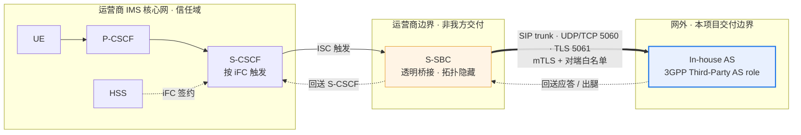
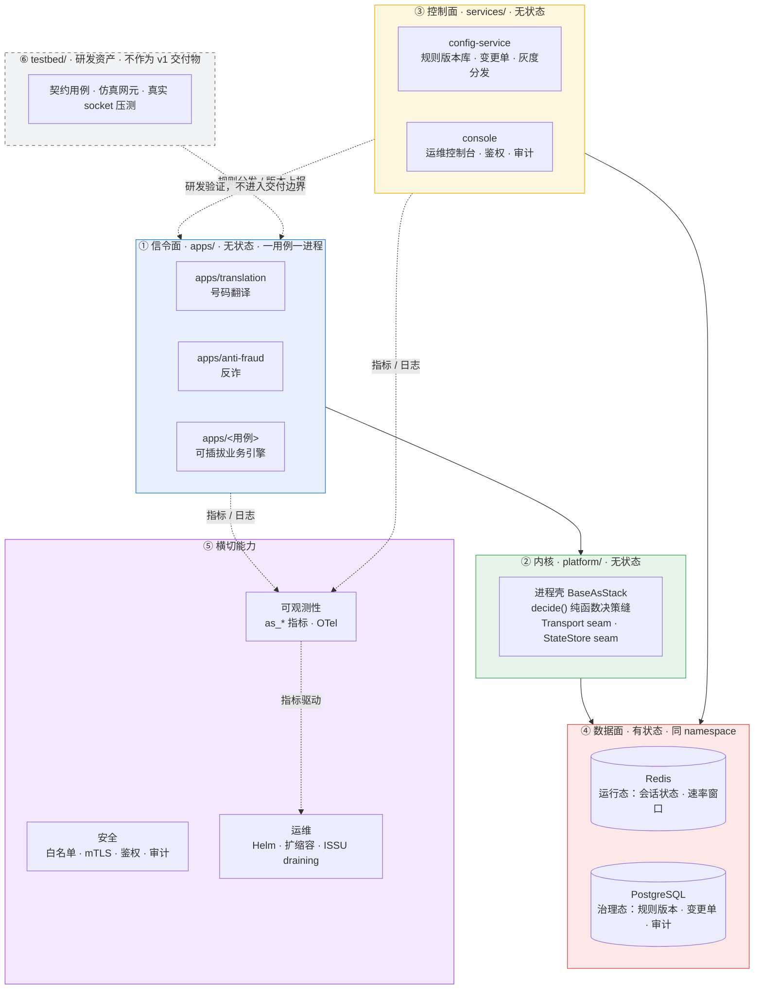

# In-house IMS Application Server（文档暂用名）—— 产品一页纸

> **状态块（阅读本文前先看这里）**
>
> - **产品名**：**In-house IMS Application Server（文档暂用名）**，首现处标注 3GPP Third-Party AS role，下文简称 in-house AS。该名称**不是已正式批准的产品名** —— 正式命名决策落点待补（`docs/plan.md` §0「产品决策记录」；`docs/product-packaging-plan.md` §4.3）。
> - **git repo 名**拟改为 `inhouse-ims-as`，**仅涉及 git 仓库名与 remote URL**；chart name（`3rdparty-as`，见 `deploy/helm/Chart.yaml`）、镜像名（`registry.example.com/3rdparty-as`）、OTel 服务名**保持 `3rdparty-as` 不变**。
> - **目标场景**：**3HK 内部上线评审（内部评审导向）** —— 这是**当前默认方向**（来源为 `docs/discussion.md` 讨论 + 维护者 2026-10-09 确认方向），**尚未形成正式决策落点**，不得当作已确认的产品决策引用。
> - **本文件归属**：`docs/product-packaging-plan.md` §1 第一批交付物 **1.1（产品一页纸 + 命名）**。
> - **本文尚未评审**：按 `AGENT.md` §3.3，评审必须留下独立 review record；本文当前**没有** review record，待维护者评审。
> - **本文不含任何容量/性能数字**：O1（容量目标）**未裁决**（`docs/plan.md` §5.1）。M6 dev-host 测量属内部参考、非对外指标，`AGENT.md` §2 在 O1 裁决前禁止发布任何 CPS / CAPS / BHCA / 并发 / 时延数字。本文因此**没有**容量章节，也**没有**时延 KPI。

---

## 1. 价值主张

in-house AS 是一个**多业务承载平台**：每个业务用例是一个独立进程（`apps/`，一个用例一个进程、一个故障域、一个灰度单元），业务引擎可插拔，新增业务不改核心网。新业务上线只需要"加一个 app + 一条配置变更单"，**不需要改动 IMS 核心网** —— S-CSCF 按 HSS 里的 iFC 签约触发 ISC，S-SBC 做透明桥接把呼叫送到网外。平台因此**不被核心网厂商的业务版本绑定**：业务逻辑在我们自己的进程里，核心网侧只看到标准 ISC 触发。交付形态是**单租户、on-premises**，数据（运行态与治理态）全部留在客户机房，不出客户边界。

---

## 2. 我们是什么 / 不是什么

| 维度 | 是什么 | 不是什么 | 理由与依据 |
|---|---|---|---|
| 网络角色 | 运营商 IMS 网络**之外**的外部 AS，由 S-CSCF 按 iFC 触发 | 不是核心网网元，不是 S-CSCF / S-SBC / HSS 的替代品 | 核心网是运营商的；我方只实现外部 AS（S-CSCF / S-SBC / HSS 仅作为 `testbed/` 仿真器出现，`AGENT.md` §1） |
| 接入语义 | 只实现**一种**接入语义：ISC（被 S-CSCF 触发） | 不做"网内 / 网外"双模适配器；SIP trunk 只是承载层，不是第二种业务语义 | S-SBC 透明桥接使两侧都无感（ADR-0003 accepted；REQ-NF-5） |
| 业务面 | 只做**信令**：SIP 消息与业务判决，头域与 SDP 原样透传 | 不做媒体：无 RTP、无转码、无 DTMF、无 MRF、无媒体锚定 | 网外做媒体中继会形成三角路由并引入语音合规问题；媒体能力只保留 seam 并写明触发条件（ADR-0004 accepted） |
| 呼叫记录 | 按 **Call-ID** 的呼叫轨迹，用于投诉追溯与反诈举证 | 不做 CDR：不采集、不投递、不归档、不批价 | CDR 是话单，网外第三方 AS 不介入（ADR-0017 accepted） |
| 计费 | 不参与计费；计费域（OCS / 计费网元）**N/A**，不出现在本产品架构图内 | 不做计费、不做批价、不做话单分发 | 计费数据归属运营商计费域；本产品数据面只有 Redis / PostgreSQL（ADR-0017 accepted） |
| 合规 | 边界内安全：trunk 对端白名单 + 端到端 TLS + 控制台鉴权与全量审计 | 不做合法监听（LI）；IRI 由网内网元出 | 第三方 AS 介入 LI 会引入跨法域暴露（ADR-0016 accepted） |
| 接口面 | 对外只有 SIP trunk；控制面只暴露 AS 内部 API | 不做 **Diameter Sh** | 数据来自我们自己的数据面，不需要 Sh（`AGENT.md` §2 非目标，无独立 ADR） |
| 部署形态 | 单租户、on-premises，一个 namespace 承载一套完整系统 | 不做多租户 / 共享实例逻辑隔离 | 运营商交付本身就是一客户一系统；单租户天然物理隔离、数据不出机房（REQ-NF-9；`AGENT.md` §2） |
| 配置治理 | 变更单 → 审批 → 写 PostgreSQL → 灰度分发 → 可回滚 | 配置**不走 GitOps**；不是运维直接 UPDATE 数据库 | 不应要求运营商运维为改号段去学 Git（ADR-0006 accepted） |
| 交付物 | Helm + 标准 Deployment / ConfigMap / Secret 是生产唯一形态 | 不写 Operator（CRD） | 标准 Helm 已足够（ADR-0013 accepted） |
| 容量口径 | 只声明"如何测量"，不声明"能扛多少" | **M6 实测与维护者裁决之前，不发布任何容量数字** | O1 未裁决；`deploy/alerts/README.md` 明确"没有容量类告警"（`AGENT.md` §2） |

---

## 3. 在网络中的位置

- S-SBC 对两侧都透明：对 S-CSCF，AS 是网内 AS；对 AS，对端就是 S-CSCF。因此本系统只实现 ISC（ADR-0003）。
- **计费域不在图内**：本产品与计费域无接口，标 **N/A**（不做 CDR / 计费，ADR-0017）。
- **ISSC / iFC 触发不可用时**：呼叫不经本 AS 放行，AS 侧不介入。iFC 触发逻辑属于 S-CSCF / HSS，不在我方交付边界内；AS 只实现 ISC 触发后的业务判决。

---

## 4. 架构大图

**关键决策缝（换零件不换架构）**

| 决策缝 | 位置 | 性质 | 依据 |
|---|---|---|---|
| `decide()` 纯函数 | 内核 | 判决模块内无 socket、无时钟、无全局状态 → 可强制 TDD | `AGENT.md` §5；`apps/` 业务判决为纯函数 |
| Transport seam | 内核 | 对端准入与传输策略可替换（白名单、证书、监听） | ADR-0016 accepted |
| StateStore seam | 内核 | 运行态存储可替换（内存 / Redis），数据面职责单一 | ADR-0007 accepted |
| 一用例一进程 | `apps/` | 每用例独立 Deployment、独立 Service、独立缩容单元 | ADR-0002 accepted；chart 每个 `useCases` 条目渲染一个 Deployment |
| ISSU = draining | 内核 + 运维 | 摘流 → draining → 归零才退出；不做在途呼叫迁移 | ADR-0009 accepted |
| ISC 触发不可用 | 网络边界 | 呼叫不经本 AS，AS 侧不介入（无 iFC 逻辑落在 AS 侧） | ADR-0003 accepted；REQ-NF-5 |

---

## 5. 关键 KPI（定义式，不含数值）

指标名与语义以 `platform/src/as_platform/telemetry/metrics.py` 为唯一权威；采集通路是进程的 `/metrics` 端点（Prometheus 文本格式，`HealthServer`，需 `AS_HEALTH_PORT`）。**本页只给定义，不给阈值、不给目标值。**

| KPI | 定义 | 数据来源 | 当前可观测性状态（如实标注） |
|---|---|---|---|
| 在途呼叫数 | 单个实例当前承载的在途呼叫数 | `as_active_calls{use_case,pod}` | 生产路径**有**生产者，但覆盖范围受限：仅在 reSIProcate 运行时（`AS_ENABLE_SIP_RUNTIME=1` 且 `_resip_runtime` 已构建）的 dialog established / terminated 事件上 +1 / −1；非该运行时下只能由 `AS_M5_SIMULATED_ACTIVE_CALLS` 模拟。而 reSIProcate 生产路径行为 E1 仍未验收（`docs/plan.md` §5.1 O3），故**尚无生产环境证据** |
| 缩容可摘除标志 | 缩容保护判定：`1` = 允许摘除，`0` = 受保护或 draining 中 | `as_downscale_removable{use_case,pod}` | 生产路径**已接线**：metrics 循环按 guard 配置与 draining 状态周期性写入。无阈值、无目标值 |
| 状态存储可用性 | Redis 可达性：`1` = 可达，`0` = 不可达 | `as_state_store_available{use_case}` | 生产路径**已接线但有条件**：仅当环境变量 `REDIS_URL` 非空时才探测；未设置 `REDIS_URL` 时该序列**不存在**（不是 0） |
| SIP 响应计数 | 按 `use_case` / `status_class` / `status_code` 计数的 SIP 响应 | `as_sip_responses_total{use_case,status_class,status_code}` | 生产路径**暂无数据生产者**：只有 `AS_M5_PROBE_SIP_STATUS` 探针（进程启动时写一次，生产 on-prem 不设该变量）；产品 SIP adapter 在每次发最终响应时调用该路径**仍待接线**。因此依赖它的 `ASHighErrorRatio` 告警当前不会触发（见 `deploy/alerts/README.md` 指标契约表） |
| 规则命中计数 | 每条规则做出判决的次数 | `as_rule_hits_total{rule}` | 定义与写入接口已存在，但**生产路径无调用方**（目前只有单测调用），且不在 `deploy/alerts/README.md` 的告警契约表内 |
| 遥测丢弃计数 | 有界队列丢弃的遥测事件数 | `as_telemetry_dropped_total{use_case}` | 需配置 `OTEL_EXPORTER_OTLP_ENDPOINT` 才会启用有界队列（未配置时 sink 为 `NoOpSink`，该计数不产生）；且队列的 exporter 目前默认 `NoOpExporter`，**真实 OTLP 后端接线仍未完成** |

> **注记：当前没有时延 / 吞吐 / CPS 类指标。** `MetricKind` 只有 `COUNTER` 与 `GAUGE` 两种（`platform/src/as_platform/telemetry/metrics.py`），没有 histogram 类型，指标注册表里也不存在任何时延或吞吐序列；`deploy/alerts/README.md` 的阈值一律是比率、相对变化或状态条件，不含绝对容量值。因此本页**不列时延 KPI，也不列任何容量 KPI** —— 容量模型与测量方法待 O1 裁决后写入 [`docs/product/ne-datasheet.md`](ne-datasheet.md)。

---

## 6. 三步部署

Helm 是生产唯一交付形态（ADR-0013），chart name 为 `3rdparty-as`。

| 步骤 | 做什么 | 注意 |
|---|---|---|
| 1. 准备环境与依赖 | 确认 K8s 版本与 API、节点资源、Helm 与 RBAC；准备运行态 Redis 与治理态 PostgreSQL（或启用 chart 的 `stateStores`）；执行部署前环境校验 | 校验脚本见 [`docs/delivery/preflight.sh`](../delivery/preflight.sh)（预检 K8s / 资源 / 依赖服务 / Helm / RBAC） |
| 2. 安装 | 用 `helm upgrade --install` 安装 chart，每个业务用例渲染为独立 Deployment | **本文不复述 values 参数** —— 参数与渲染行为以 [`deploy/helm/README.md`](../../deploy/helm/README.md) 为权威，交付清单与命令序列见 [`docs/delivery/install-guide.md`](../delivery/install-guide.md) |
| 3. 接入与验证 | 与运营商 S-SBC 对接 SIP trunk（UDP/TCP 5060、TLS 5061，mTLS + 对端白名单）；由 S-CSCF / HSS 侧 iFC 签约触发 ISC；用仿真对端或真实 S-SBC 验证呼叫与判决 | iFC 触发在 S-CSCF / HSS 侧配置，不在 AS 侧；AS 只实现 ISC 触发后的业务判决 |

**不在范围内**：生产 ingress（7.2d）与真实集群证据当前仍 **blocked**；本页不提供任何集群内验证结论，也不提供 air-gapped 离线包步骤（见 [`docs/delivery/airgap-package.md`](../delivery/airgap-package.md)）。

---

## 7. 当前状态与未决（如实标注，不得当已验收引用）

| 项 | 状态 |
|---|---|
| M8 发布候选 | 产物就绪，**退出签字未完成**（`docs/plan.md` §0） |
| E1 reSIProcate 生产路径行为 | **待验收**（O3 / O2） |
| E4 TLS 证书热轮换 | **待验收**；运营商 PKI 无实验室证据 |
| E5 状态外置与恢复 | **待验收**（REQ-NF-1 签收仍归 M8） |
| e2e 测试 | `pytest e2e` marker **为 0**，完整呼叫 + 控制台端到端路径未落地 |
| O1 容量目标 | **未裁决** —— 因此本文无任何容量数字 |
| O4 呼叫轨迹保留期 | **未决** —— 保留期限无法落地 |
| D5 轨迹存储选型 | **未决** —— PostgreSQL 或独立短保留存储待定 |
| O5 容灾等级 | **未决**（N+1 单节点 / N+M 机架或 AZ），影响 Redis 是否跨 AZ |

---

## 8. 文档索引

| 文档 | 内容 | 位置 |
|---|---|---|
| **本文件** | 定位、价值主张、架构大图、KPI 定义、三步部署 | `docs/product/one-pager.md` |
| [`compliance-matrix.md`](compliance-matrix.md) | 3GPP / GSMA / RFC 规范符合性矩阵（Sh 与计费标 N/A 并保留理由） | `docs/product/` |
| [`ne-datasheet.md`](ne-datasheet.md) | 网元档案：KPI 定义、告警清单、依赖关系、资源规格、容量模型（容量数值受 O1 阻塞） | `docs/product/` |
| [`responsibility-matrix.md`](responsibility-matrix.md) | 责任边界矩阵 RACI：AS 与 S-CSCF / HSS / 计费域 / 网管 / 安全各域 | `docs/product/` |
| [`version-lifecycle.md`](version-lifecycle.md) | 版本生命周期与 EOL 策略（REQ-NF-16 / ADR-0027） | `docs/product/` |
| [`security-privacy.md`](security-privacy.md) | 安全与隐私合规（PDPO）；保留期限待 O4、存储选型待 D5 | `docs/product/` |
| [`../operations/runbook-l1.md`](../operations/runbook-l1.md) | L1 运维手册（NOC 日常与告警处置） | `docs/operations/` |
| [`../operations/runbook-l2.md`](../operations/runbook-l2.md) | L2 运维手册（深度排障与信令分析） | `docs/operations/` |
| [`../operations/fault-demarcation.md`](../operations/fault-demarcation.md) | 故障定界手册：AS / S-CSCF / HSS / 计费域四方定界 | `docs/operations/` |
| [`../operations/rollback-playbook.md`](../operations/rollback-playbook.md) | 业务摘流 / 回退 + iFC 侧配合手册 | `docs/operations/` |
| [`../operations/backup-restore.md`](../operations/backup-restore.md) | 备份恢复方案 + 演练记录模板（受真实集群环境阻塞） | `docs/operations/` |
| [`../delivery/install-guide.md`](../delivery/install-guide.md) | 交付清单、镜像同步、`helm install` 命令序列 | `docs/delivery/` |
| [`../delivery/airgap-package.md`](../delivery/airgap-package.md) | 离线安装包（镜像同步 + `helm package`）制作与使用 | `docs/delivery/` |
| [`../delivery/preflight.sh`](../delivery/preflight.sh) | 部署前环境校验脚本 | `docs/delivery/` |
| [`../../deploy/helm/README.md`](../../deploy/helm/README.md) | Helm chart 参数与渲染行为的**权威**说明 | 已存在 |
| [`../architecture/新系统整体架构.md`](../architecture/新系统整体架构.md) | 设计基线：网络位置、分层、配置治理、冗余与 ISSU、安全边界、未决与风险 | 已存在 |
| [`../plan.md`](../plan.md) | 里程碑状态、产品决策记录、未决项（O1–O5） | 已存在 |
| [`../product-packaging-plan.md`](../product-packaging-plan.md) | 本文件所属的包装计划与交付物清单 | 已存在 |
| [`../acceptance/test-plan.md`](../acceptance/test-plan.md) | 验收标准与自动化分层边界（e2e marker 现状） | 已存在 |
| [`../../deploy/alerts/README.md`](../../deploy/alerts/README.md) | 告警规则集与指标契约（为什么没有容量类告警） | 已存在 |
| [`../../AGENT.md`](../../AGENT.md) | 协作守则：非目标、编码约定、门禁、DoD | 已存在 |

> 上表中标注 `docs/product/`、`docs/operations/`、`docs/delivery/` 的链接**均已落盘**，可直接打开；其中**依赖真实集群 / 依赖对端配合的部分仍 blocked**（G-P1-10），见各自文档的阻塞标注。

---

## 9. 追溯

- **对应交付物**：`docs/product-packaging-plan.md` §1 第一批 **1.1（产品一页纸 + 命名）**；工程事实约束见该计划 §0.3。
- **已落实的评审整改项**：
  - **G-P0-6**（目标场景决策依据不足）→ 目标场景降格为**当前默认方向（讨论确认，待补正式决策落点）**，见状态块；正式落点位置为 `docs/plan.md` §0「产品决策记录」。
  - **G-P2-6**（产品名"已确认"依据不足）→ 全文使用**文档暂用名**，并写明「不是已正式批准的产品名」；git repo 改名限定为仓库名与 remote URL，chart / 镜像 / OTel 服务名不变。
- **引用的 REQ**：`REQ-NF-1`（进程重启不丢会话）、`REQ-NF-2`（单进程状态有界）、`REQ-NF-3`（可水平扩展）、`REQ-NF-4`（ISSU）、`REQ-NF-5`（S-SBC 透明桥接）、`REQ-NF-9`（单租户 on-premises）、`REQ-NF-13`（OTel 三信号导出）、`REQ-NF-14`（告警规则集）、`REQ-NF-16`（版本生命周期与 EOL）；`REQ-F-1`（基本呼叫信令序列）、`REQ-F-2`（B2BUA 两侧 Call-ID 不同）、`REQ-F-5`（Route / Record-Route 处理）、`REQ-F-7`（命中阻止策略返回 603 Decline）。定义见 `docs/requirements/prd.md`。
- **引用的 ADR（状态以各文件头为准）**：ADR-0002（一用例一进程，accepted）、ADR-0003（S-SBC 透明桥接 / 单一 ISC，accepted）、ADR-0004（媒体 seam，accepted）、ADR-0005（OTel 可观测性，accepted）、ADR-0006（配置治理，accepted）、ADR-0007（数据面 split，accepted）、ADR-0009（ISSU / draining，accepted）、ADR-0013（Helm-only 生产形态，accepted）、ADR-0014（三层 testbed，accepted）、ADR-0016（边界内安全，accepted）、ADR-0017（不做 CDR，accepted）、ADR-0021（运行态覆盖粒度，accepted）、ADR-0026（集群内状态存储，accepted）、ADR-0027（版本生命周期与 EOL，accepted）。**ADR-0023（Redis checkpoint，proposed）与 ADR-0025（托管规则运行时 bundle，draft）尚未通过**，本文不据其作结论。
- **未做的事**：不写容量数字（O1 未裁决）；不写 Diameter Sh 与 CDR / 计费相关内容（N/A 并给理由）；不引用 M6 dev-host 数字作为对外指标；不把任何未验收项写成已通过。
