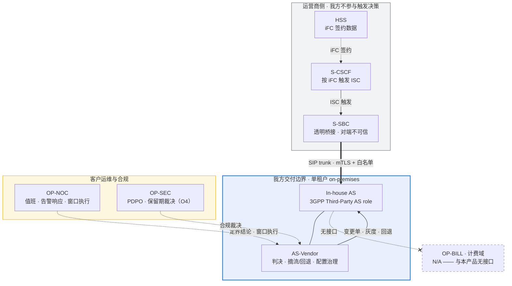

# In-house IMS Application Server（文档暂用名）—— 责任边界矩阵（RACI）

> **状态块（阅读本文前先看这里）**
>
> - **产品名**：**In-house IMS Application Server（文档暂用名）**，首现处标注 3GPP Third-Party AS role，下文简称 in-house AS。该名称**不是已正式批准的产品名**（`../plan.md` §0「产品决策记录」；`../product-packaging-plan.md` §4.3）。git repo 名拟改为 `inhouse-ims-as`，**仅涉及 git 仓库名与 remote URL**；chart name（`3rdparty-as`）、镜像名、OTel 服务名**保持 `3rdparty-as` 不变**。
> - **本文件归属**：`../product-packaging-plan.md` §1 第三批交付物 **3.3（责任边界矩阵 / RACI）**。按该计划 §3.2，本交付物属 **A 类**（不依赖未决项，可立即启动）。
> - **⚠️ iFC 触发逻辑属 S-CSCF / HSS，不在 AS 侧**（评审 **G-P0-5** 已裁决）。本产品**只实现 ISC 触发后的业务判决与摘流/ 回退**。按号段/ 百分比的 **iFC 侧灰度触发必须由 S-CSCF / HSS 侧配置**，AS 侧无从代劳。本文所有 RACI 行都按这一边界写。
> - **⚠️ 计费域全程 N/A**：不做 CDR、不投递、不归档、不批价（ADR-0017 accepted）；**Sh 相关活动 N/A**（`AGENT.md` §2 非目标）；**LI / IRI N/A**（ADR-0016 accepted）。
> - **本文不含任何容量 / 性能数字**：O1（容量目标）**未裁决**（`../plan.md` §5.1 O1），`AGENT.md` §2 在实测裁决前禁止发布任何 CPS / CAPS / BHCA / 并发 / 吞吐 / 时延数字。文中出现的 `5060` / `5061` 是**协议端口常量**，不是容量指标。
> - **本文尚未评审**：按 `AGENT.md` §3.3，评审必须留下独立 review record；本文当前**没有** review record，待维护者评审。
> - **未验收项不得当作已验收**：E1（reSIProcate 生产路径行为）/ E4（TLS 证书热轮换）/ E5（状态外置与恢复）**未验收**；e2e marker **为 0**；REQ-S-4 仅为**工程切片**，M4/M4b 工程关门 ≠ REQ 验收；M8 RC 产物就绪但**退出签字仍搁置**（RC 就绪 ≠ 通过）。
> - **互链**：本文与 [`../operations/fault-demarcation.md`](../operations/fault-demarcation.md)（故障定界手册）、[`../operations/rollback-playbook.md`](../operations/rollback-playbook.md)（业务摘流 / 回退 + iFC 侧配合手册）互链，二者**均已落盘**；但依赖真实集群 / 对端配合的部分**仍 blocked**（G-P1-10）。
> - **评审入口**：本次产品化包装的**执行记录**见 [`../reviews/product-packaging-execution-record-2026-10-10.md`](../reviews/product-packaging-execution-record-2026-10-10.md) —— 它是**执行记录，不是维护者签字的 review record**（下条「本文尚未评审」仍然成立）。

---

## 1. 参与方定义

| 代号 | 角色 | 所属 | 在本产品中的关系 |
|---|---|---|---|
| **AS-Vendor** | In-house IMS Application Server 维护方（我方） | 本文编写方 | 交付并维护 AS 全部组件：`apps/` 业务引擎、`platform/` 内核、`services/` 控制面、`deploy/` 部署资产。**只实现外部 AS**（`AGENT.md` §1） |
| **OP-NET** | 运营商网络部（S-CSCF 侧） | 客户 | 拥有 S-CSCF；持有 iFC 签约数据的使用权；**iFC 触发逻辑的实现方**。按iFC 触发 ISC 并经 S-SBC 送达 AS |
| **OP-SBC** | S-SBC 网元 | 客户（**非我方交付**） | SIP trunk 的**对端**；透明桥接、拓扑隐藏。trunk 不可信，对端准入由 AS 侧校验（ADR-0016） |
| **OP-HSS** | HSS | 客户 | iFC 签约数据的**存储方**；按 iFC 灰度触发需其侧配合配置 |
| **OP-BILL** | 计费域（OCS / 计费网元） | 客户 | **N/A** —— 与本产品**无接口**。不做 CDR / 计费 / 批价（ADR-0017） |
| **OP-NOC** | 网管 / NOC | 客户 | 承接告警响应、日常巡检、变更窗口执行；在我方回退决策配合下操作 |
| **OP-SEC** | 安全与合规 | 客户 | PDPO 与数据留港的**责任方**；保留期与跨境安排的裁决方（O4）；渗透测试的委托方与出口标准裁决方 |
| **3P** | 第三方联调方（如集成商、S-SBC 厂商） | 客户指定 | 在客户授权下参与互通测试与联调；**不直接持有本产品任何凭据**（`AGENT.md` §11：绝不提交密钥 / 证书 / 真实抓包） |

**边界一句话**：AS 侧只拥有「ISC 触发之后的判决、摘流与回退」；触发之前的接入决策（iFC 签约、触发、灰度）全部在 OP-NET / OP-HSS / OP-SBC 侧。

### 1.1 边界图与责任面

**读图要点**：① 虚线框「运营商侧」内的一切**都不是我方交付物**；② 我方与客户运维/合规之间是**协作**关系（定界结论由 OP-NOC 出、保留期由 OP-SEC 裁决），不是我方单方面决定；③ 计费域用虚线且无连线 —— **无接口即无责任**。

---

## 2. RACI 矩阵（主交付物）

**图例**：`R` = 执行（干活的人）·`A` = 批准 / 最终负责（拍板的人，恒为每行唯一）· `C` = 被咨询 · `I` = 被通知 · **`对方`** = 该活动完全在运营商侧，**我方不参与**。

| # | 活动 | AS-Vendor | OP-NET | OP-SBC | OP-HSS | OP-BILL | OP-NOC | OP-SEC | 3P |
|---|---|---|---|---|---|---|---|---|---|
| ① | **iFC 签约与触发配置**（签约数据、按号段/百分比灰度触发） | I | **A**/R | C | **R** | — | I | — | — |
| ② | **S-CSCF → S-SBC → AS trunk 建立与互通测试** | R | C | **A**/R | I | — | I | — | C |
| ③ | **trunk TLS 证书签发与轮换**（双方各自签发/更新，密钥不跨方共享） | R（AS 侧证书与热更新） | C | **A**/R（S-SBC 侧证书） | — | — | I | C | — |
| ④ | **AS 侧号码/ 号段规则与变更单** | **A**/R | C | — | — | — | I | — | — |
| ⑤ | **业务判决灰度**（号段 / 稳定哈希百分比，ADR-0021） | **A**/R | I | I | — | — | I | — | — |
| ⑥ | **ISC 触发后的摘流 / 回退**（AS 侧 runtime override，热判定不重启） | **A**/R | C | C（执行摘流） | — | — | **R**（操作） | — | — |
| ⑦ | **NOC 值班与告警响应** | C（升级二线） | I | I | — | — | **A**/R | — | — |
| ⑧ | **故障定界** | R（AS 侧自查） | C | C | C | — | **A**（定界结论） | — | C |
| ⑨ | **接口抓包与日志取证**（AS 侧提供，详见 §3） | **A**/R | C | C | — | — | C | C | — |
| ⑩ | **变更窗口协调** | R（AS 侧窗口） | **A**（网络侧窗口） | C | I | — | R（执行） | I | I |
| ⑪ | **备份与恢复**（含 PostgreSQL 流复制 + 备份 + PITR） | **A**/R | I | I | — | — | C（执行窗口） | C | — |
| ⑫ | **容量规划与 O1 裁决** | R（提供测量方法学） | **A**（目标裁决） | C | — | — | C | — | — |
| ⑬ | **版本升级与 EOL 通知** | **A**/R（依 ADR-0027发出） | I | I | — | — | I | I | I |
| ⑭ | **PDPO 合规与保留期裁决（O4）** | C（提供机制与范围） | I | — | — | — | I | **A**/R | — |
| ⑮ | **渗透测试** | R（提供环境与范围） | C（对端配合） | C（对端配合） | — | — | I | **A**（出口标准） | C |
| ⑯ | **性能证据采集**（内部测量口径，见下方纪律） | **A**/R | I | I | — | — | I | — | — |
| ⑰ | **Sh 相关活动**（订阅数据查询等） | — | — | — | — | — | — | — | — |
| ⑱ | **CDR / 计费相关活动** | — | — | — | — | — | — | — | — |
| ⑲ | **LI / IRI 相关活动** | — | — | — | — | — | — | — | — |

**必须如实体现的四条边界**

1. **① iFC 灰度触发需 S-CSCF / HSS 侧配合配置。** AS 侧只负责**触发后**的判决与摘流（**G-P0-5**、**G-P1-10**）。评审已明确纠正过"iFC 灰度是 AS 侧交付物"的错误表述；按号段 / 百分比的 iFC 触发需 OP-NET / OP-HSS 配置，AS 侧无从代劳。
2. **⑤ AS 侧灰度 ≠ iFC 灰度。** AS 侧能做的是**业务规则灰度**与**运行态覆盖**：判定粒度固定为**号码前缀（号段）+ 可选稳定哈希百分比**，判定须幂等（ADR-0021 accepted；实现见 `platform/src/as_platform/gating/overrides.py:39-97`，`in_bucket` 用 `fnv1a32(call_id) % _BUCKETS` 保证重复求值同答案）。部署级总开关走变更流水线，不新开通道（ADR-0020；ADR-0006）。
3. **⑰⑱⑲ 全行 N/A**：Sh —— 数据来自自有数据面（`AGENT.md` §2）；CDR / 计费 —— ADR-0017 accepted，且明确"呼叫轨迹不是话单"（ADR-0017 决策 ③）；LI / IRI —— 属网内网元职能，第三方 AS 介入引入跨法域暴露（ADR-0016 accepted）。
4. **⑯ 性能证据是内部测量。** O1 未裁决，本文**不写任何数值**；M6 dev-host 测量带「内部测量 / 非对外 / 非 SLA」限定，且 `testbed/` 是研发资产（ADR-0014），**不得充当运营商 IOT 或现网容量证据**（`../product-packaging-plan.md` §0.3 第 8 条）。

---

## 3. 接口抓包责任方

| 链路段 | 谁抓 | 抓什么 | 我方能提供什么 | 限制 |
|---|---|---|---|---|
| **S-CSCF → S-SBC**（ISC 触发） | **对方**（OP-NET / OP-SBC） | iFC 触发上下文与触发结果 | **不提供** | 该段完全不经过 AS。AS 侧无此段抓包，也不持有 iFC 触发日志 |
| **S-SBC → AS trunk**（SIP over TLS `5061`） | **双方各自抓本侧** | 各自进程/网元侧的信令流 | ① **Call-ID 关联的 JSON 日志字段契约**（见下）；② `/metrics` 端点的 `as_*` 序列 | **TLS 情况下抓包解密属各方责任，密钥不跨方共享**。AS 侧**不接受**为解密而复制对端私钥；**绝不提交真实抓包**（`AGENT.md` §11 / §13；`SECURITY.md`） |
| **AS → 下游**（`AS_SIP_NEXT_HOP` 出腿） | **对方**（下游网元 / OP-NET 侧） | 下游侧收到的请求 | AS 侧提供入腿 / 出腿双向的 Call-ID 关联字段（`outgoing_call_id` / `inbound_call_id`） | 出腿信令的落地结果只能由下游侧取证 |
| **AS 内部**（`apps/` → `platform/` → Redis / PostgreSQL） | **我方** | 判决结果、状态存储交互、配置版本 | 全部由 AS 侧提供 | 内网内部；PG 密码与审计 HMAC key 走 Secret，**不进日志** |
| **`testbed/` 仿真链路** | **我方**（研发） | 全部 | 全部 | ⚠️ **不是现网证据**。仿真结果（含 callload、M7.1 仿真平台、dev-host harness）是研发/ 演示资产，ADR-0014 明确 v1 不把 testbed 作为交付物 |

**AS 侧可提供的确切契约（供对方对齐检索键）**

| 项 | 内容 | 位置 |
|---|---|---|
| JSON 日志字段 | `timestamp` / `level` / `trace_id` / `call_id` / `direction` / `method` | [`../acceptance/m8-resip-runtime-log-contract.md`](../acceptance/m8-resip-runtime-log-contract.md) §1-§2（冻结的字段与事件表） |
| 事件表 | `RESIP_RUNTIME_LISTENING` / `UAC_INVITE_SENT` / `UAC_NEW_SESSION` / `UAC_FAILURE` / `UAS_FAILURE_MAPPED` / `OUTBOUND_CANCEL_FORWARD` / `UAS_ANSWER_RELAYED` / `RELOAD_CERTIFICATES` + 各类 `*_ERROR` / `*_CORRELATION_MISS` | 同上 §2 字段契约表 |
| 两腿 Call-ID 关联 | 入腿 `inbound_call_id` ↔ 出腿 `outgoing_call_id`（B2BUA 两侧 Call-ID 不同） | 契约事件 `RESIP_RUNTIME_UAC_INVITE_SENT` 的 `inbound_call_id` + `outgoing_call_id` |
| 解析器与测试 | `platform/src/as_platform/sip/resip_runtime_log_contract.py`；`platform/tests/test_resip_runtime_log_contract.py`（`contract` marker） | 字段稳定性由契约测试守卫（C++ 改名 / 改键即红） |
| 指标 | `/metrics`（Prometheus 文本格式，`HealthServer`，端口来自 `AS_HEALTH_PORT`） | `platform/src/as_platform/telemetry/metrics.py`（定义权威）；⚠️ chart 未接线抓取（无 scrape 注解、无 ServiceMonitor） |

**AS 侧明确不提供的**

| 不提供 | 理由 | 依据 |
|---|---|---|
| **IRI / LI** | 属网内网元职能；第三方 AS 介入引入跨主体 / 跨法域暴露。本 ADR **不为其预留任何采集点** —— 预留采集点等于预留了被要求启用的可能 | ADR-0016 accepted |
| **CDR / 话单** | 不采集、不投递、不归档、不批价。以按 Call-ID 的呼叫轨迹替代，且**明确声明轨迹不是话单** | ADR-0017 accepted（决策 ①③） |
| **跨侧解密抓包** | 密钥不跨方共享 | `AGENT.md` §11 |
| **载荷日志**（默认关闭） | `AS_PAYLOAD_LOGS_ENABLED` / `telemetry.payloadLogsEnabled` 默认 `false`（`deploy/helm/values.yaml:319`；`deploy/helm/templates/configmap.yaml:65`）。开启是显式、可审计的操作 | ADR-0016；`AGENT.md` §13 |

---

## 4. 故障归属速查

> 完整剧本与检查表见 [`../operations/fault-demarcation.md`](../operations/fault-demarcation.md)（**已落盘**；但完整剧本的真实集群证据仍 blocked，M8 7.2d 未解锁）。本文只给首轮归属判断与 AS 侧自查动作。

| 现象 | 首选归属方 | AS 侧自查动作 | 升级路径 |
|---|---|---|---|
| 呼入未到达 AS（对端无任何 INVITE） | **对方**（OP-SBC / OP-NET） | 查本端是否收到连接：`as_downscale_removable`、Pod 状态、Service Endpoints | OP-NOC → OP-NET。AS 侧**无证据时不得先行定界** |
| AS 侧无入腿日志但投诉成立 | **待定**，双方对齐 | 查 `/metrics` 是否有该use_case 的序列产生；查 ingress 是否拒了对端 | OP-NOC 拉双方时间线 → 联合定界 |
| `403 Forbidden` | **AS 侧** | 明文在要求 TLS 时被拒（`platform/src/as_platform/sip/ingress.py:178-194`，`tls`/`sips` 之外的 transport 一律拒），或对端白名单未命中 —— **两者共用403** | AS 二线 → 客户 PKI / 网络部 |
| `603 Decline` | **通常不是故障**（预期业务判决） | 查生效规则版本与命中策略（反诈超限） | 若规则与预期不符 → 走变更单回滚（ADR-0006） |
| `404 Not Found` | **通常不是故障**（无匹配规则） | 查号段 / 前缀规则是否覆盖 | 规则问题 → 变更单 |
| `487 Request Terminated` | 通常是**主叫放弃** | 与契约场景 S4 对齐；注意 native DUM 语义仍在验收中（E1 未验收） | 计数异常 → AS 二线 |
| TLS 握手失败 | **双方**（证书链 / 指纹白名单 / CA 配置） | 查 `AS_TLS_CA_PATH` 指向的 CA 是否包含对端签发链；查对端指纹是否在 `AS_PEER_ALLOWED_CERT_FINGERPRINTS`（`platform/src/as_platform/runtime/transport_env.py:86-89`）。**密钥不跨方共享** | 双方 PKI 负责人联合 |
| `ASCallStateStoreUnavailable` 触发 | **AS 侧**（Redis 不可达） | 该指标**仅在 `REDIS_URL` 非空时产生**；未配置时序列不存在（不是 0），规则永不触发 | AS 二线 / 平台侧 |
| `ASRestartLoop` 触发 | **AS 侧** | 唯一当前可触发的 `as.*` 规则；数据源是外部 kube-state-metrics | AS 二线 |
| 配置改了但不生效 | **AS 侧** | 变更单是否走到「生效」态；灰度分发是否完成；各实例上报的 `current_rule_version` 是否一致 | AS 二线 / config-service 负责人 |
| 已下发摘流指令但呼叫仍到达 | **对方**（OP-SBC / OP-NET 侧 iFC / 摘流未配） | 确认 AS 侧 override 已生效；**AS 侧不主动摘在途呼叫**（§5） | OP-NOC → OP-NET |
| 控制台无法登录 / 越权 | **AS 侧** | 角色矩阵 `viewer`/`approver`/`admin`（`services/console/src/as_console/access.py:26-39`）；密码为 `pbkdf2-sha256`（`services/config-service/src/as_config_service/auth.py:191-201`）；会话可撤销（同文件 `RevokedSession`，`:128-134`） | AS 二线；**越权事件同时通知 OP-SEC** |
| 审计记录缺失 / 疑似被改 | **AS 侧** | 审计表 append-only，由 `BEFORE UPDATE OR DELETE` / `BEFORE TRUNCATE` 触发器强制（`services/config-service/src/as_config_service/audit_store.py:102-104`） | AS 二线 **+ OP-SEC**（审计完整性事件） |
| 高负载下呼叫异常 | **待定** | ⚠️ **不得用容量数字定界**。O1 未裁决，`as-*` 告警中无容量类规则；用 `ASActiveCallsSurge`（相对变化）+ M6 harness（内部测量）排查 | 联合容量研究（O1） |

---

## 5. 变更窗口协作机制

### 5.1 窗口的四方结构

| 环节 | 谁提单 | 谁审批 | 备注 |
|---|---|---|---|
| AS 侧变更（镜像 `helm upgrade`、配置变更单、证书轮换） | **AS-Vendor** | AS-Vendor 内部 + **OP-NOC** 知会 | 配置走变更单 → 审批 → 写 PG → 灰度分发 → 可回滚（ADR-0006）。**不走 GitOps**（`AGENT.md` §2） |
| 运营商网络侧变更（iFC 签约 / 触发灰度、trunk 优先级、摘流） | **OP-NET / OP-NOC** | **OP-NET** | **AS 侧不代提、不代批** |
| 有状态组件维护（PostgreSQL / Redis） | **AS-Vendor** 提方案 | **OP-NOC** 批准窗口 | chart 内建的是**单副本**，**不是 HA**（`../product/ne-datasheet.md` §7）；HA / 容灾等级受 **O5** 未决影响 |
| 跨站点切换 | **AS-Vendor** 提供切换脚本 | **OP-NOC + OP-NET**（S-SBC 侧 trunk 优先级由对方改） | ADR-0008：站点内 N+1 零单点 + 跨站点 **1+1 温备（非双活）**；切换是**运维动作**，必须演练 |

### 5.2 窗口期的硬约束

| 约束 | 内容 | 依据 |
|---|---|---|
| **ISSU = draining** | 升级 / 重启 / 缩容一律：停止接收新请求 → 存量呼叫在原进程跑完 → `active_calls` 归零后退出。**不做在途呼叫状态迁移**，也**不存在"收到终止信号立即退出"** 的路径 | ADR-0009 accepted；编排侧 `preStop` + `terminationGracePeriodSeconds`（`deploy/helm/templates/deployment.yaml:49-53`） |
| **AS 侧不主动摘在途呼叫** | 我方能保证的是「**不主动摘在途呼叫**」；**呼叫是否进入本 AS 由 S-SBC / S-CSCF 侧的 iFC 配置与摘流动作决定** | G-P0-5 / G-P1-10；本产品无 iFC 逻辑 |
| **配置与证书变更不重启进程** | 证书轮换是**配置热更新**；白名单与证书走同一条变更流水线 | ADR-0016；`TransportSeam.reload` 返回新快照而非就地修改（`platform/src/as_platform/sip/transport.py:110-132`）；双证书重叠窗口见 `platform/src/as_platform/sip/ingress.py:70-100` |
| **摘流 / 回退决策人** | **AS 侧决策 + OP-NOC 执行 + OP-NET 配合**。运行态覆盖是**热判定、不重启**（ADR-0021）；部署级总开关走变更单（ADR-0020 / ADR-0006） | ADR-0020 / ADR-0021 accepted |
| **回退不是"一键零影响"** | 运行态 override 的作用范围是 AS 侧业务逻辑；把呼叫从本 AS 引走仍需 S-SBC / S-CSCF 侧配合 | G-P1-10；操作手册见 [`../operations/rollback-playbook.md`](../operations/rollback-playbook.md)（**已落盘**；但真实集群演练仍 blocked） |
| **真实集群证据仍缺** | 真实 SIP 负载下的滚动升级 / 缩容不掉呼叫、备份恢复演练**仍 blocked**；M8 7.2d 未解锁 | `../product-packaging-plan.md` §0.3 第 3 / 8 条；`docs/acceptance/test-plan.md` |

---

## 6. 未决与阻塞

| 项 | 阻塞源 | 影响 | 责任方 |
|---|---|---|---|
| iFC 侧按号段 / 百分比灰度触发的联调 | **OP-NET / OP-HSS 侧配置** | 端到端灰度与回退演练无法闭环；AS 侧只能自证override 生效 | OP-NET（AS 侧提供接口约定） |
| E4 TLS 证书热轮换无实验室证据 | M8 验收 + 运营商 PKI（REQ-S-2 / REQ-S-3） | ③ 双证书重叠窗口与轮换只有机制与 testbed-only 证据 | AS-Vendor + OP-SEC / OP-NET |
| E1 reSIProcate 生产路径行为 | M8 验收（O2 / O3） | ②⑧ 互通与定界结论缺生产证据；14 条 B2BUA 全文回放未签收 | AS-Vendor |
| E5 状态外置与恢复 | REQ-NF-1 签收归 M8 | ⑪ 恢复路径只有工程切片证据 | AS-Vendor |
| O1 容量目标未裁决 | 维护者裁决 | ⑫⑯ 无法给容量口径；容量类告警全部 defer | 维护者 + OP-NET |
| O4 呼叫轨迹保留期未决 | 客户合规要求 | 轨迹 TTL、存储容量、清理行为均未定| **OP-SEC**（AS 侧提供机制与范围） |
| D5 轨迹存储选型未决（PostgreSQL 或独立短保留存储） | 与 O4 相关 | §2 数据留存与备份策略无法定稿 | OP-SEC + AS-Vendor |
| O5 容灾等级未决（N+1 节点 / N+M 机架或 AZ） | 客户 SLA | Redis 是否跨 AZ、Sentinel 拓扑、PG HA 均未定 | OP-NET（客户 SLA） |
| D1 Python 3.10 生命周期终点 | 该日期之后的任何交付 | 需先验证迁移或登记为已接受风险（详见 [`security-privacy.md`](security-privacy.md) §6） | 维护者 |
| REQ-S-4 正式验收 | 仅为**工程切片** | ⑮ 安全相关结论不得写成已通过验收 | AS-Vendor + OP-SEC |
| 渗透测试未执行 | 无产物、无排期 | ⑦⑮ 安全基线无独立验证 | **OP-SEC**（委托）+ AS-Vendor（执行） |
| e2e marker = 0 | M8 | 完整呼叫 + 控制台端到端无自动化证据 | AS-Vendor |

---

## 7. 追溯

| 项 | 内容 |
|---|---|
| **对应交付物** | `../product-packaging-plan.md` §1 第三批 **3.3（责任边界矩阵 / RACI）**；按 §3.2 属 **A 类**（无外部阻塞）。工程事实约束见该计划 **§0.3**（尤其第 3 条运营商 PKI 无 lab 证据、第 8 条 testbed 边界） |
| **已落实的评审意见** | **G-P0-5** —— iFC 触发逻辑属 S-CSCF / HSS，不在 AS 侧；本文状态块、§1、§2 行 ①⑤⑥ 与 §5.2 全部按此边界写（评审记录 [§ Adjudication](../reviews/product-packaging-plan-review-2026-10-09.md)） **G-P1-10** —— 依赖 S-CSCF 侧配合与真实集群演练：§2 行 ①②③⑤⑥⑩ 均标注对方角色，§5 明确 AS 侧只保证不主动摘在途呼叫，§6 登记联调阻塞 **G-P0-4** —— 不做 Sh / 不做计费：§2 行 ⑰⑱ 全行 N/A 并给理由，§3「AS 侧明确不提供的」列出 CDR 与 IRI **G-P2-3** —— 不出现 `sh-interface` 类命名 |
| **引用的 REQ** | `REQ-F-13`（按 Call-ID 的轨迹查询）、`REQ-F-7`（`603 Decline`）、`REQ-F-2`（两腿 Call-ID 不同）、`REQ-NF-4`（ISSU）、`REQ-NF-5`（S-SBC 透明桥接）、`REQ-NF-7`（不做 CDR → 呼叫轨迹替代）、`REQ-NF-9`（单租户on-premises）、`REQ-NF-10`（运行态覆盖可追溯）、`REQ-NF-13`（OTel 三信号 / 日志字段）、`REQ-NF-14`（告警规则集）、`REQ-NF-16`（版本生命周期与 EOL）、`REQ-G-1`（feature 门控）、`REQ-S-1` / `REQ-S-2` / `REQ-S-3`（对端白名单 / 端到端 TLS / 证书热轮换）、`REQ-S-4`（控制台鉴权与审计，**仅工程切片**）。定义见 `../requirements/prd.md` |
| **引用的 ADR** | ADR-0002（一用例一进程）、ADR-0003（S-SBC 透明桥接单一 ISC）、ADR-0005（OTel 可观测性）、ADR-0006（配置治理 / 变更单）、ADR-0007（数据面split）、ADR-0008（冗余 / 跨站点 1+1 温备）、ADR-0009（ISSU = draining）、ADR-0010（缩容保护）、ADR-0013（Helm-only）、ADR-0014（三层 testbed）、**ADR-0016（边界内安全；不做 LI / 不做计费）**、**ADR-0017（不做 CDR）**、ADR-0018（版本号语义）、ADR-0019（SIP栈选型）、ADR-0020（feature 分层门控）、**ADR-0021（运行态覆盖粒度）**、ADR-0024（控制台密码与会话）、ADR-0026（集群内状态存储）、ADR-0027（版本生命周期与 EOL）。状态以 `../architecture/adr/README.md` 注册表为准；**ADR-0023 / ADR-0025 仍为 draft，本文不据其作结论** |
| **关键代码依据** | 对端准入 `platform/src/as_platform/sip/transport.py:249-298`（空策略拒绝 `:272-273`）；mTLS 默认值 `transport.py:86,88-93`；明文拒绝 `platform/src/as_platform/sip/ingress.py:178-194`；双证书重叠窗口 `ingress.py:70-100`；环境变量 `platform/src/as_platform/runtime/transport_env.py:52-103`；fail-closed 渲染 `deploy/helm/templates/deployment.yaml:11-16`、`validate-install.yaml:6,9,12`；draining `deployment.yaml:49-53`；NetworkPolicy `deploy/helm/templates/state-networkpolicy.yaml:1-29`；角色矩阵 `services/console/src/as_console/access.py:26-74,152-185`；密码与会话 `services/config-service/src/as_config_service/auth.py:191-232`；append-only 审计 `services/config-service/src/as_config_service/audit_store.py:102-104`；运行态覆盖 `platform/src/as_platform/gating/overrides.py:39-97`；日志字段契约 `docs/acceptance/m8-resip-runtime-log-contract.md` |
| **同批交付物** | [`one-pager.md`](one-pager.md)（1.1）、[`compliance-matrix.md`](compliance-matrix.md)（1.2）、[`ne-datasheet.md`](ne-datasheet.md)（1.3）、[`version-lifecycle.md`](version-lifecycle.md)（3.5）、[`security-privacy.md`](security-privacy.md)（3.4）及 `docs/operations/` 目录**均已落盘** |
| **已落盘的互链文档** | [`../operations/fault-demarcation.md`](../operations/fault-demarcation.md)（§4 完整剧本）、[`../operations/rollback-playbook.md`](../operations/rollback-playbook.md)（§5.2 回退）、[`../operations/alert-response-matrix.md`](../operations/alert-response-matrix.md)（§4 告警归属）、[`../operations/backup-restore.md`](../operations/backup-restore.md)（§2 备份与恢复 RACI）、[`version-lifecycle.md`](version-lifecycle.md)（§5.2 版本与回退）。其中依赖真实集群 / 对端配合的部分**仍 blocked**（G-P1-10） |
| **状态纪律** | 本文只登记**责任划分与证据状态**，不构成验收结论。M8 退出签字仍搁置（**RC 就绪 ≠ 通过**）；E1 / E4 / E5 未验收；O1 / O4 / O5 / D1 / D3 / D5 未决；REQ-S-4 仅为工程切片。本文**尚未评审**，按 `AGENT.md` §3.3 待维护者评审并留独立 review record |