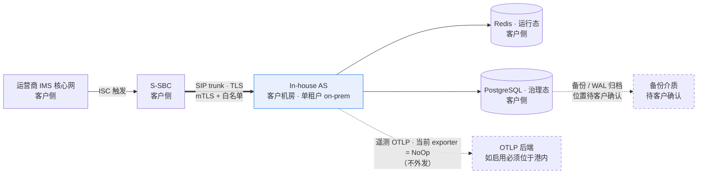

# In-house IMS Application Server（文档暂用名）—— 安全与隐私合规说明（PDPO）

> **状态块（阅读本文前先看这里）**
>
> - **产品名**：**In-house IMS Application Server（文档暂用名）**，首现处标注 3GPP Third-Party AS role，下文简称 in-house AS。该名称**不是已正式批准的产品名**（`../plan.md` §0「产品决策记录」；`../product-packaging-plan.md` §4.3）。git repo 名拟改为 `inhouse-ims-as`，**仅涉及 git 仓库名与 remote URL**；chart name（`3rdparty-as`）、镜像名、OTel 服务名**保持 `3rdparty-as` 不变**。
> - **本文件归属**：`../product-packaging-plan.md` §1 第三批交付物 **3.4（安全合规说明 / PDPO）**。按该计划 §3.2 属 **B 类**：**保留期限部分被 O4 / D5 阻塞**。
> - **⚠️ 本文不是法律意见。** 本文是工程与交付侧的合规**说明材料**，供客户安全与合规部门评审用；PDPO 的适用性判定、角色界定（data processor / data controller）与最终合规结论**由客户与其法务作出**。
> - **⚠️ 本文不写任何保留天数或时间期限**（评审 **G-P1-8**、**G-P1-5**）：**呼叫轨迹保留期由 O4 裁决、轨迹存储选型由 D5 裁决**，二者均未裁决（`../plan.md` §5.1 O4、§5.2 D5）。ADR-0017 决策 ④ 明确「机制先落地、数值不落地」—— 写一个默认值出来，等于替客户回答了一个合规问题。因此 §2 的保留期列一律写「**待 O4 裁决后填入**」，存储列写「**待 D5 裁决**」。
> - **⚠️ 渗透测试尚未执行**：仓库内**无任何渗透测试产物**（核查方式见 §7）。§7 只写**建议范围、前置条件、期望交付物与出口标准**。
> - **⚠️ 依赖漏洞扫描：仓库内无现成扫描产物**（核查方式见 §6）。CI 四层门禁中**没有** SCA / 镜像扫描 / SBOM 步骤。§6 写现状与计划，不虚构结果。
> - **本文不含任何容量 / 性能数字**：O1 未裁决（`../plan.md` §5.1），`AGENT.md` §2 在实测裁决前禁止发布任何 CPS / CAPS / BHCA / 并发 / 吞吐 / 时延数字。
> - **本文尚未评审**：按 `AGENT.md` §3.3，评审必须留下独立 review record；本文当前**没有** review record，待维护者评审。

---

## 1. 适用范围与法律框架

### 1.1 适用范围

| 项 | 内容 |
|---|---|
| 覆盖对象 | In-house AS 采集/生成的**全部数据资产**（§2）、数据留存与删除机制（§3）、数据驻留与跨境（§4）、已实现的安全措施（§5）、漏洞与依赖安全（§6）、渗透测试（§7） |
| 部署形态 | **单租户、on-premises**：一个 namespace 承载一套完整系统（含各自的 Redis / PostgreSQL / AS Pod 组）。**数据不出客户机房**（REQ-NF-9；ADR-0026 accepted；`../product/ne-datasheet.md` §1） |
| 不在范围 | 媒体面（不做媒体，ADR-0004）、计费面（不做 CDR / 计费，ADR-0017）、Diameter 面（不做 Sh，`AGENT.md` §2）、**合法监听 LI / IRI**（ADR-0016）、规范符合性矩阵（见 [`compliance-matrix.md`](compliance-matrix.md)）、责任边界（见 [`responsibility-matrix.md`](responsibility-matrix.md)） |

### 1.2 法律框架与六原则映射

**框架**：香港《个人资料（私隐）条例》（PDPO）。选择 PDPO 而非等保，理由见 `../discussion.md` §合规过审条（3HK 属上市公司，内控要求）。**本文只做工程侧对照，不作法律解释。**

| PDPO 原则 | 我方如何满足 | 证据 | 缺口 |
|---|---|---|---|
| **收集限制**（Collection limitation） | 只收集业务判决与投诉追溯所必需的号码与Call-ID；不采集 CDR 话单、不采集媒体、不为LI 预留采集点 | ADR-0017 决策 ①（四个动作一个都不做，**不预留采集点**）；ADR-0016（**不为其预留任何采集点** —— 预留采集点等于预留了被要求启用的可能）；ADR-0004（不做媒体） | 采集项的**最小必要清单**需客户合规确认；号码是否属 PDPO 意义上的「个人资料」需客户法务认定（§1.3） |
| **用途限制**（Purpose limitation） | 号码 / 轨迹**只用于**投诉追溯与反诈举证；**不做计费、不批价、不做网间结算**；呼叫轨迹**明确不是话单** | ADR-0017 决策 ②③（无投递通道、不批价，声明的目的是防止它被下游当成计费数据源） | 客户若提出新的用途（如向第三方披露），需新 ADR + 文档链，不得在实现里加一条导出（ADR-0017 consequences） |
| **保安**（Data security） | 对端白名单 + 端到端 mTLS + 控制台角色/密码/可撤销会话 + append-only 审计 + 非 root 容器 + NetworkPolicy + 凭据走 Secret / 客户 PKI + fail-closed 渲染 | §5 全表（每项均有 `file:line`） | 证书热轮换 **E4 未验收**、运营商 PKI **无实验室证据**；控制台仅**工程切片**，**REQ-S-4 未验收**；无渗透测试（§7）；无漏洞扫描产物（§6） |
| **保留**（Retention） | 清理机制已formalize 为功能（可配），**数值不落地** | ADR-0017 决策 ④；REQ-NF-7（清理任务已 formalize 为功能，但默认值未定） | **O4（保留期）未裁决** → **本文不写任何天数**；**D5（存储选型）未裁决** |
| **透明度**（Transparency） | 本文与 [`one-pager.md`](one-pager.md) / [`ne-datasheet.md`](ne-datasheet.md) / [`compliance-matrix.md`](compliance-matrix.md) 构成对客户的数据说明包；产品文档暂用名 + 状态标注 + 未验收项如实披露 | 本文 §2 资产清单；同批三份文档的状态块 | 面向最终用户的**隐私告知文本**（用户侧告知 / 号码使用告知）**不在本交付物范围**，需客户按其用户告知义务另行提供 |
| **查閱与更正**（Data access & correction） | 数据更正 = 改配置（号段 / 规则 / 号码段），走变更单 → 审批 → 写 PG → 灰度分发；控制台支持角色鉴权 + 全量审计 | ADR-0006 变更流水线；`services/console/src/as_console/access.py:26-74` | **呼叫轨迹是逐消息记录，本产品不提供事后改写能力**（轨迹不可变）；见 §3.3 |

### 1.3 角色界定（**待客户与法务确认，本文不得自行断言**）

| 项 | 状态 |
|---|---|
| 我方在本产品中的角色（data processor / data controller 之一或兼具） | **待客户与其法务确认**。本文**不自行断言**任何一种界定 |
| 判定影响 | 直接影响 §3 的请求受理路径、§4 的跨境安排与合同条款；**必须由客户法务先行界定**，本文所有描述均以此为前提 |
| 我方可提供的事实 | 数据的**采集点、处理方式、存储位置、访问控制、审计**是可核查的工程事实（§2、§5）；**数据的使用目的与对外提供行为由客户决定**（§1.2 用途限制行） |

---

## 2. 数据资产清单

| 数据项 | 内容 | 来源 | 用途 | 是否可能属个人资料 | 存储位置 | 保留期 |
|---|---|---|---|---|---|---|
| **MSISDN / 被叫号码** | 号码字符串、号段前缀 | 入腿 INVITE 的被叫用户部分 / 出腿改写目标 | 号段规则匹配、号码翻译 | **可能属** —— 号码可识别个人；最终认定待客户法务 | ① 进程内（判决）；② 配置库 `as_config` 的规则版本行（号段 / 前缀）；③ 呼叫轨迹 | 待 O4 裁决后填入（规则侧随配置版本库生命周期，轨迹侧随轨迹 TTL） |
| **主叫号码** | 号码字符串（若在消息中被解析使用） | 入腿 INVITE 的主叫部分 | 反诈策略判定、号码翻译 | **可能属**；同上手工认定 | 同上（进程内判决 + 轨迹；**是否持久化到治理库需随轨迹存储选型 D5 确定**） | 待 O4 裁决后填入 |
| **Call-ID** | SIP Call-ID 字符串（入腿 / 出腿各一，B2BUA 两侧不同） | SIP 消息头 | **呼叫轨迹的检索键**（REQ-F-13）；两腿关联；与 trace 关联 | **可能属** —— 可与其他字段组合定位到个人 | 轨迹存储（**待 D5 裁决：PostgreSQL 或独立短保留存储**）；日志中作为 JSON 字段 | 待 O4 裁决后填入 |
| **呼叫轨迹**（按 Call-ID） | 逐条 SIP 消息记录：入/ 出方向、时间戳、方法、响应码 | AS 自身数据面 | **投诉追溯与反诈举证**。**明确不是话单**：无投递通道、不批价、不做网间结算 | **可能属**；同上 | **待 D5 裁决** | 待 O4 裁决后填入 |
| **规则与号段配置** | 号段前缀、翻译映射、反诈限额、feature 开关 | 运维人员经变更单提交 | 业务判决输入 | 通常**不属**个人资料（配置而非用户数据）；若号段本身可反推用户群体需复核 | PostgreSQL `as_config` schema 的**不可变版本行**（ADR-0006） | 随配置版本库保留策略（**待客户与 OP-SEC 确认**）；与个人资料保留期分开评估 |
| **控制台审计日志** | 操作者、时间戳、操作类型、变更前后值；**append-only** | 每个控制台操作 | 追责、合规举证、变更追溯 | 通常**不属**（操作者标识可能属个人资料） | PostgreSQL `console_audit` schema（`services/config-service/src/as_config_service/audit_store.py:493-494`；`deploy/helm/values.yaml:123`） | 待客户与 OP-SEC 确认（REQ-S-4 写明「审计日志保留期 = 合规要求，M4 冻结」→ **未冻结**） |
| **凭据与证书** | TLS 私钥 / 证书链 / CA、对端证书指纹白名单、PG 密码、控制台密码校验值（`pbkdf2-sha256`）、审计 HMAC key | 客户 PKI / 客户 Secret / `as-config-migrate` bootstrap | 接入准入、连接加密、治理库访问、控制台鉴权、审计完整性 | 通常**不属**个人资料；**属敏感凭据，绝不入日志** | k8s Secret（客户 PKI / 客户 vault）→ 挂载为文件（`defaultMode: 0440`）；**TLS 材料绝不存进 chart 的凭据 Secret**（`deploy/helm/templates/secret.yaml:51-55`） | 随证书有效期 + 轮换周期（**待客户 PKI 政策**） |

**三条必须一起读的注记**

1. **不存在的资产（因其不做）**：**CDR / 话单**（ADR-0017 决策 ①）、**媒体 / 语音内容**（ADR-0004：不做 RTP / 转码 / DTMF / MRF / 媒体锚定）、**Diameter Sh 订阅数据**（`AGENT.md` §2）、**IRI / LI**（ADR-0016）。**表中不列这些行，因为它们根本不被采集** —— 补上它们等于暗示存在。
2. **载荷日志默认关闭**：`AS_PAYLOAD_LOGS_ENABLED` / `telemetry.payloadLogsEnabled` 默认为 `false`（`deploy/helm/values.yaml:319`；`deploy/helm/templates/configmap.yaml:65`）。开启是**显式、可审计**的操作（ADR-0016）。因此**消息载荷默认不落盘**。
3. **呼叫轨迹的存储与查询当前尚无实现**：检索键是 Call-ID（REQ-F-13；ADR-0017 决策 ②）是**设计约定**；仓库内 `platform/` 与 `services/` 中**没有**轨迹存储或轨迹查询 API 的代码命中，`../plan.md` §5.4 明确记录「无 trace store/API；REQ-F-13 / M4b-7.4 补测未做，M4b-8 标 BLOCKED」。因此本节登记的是**数据资产类别与存储选型待决**，不是"系统已在采集"的事实。

---

## 3. 留存范围与删除机制

### 3.1 机制已具备 vs 待落地 / 待裁决

| 环节 | 状态 | 内容与依据 |
|---|---|---|
| **轨迹清理机制** | **机制已formalize 为功能，默认值未定** | REQ-NF-7（"清理任务已 formalize 为功能，但默认值未定"）；ADR-0017 决策 ④ |
| **轨迹保留期数值** | 🔴 **待 O4 裁决** | `../plan.md` §5.1 O4（呼叫轨迹保留期 / 客户合规要求）。**本文不写天数**（G-P1-8） |
| **轨迹存储选型** | 🔴 **待 D5 裁决** | `../plan.md` §5.2 D5（PostgreSQL 还是独立的短保留存储 / 与 O4 相关）。ADR-0017 consequences 明确「在保留期定下来之前，存储选型缺乏关键输入，本 ADR 不裁决选型」 |
| **审计与治理数据的删除** | 🟡 **待落地 / 待确认** | 审计表 append-only（`audit_store.py:102-104`：`BEFORE UPDATE OR DELETE` 行触发器 + `BEFORE TRUNCATE` 表触发器），因此**删除不能靠 UPDATE/DELETE**。任何清理必须走**运维层的显式受控操作 + 变更单 + 审计留痕**，且受审计合规约束；审计保留期待 OP-SEC 确认（REQ-S-4 写明「M4 冻结」→ **未冻结**） |
| **配置版本库的数据删除** | 🟡 **待确认** | 变更单状态机拒绝非法跳转（ADR-0006），不可变版本行；删除策略需与审计保留要求一起评估 |
| **凭据的更换与销毁** | 🟡 **机制已具备，周期待定** | 证书轮换是配置热更新（ADR-0016；`transport.py:110-132`、ingress 重叠窗口 `ingress.py:70-100`）；旧证书的销毁责任在双方各自 PKI 流程 |

### 3.2 「机制先落地、数值不落地」的理由（ADR-0017 决策 ④ 原文精神）

保留期直接决定存储容量与清理任务的行为。**写一个默认值出来，等于替客户回答了一个合规问题** —— 若这个默认值短于客户要求，会造成举证数据缺失；若长于客户要求，则构成超出必要性的留存。因此本文与产品文档在该项上**一律留空**（这是刻意留空，不是遗漏）。

### 3.3 查閱与更正请求的处理流程

| 步骤 | 谁做 | 做什么 |
|---|---|---|
| 1 | **客户侧受理** | 由客户（作为与数据主体关系的当事人）受理查閱 / 更正请求。**我方不直接面向数据主体受理** |
| 2 | **客户书面指令** | 以书面形式给出查询键（Call-ID / 号段 / 时间范围）与更正内容。我方不自行推断请求范围 |
| 3 | **我方执行查询** | 按Call-ID 在轨迹通道检索并导出（**注意：轨迹存储与查询 API 当前尚无实现**，见 §2 注记 3；实际可导出范围以交付时的实现为准，不得预先承诺） |
| 4 | **我方执行更正** | 号码 / 号段类更正 = **改配置**，走变更单 → 审批 → 写 PostgreSQL → 灰度分发（ADR-0006）。**不是**运维直接 UPDATE 数据库，也不是用 git 管配置（`AGENT.md` §2） |
| 5 | **不可更正项** | **呼叫轨迹是逐消息记录，不可事后改写**（append-only 语义）。因此更正只能作用于配置与未来呼叫，不能重写历史轨迹。若客户要求重写历史，须回到ADR-0017 重新裁决 |
| 6 | **留痕** | 每个控制台操作都鉴权并审计（ADR-0016；REQ-S-4）。审计本身 append-only（`audit_store.py:102-104`） |
| 7 | **范围争议** | 若请求涉及计费数据 —— 本产品**不采集**（ADR-0017），无法提供；该诉求应指向运营商计费域 |

**本文不承诺任何响应时限**（期限需与客户 SLA 一并约定，本文不单方面写入天数）。

---

## 4. 数据留港原则与跨境

### 4.1 原则与逐项事实

| 项 | 结论 | 依据 / 缺口 |
|---|---|---|
| **数据不出客户机房** | ✅ 设计如此 | 单租户 on-premises，一个 namespace 一套系统（REQ-NF-9；ADR-0026 accepted）。数据面只有 Redis（运行态）与 PostgreSQL（治理态）（ADR-0007） |
| **跨境传输** | ✅ **无跨境传输** —— 仓库内**没有**任何把数据发往外部的通道 | 唯一出向候选是遥测 OTLP exporter，而**它当前是 `NoOp`**：`platform/src/as_platform/telemetry/__init__.py:77` `NoOpExporter`、`:129` 队列 exporter 默认 `NoOpExporter`；`:89-95` `default_sink()` 返回 `NoOpSink`。因此**遥测不外发**。**待确认**：若未来接入真实 OTLP 后端，该后端**必须位于香港境内**，否则须先做合规评估 |
| **日志与镜像不得上传第三方 SaaS** | ✅ 纪律项 | `AGENT.md` §11 / §13：「绝不提交密钥、证书或真实流量抓包」；`SECURITY.md`「绝不提交的东西」。交付链路的镜像走客户内网 registry（`../product/ne-datasheet.md` §8：仓库内**没有**公开 registry） |
| **备份介质与WAL 归档位置** | 🔴 **待客户确认** | 架构要求 PostgreSQL 流复制 + 备份 + PITR（ADR-0007 / ADR-0008 语境；`../architecture/新系统整体架构.md` §7），但chart **无备份 Job**（`../product/ne-datasheet.md` §8）；**备份落地位置、是否跨站点、是否出港需客户确认** |
| **跨站点容灾** | 🟡 架构已定，参数未决 | ADR-0008 accepted：站点内 N+1 零单点 + 跨站点 **1+1 温备（非双活）**，切换靠 S-SBC 侧 trunk 优先级。**容灾等级 O5 未决**（N+1 节点 / N+M 机架或 AZ）。**跨站点本身即跨境评估对象**（若备站在港内则无跨境） |
| **未来引入外部后端** | 🔴 须先做合规评估 | 任何 OTLP 后端、日志聚合平台、告警平台若位于港外，须先完成跨境传输合规评估并更新本文，再上线 |

### 4.2 留港论证链（供评审直接引用）

**论证链的三个支点**：① 单租户 on-prem 天然物理隔离（`AGENT.md` §2 选择依据表）；② 产品唯一出向通道当前不落地（`NoOpExporter`）；③ 交付形态不产生对外依赖（Helm + 客户内网 registry，ADR-0013）。

---

## 5. 已实现的安全措施

> 每行都给出 `file:line`。**未验收项如实标注，不写成已验收。**

| 措施 | 实现位置 | 说明 |
|---|---|---|
| **对端白名单**（IP / CIDR / `host:port` / 证书指纹） | `platform/src/as_platform/sip/transport.py:249-298`（`authorize_peer`）、`:48-63`（`PeerPolicy`） | **证书命中或地址命中任一即放行**；mTLS 下证书是真正识别对端的那一维（源地址可伪造，证书不可）。支持 IPv6 bracket 端点语法；畸形 CIDR / 端点 token 不授权任何人 |
| **空策略拒绝（fail-closed）** | `platform/src/as_platform/sip/transport.py:272-273` | 空策略（两个集合都空）**授权 nobody**。理由：能伪装成 S-SBC 的人就能灌入呼叫，白名单没填过就不能变成放行的洞（ADR-0016；`AGENT.md` §13） |
| **端到端 mTLS，默认要求客户端证书** | `platform/src/as_platform/sip/transport.py:86`（`require_client_certificate: bool = True`）、`:88-93`（`ca_path` 为空即`raise ValueError`）；环境变量解析 `platform/src/as_platform/runtime/transport_env.py:66-71` | 只有 server-only TLS 是**显式配置**而非默认。优先级：`AS_TLS_REQUIRE_CLIENT_CERT` → `SIP_TLS_REQUIRE_CLIENT_CERT` → 默认 `True` |
| **明文在解析前拒绝** | `platform/src/as_platform/sip/ingress.py:178-194`（`reject_plaintext_when_tls_required`）、`:24`（只接受 `tls` / `sips`） | 拒绝**先于** `decide()` 与消息解析。⚠️ 明文拒绝与白名单未命中**共用 `403`**，排障时需区分（见 [`responsibility-matrix.md`](responsibility-matrix.md) §4） |
| **证书热更新（不重启、不丢在途呼叫）** | 机制：`transport.py:110-132`（`reload` 返回新快照而非就地改）、`ingress.py:52-68`（`install`）、`ingress.py:70-100`（`install_with_overlap` 双证书重叠窗口）、`:140-164`（重叠期内 legacy 连接沿用退役策略） | 🔴 **E4 无实验室证据 → 状态为 open**，不得表述为已通过验收。热轮换的完整验收依赖运营商 PKI（REQ-S-2 / REQ-S-3） |
| **控制台角色 + 密码 + 可撤销会话** | 角色矩阵 `services/console/src/as_console/access.py:26-39`（`viewer` / `approver` / `admin`）、`:60-74`（`ROLE_PERMISSIONS`）、`:152-166`（`authorize` 按"是否被授予"判定 → 新增权限默认对所有人拒绝）、`:169-185`（提交者不得审批自己的变更）；密码 `services/config-service/src/as_config_service/auth.py:191-201`（`pbkdf2-sha256$v1$600000$32`，每账号独立随机盐）、`:227-232`（校验）、`:166-171`（最小长度约束）、`:118-134`（`IssuedSession` / `RevokedSession`，raw token 只在签发时返回调用方，撤销后对象不含 token 材料） | 🔴 **仅为工程切片**，REQ-S-4 **未验收**。ADR-0024 已 accepted（2026-10-03 维护者签核），但 ADR 自述证据边界：仅本地 PostgreSQL 12.22 验证、3 个 publication DDL 测试因 `wal_level=replica` 跳过、**PG16 与 CI 未测**、**无生产 trusted-proxy 证据、无应用层限流证据、无 REQ-S-4 验收** |
| **全量控制台操作审计，append-only** | `services/config-service/src/as_config_service/audit_store.py:1`（append-only）、`:102-104`（行级 `BEFORE UPDATE OR DELETE` + 表级 `BEFORE TRUNCATE` 触发器抛异常）、`:1064-1110`（`REVOKE ALL ... FROM PUBLIC` + 最小 `GRANT`）；schema `console_audit`（`:493-494`；`deploy/helm/values.yaml:123`） | 允许与拒绝**都留痕**（`access.py:78` `AuditOutcome.ALLOWED/DENIED`）。审计 HMAC key 走 Secret（`deploy/helm/templates/config-service-deployment.yaml:53-57`） |
| **治理库三角色最小权限** | `deploy/compose/postgres/init/01-dev-roles.sh:9-14`：`as_config_runtime` **NOLOGIN**、`as_config_owner` LOGIN、`as_config_web` LOGIN，`GRANT as_config_runtime TO as_config_web`；chart 侧同构 `deploy/helm/templates/state-postgres.yaml:18-22` | 生产角色须由 DBA 预置，chart **不创建也不填充** 生产凭据（`deploy/helm/templates/secret.yaml:16-18` fail；`:44-48` 空占位并带 `as.3rdparty/credentials: "placeholder-replace-before-install"` 注解）。**注**：`01-dev-roles.sh` 文件头自述为 **dev-only**，生产不得直接使用 |
| **凭据走 k8s Secret / 客户 PKI** | `deploy/helm/templates/secret.yaml:19-50`（凭据 Secret，**仅占位空串**）、`:51-55`（**TLS 材料绝不存此处**，来自客户 PKI，按 `tls.secretName` 引用）；挂载 `deploy/helm/templates/deployment.yaml:176-181`（`defaultMode: 0440`，非 world-readable）；`deploy/helm/templates/config-service-deployment.yaml:5`（configService 启用必须给 `secretName`） | ConfigMap 中**不含任何密码**（`deploy/helm/templates/configmap.yaml:50-55`：DSN 在 Deployment 侧由 host/port/name + Secret 拼装） |
| **fail-closed 渲染守卫** | `deploy/helm/templates/deployment.yaml:11-13`（`tls.enabled=true` 且 `tls.secretName` 空 → 渲染失败）、`:14-16`（`sip.peerAllowlist` 空且未设 `allowEmptyAllowlistForTest` → 渲染失败）；`deploy/helm/templates/validate-install.yaml:6,9,12`（三条安装期守卫）；`deploy/helm/templates/secret.yaml:16-18` | 空值回落的是**可用性开关，不是安全开关** —— 安全侧一律拒绝渲染。Ingress 侧 `config-service-ingress.yaml:7-8`（只支持 ingress-nginx，否则渲染失败）、`:11`（`tlsSecretName` 必填）、`:37-38`（强制 ssl-redirect + force-ssl-redirect） |
| **NetworkPolicy：仅放行本系统 Pod → PG / Redis** | `deploy/helm/templates/state-networkpolicy.yaml:1-29`：`podSelector` 选中 `state-postgres` / `state-redis`，`ingress.from` 仅 `app.kubernetes.io/part-of: 3rdparty-as`，端口仅 `5432` 与 `stateStores.redis.port` | 仅在 `stateStores.enabled` 且 `stateStores.networkPolicy.enabled` 时渲染（`:1`）。⚠️ 依赖客户集群的 CNI 实际执行 NetworkPolicy |
| **非 root 运行 + 丢弃全部 capabilities** | `deploy/helm/templates/deployment.yaml:190-194`（`runAsNonRoot: true`、`runAsUser: 10001`、`runAsGroup: 10001`、`fsGroup: 10001`）、`:169-172`（`allowPrivilegeEscalation: false`、`capabilities.drop: ["ALL"]`） | uid 10001 是进程实际用户；TLS Secret 以 `fsGroup` 可读 + `0440` 方式挂载 |
| **不挂载 ServiceAccount token** | `deploy/helm/templates/serviceaccount.yaml:16`（`automountServiceAccountToken: false`），注释见 `:1-8` | 理由写明：AS 进程无状态、只与 Redis / PG / OTLP collector 通信，**不需要访问 K8s API**（ADR-0002；REQ-NF-9） |
| **载荷日志默认关闭** | `deploy/helm/values.yaml:319`（`payloadLogsEnabled: false`）→ `deploy/helm/templates/configmap.yaml:65`（`AS_PAYLOAD_LOGS_ENABLED`） | 显式可开关；开启是可审计的操作（ADR-0016；`AGENT.md` §13）。**因此消息载荷默认不落盘** |
| **OTLP exporter 当前为 NoOp** | `platform/src/as_platform/telemetry/__init__.py:77`（`NoOpExporter`）、`:89-95`（`default_sink()` → `NoOpSink`）、`:116,129`（队列 exporter 默认 `NoOpExporter`）；`platform/src/as_platform/__main__.py:193`（读`OTEL_EXPORTER_OTLP_ENDPOINT`）；chart 默认 `telemetry.otlpEndpoint: null`（`configmap.yaml:63`） | ✅ **当前遥测不会外发**（数据留港的最强支点）。🔴 缺口：**真实 OTLP 后端接线未完成**。ADR-0005 要求导出不得阻塞呼叫路径（有界队列、独立线程） |

**已知未落实项（不得当作已具备）**

| 项 | 状态 | 依据 |
|---|---|---|
| 证书热轮换的实验室证据（E4） | **open** | `../plan.md` §5.1 O2/O3；`compliance-matrix.md` §3.6.7 |
| REQ-S-4 正式验收 | **未验收**（工程切片） | ADR-0024 Evidence limits |
| 生产 ingress / trusted-proxy | **未验收**（7.2d blocked） | `../product/ne-datasheet.md` §8 |
| Prometheus 抓取接线 | **缺失** —— chart 无 `prometheus.io/scrape` 注解、无 ServiceMonitor / PodMonitor | `../product/ne-datasheet.md` §5、§10。后果：`as_*` 序列在标准部署中不会被采集，依赖它的 `as.*` 告警事实上不可触发 |
| 渗透测试 | **未执行** | §7 |
| 依赖漏洞扫描 | **无产物** | §6 |
| 应用层限流 / hardened reverse proxy | **无证据** | ADR-0024 Evidence limits |

---

## 6. 漏洞管理与依赖安全

### 6.1 现状（如实，含核查方式）

**核查方式**（可复现）：
① 读 `.github/workflows/ci.yml` 全文 → 四个 job（`fast` / `integration` / `e2e` / `performance`）；② 全仓库 grep `trivy|grype|syft|snyk|bandit|pip-audit|dependabot|osv|sbom|cyclonedx|vulnerability|CVE-`（排除 `.git` / `.venv` / `node_modules`）；③ 查 `docs/acceptance/artifacts/` 全部文件；④ 查 `docs/reviews/` 是否有扫描/渗透测试记录；⑤ 查 `CHANGELOG.md` 是否有 CVE 条目。

| 项 | 现状 | 结论 |
|---|---|---|
| **依赖锁定** | ✅ 有：`uv.lock` + CI `uv sync --frozen`（锁不一致即失败）；`AGENT.md` §8「每个依赖都走 `uv`，提交 `uv.lock` 并在 CI 中校验」 | 锁存在，但**锁不等于没有漏洞** |
| **本地门禁** | ✅ 有：`make gate` = lint → type → layer①（`Makefile:131`）；`make gate-strict` 追加 ADR 标注扫描（`Makefile:136`）；另有 `make chart-check`、`make alert-check` | 都是**正确性**门禁，**不是安全扫描** |
| **CI 中的安全扫描** | ❌ **无**。`ci.yml` 四层中没有任何 SCA、容器镜像扫描、SBOM 生成或依赖审计步骤 | **无自动化依赖漏洞检测** |
| **扫描产物** | ❌ **无现成扫描产物**。`docs/acceptance/artifacts/` 下只有 `m5/`（alert-check / gate / chart-check 采样）与 `m8/`（`req-s-2-pki`、`req-nf-1-live`、`req-s-3-rotation` 三份 README，无扫描报告）；`CHANGELOG.md` 无 CVE 条目；`docs/reviews/` 无渗透测试记录 | 唯一提及「依赖漏洞扫描 / 渗透测试」的地方是 `docs/discussion.md:23` 与 `:160`，属**讨论记录**，不是产物 |
| **运行时基线** | ⚠️ `deploy/docker/Dockerfile:23` 运行时镜像 `python:3.10-slim`（builder `:3` 为 `ghcr.io/astral-sh/uv:python3.10-bookworm-slim`）；CI `PYTHON_VERSION: "3.10"` | **D1 未决**：Python 3.10 在 2026 年 10 月到达生命周期终点（`../plan.md` §5.2 D1）。处置二选一：① 尽早验证迁移到受支持版本；② 在 ADR 里把 EOL 运行时**登记为已接受风险**。该日期之后的任何交付需先完成其中一项 |
| **第三方 native 依赖** | reSIProcate（C++，Vovida 许可，ADR-0019 accepted）；`testbed/simulators/resip-probe/vendor/` 下有上游源码/预编译 tarball | 这类依赖**不在 `uv.lock` 覆盖范围内**，Python SCA 扫不到 —— 是当前扫描方案的**盲区** |
| **禁止提交项** | `AGENT.md` §11 / §13、`SECURITY.md` | **绝不提交密钥、证书、token、真实地址、真实流量抓包**；仓库只放占位符 |

### 6.2 计划（尚未执行，不得当作已有能力）

| # | 计划项 | 内容 | 出口 |
|---|---|---|---|
| 1 | **Python 依赖 SCA** | 在 CI ① 之后加一个依赖审计步骤，对 `uv.lock` 覆盖范围做漏洞检测，输出报告作为 artifact | 报告落 `docs/acceptance/artifacts/`；新增高危项须有处置记录 |
| 2 | **容器镜像漏洞扫描** | 扫描 `deploy/docker/Dockerfile` 产出的运行时镜像（当前 `python:3.10-slim` 基线） | 同上；**与 D1 的处置绑定** |
| 3 | **SBOM** | 为交付镜像生成 SBOM（组件清单 + 版本），随交付物提供给客户 | 交付清单中出现 SBOM 项 |
| 4 | **频率与出口** | 随 CI 每次运行（快速、无高危即不阻塞）；高危出口条件为「**发现新增高危且无处置记录 → 阻塞**」 | 写入 `deploy/alerts/README.md` 同级文档；**出口标准需与 OP-SEC 共同定** |
| 5 | **native / 非 Python 依赖** | reSIProcate 的上游版本与已知问题纳入人工跟踪（`uv.lock` 覆盖不到） | 登记进 `../plan.md` 未决或风险登记 |
| 6 | **安全报告入口** | 已存在 `SECURITY.md`：私下报告疑似漏洞，不公开 issue | 已具备 |

---

## 7. 渗透测试（**未执行**）

> **当前状态：未执行。仓库内无任何渗透测试产物**（核查方式同 §6.1：`docs/reviews/` 无记录、`docs/acceptance/artifacts/` 无报告、`CHANGELOG.md` 无条目）。本节是**计划**，不是结果。

### 7.1 建议范围

| # | 范围项 | 具体内容 | 攻击面来源 |
|---|---|---|---|
| 1 | **trunk 接入面** | 能否绕过对端白名单灌入呼叫；IP / CIDR / `host:port` / 证书指纹四种白名单形式的绕过；畸形 token（畸形 CIDR、无括号 IPv6 端点）是否被误当授权 | ADR-0016；`transport.py:146-298` |
| 2 | **TLS 与证书轮换** | 明文能否在要求 TLS 时通过；`ca_path` 为空时的 fail-closed；双证书重叠窗口内旧策略是否按期失效；证书热更新是否真的不重启进程、不丢在途呼叫 | `ingress.py:24,178-194`；`transport.py:86-93`；`ingress.py:70-100` |
| 3 | **控制台鉴权与越权** | 角色越权（`viewer` 是否能提交 / 审批）、提交者自审批绕过（`may_approve`）、会话撤销后仍可用、空角色 / 未知角色是否被 fail-closed 拒绝、新增权限是否默认对所有人拒绝 | `access.py:26-74,152-185`；`auth.py:118-134,191-232` |
| 4 | **内部 API 鉴权** | 未鉴权能否访问 `/internal/v1`；`config-service` 的 DSN / HMAC key 是否泄漏到响应或日志；trusted-proxy 与 `AS_CONFIG_PROXY_HEADERS` / `AS_CONFIG_TRUSTED_PROXIES` 的误配后果 | `config-service-deployment.yaml:48-71`；ADR-0024 Evidence limits（**无生产 trusted-proxy 证据**） |
| 5 | **配置变更审批链** | 能否绕过审批直接改生效配置；非法状态跳转是否被拒；回滚能否绕过审批；灰度分发期间的不一致窗口 | ADR-0006；`access.py:169-185` |
| 6 | **日志与数据泄露** | 开启载荷日志后是否泄漏凭据 / 证书私钥；PG 密码、审计 HMAC key 是否进日志；`console_audit` 内容是否可被越权读取；错误堆栈是否泄漏内部路径 | `configmap.yaml:65`；`secret.yaml:19-50` |
| 7 | **容器与 K8s 逃逸面** | 非 root（uid 10001）+ drop ALL 是否被绕过；未挂载 SA token 是否属实；NetworkPolicy 是否真的只放行本系统 Pod | `deployment.yaml:169-194`；`serviceaccount.yaml:16`；`state-networkpolicy.yaml:1-29` |

**明确不在测试范围**：媒体面（不做媒体，ADR-0004）、Diameter 面（不做 Sh）、计费 / CDR（不做，ADR-0017）、**LI / IRI（不实现，ADR-0016）** —— 没有攻击面可测。

### 7.2 前置条件

| # | 前置条件 | 说明 |
|---|---|---|
| 1 | **测试窗口** | 需客户批准窗口；测试期间可主动拒绝 / 伪造呼叫 |
| 2 | **客户侧对端配合** | 需要 **OP-SBC** 侧配合做畸形信令注入、双证书并行、trunk 优先级切换；需要 **OP-NET / OP-HSS** 侧配合验证 iFC 触发相关的边界 |
| 3 | **真实环境而非仿真** | `testbed/` 仿真结果**不是**安全测试证据（ADR-0014；v1 不把 testbed 作为交付物）。E1 / E4 / E5 未验收也会限制可测范围 |
| 4 | **凭据与证书** | 测试用证书由客户 PKI 或隔离测试 CA 签发；**测试产生的抓包不得进入仓库**（`AGENT.md` §11） |
| 5 | **范围与出口标准书面确认** | 出口标准由 **OP-SEC** 裁决，本文只给建议（§7.3） |

### 7.3 期望交付物与出口标准（**建议**）

| 项 | 建议 |
|---|---|
| 交付物 | 测试报告（含方法、时间线、发现清单、复现步骤、证据）、发现项逐条处置记录（修复 / 风险接受 / 不适用 + 理由）、复测结论 |
| 出口标准（建议） | ① 无**严重（Critical）** 未处置项；② 每个高危项都有**书面处置结论**（修复或经 OP-SEC 接受）；③ 复测确认已修复项不再复现；④ 报告与证据留存位置明确，**真实抓包不入库** |
| 待OP-SEC 确认 | 出口标准的具体档位、是否要求第三方执行、复测轮次 |

### 7.4 当前状态

| 项 | 状态 |
|---|---|
| 是否已执行 | **未执行** |
| 是否有产物 | **无** |
| 阻塞 | 无技术阻塞；需**客户窗口 + OP-SBC / OP-NET 侧配合 + OP-SEC 出口标准** |
| 本文立场 | 本节**不构成**任何"已通过安全测试"的表述；不得在任何对外材料中引用为安全资质证明 |

---

## 8. 未决与阻塞

| 项 | 阻塞源 | 影响 | 何时可闭合 |
|---|---|---|---|
| **O4 呼叫轨迹保留期** | 客户合规要求（`../plan.md` §5.1） | §2 保留期列、§3.1 清理行为、存储容量、备份策略全部无法定稿 → **本文不写天数**（G-P1-8） | **OP-SEC** 裁决后填入 |
| **D5 轨迹存储选型**（PostgreSQL 或独立短保留存储） | 与 O4 相关（`../plan.md` §5.2）；ADR-0017 不裁决 | §2 存储列、§4 备份位置无法定稿 | O4 裁决后 |
| **data processor / data controller 角色界定** | 客户与其法务 | §1.3、§3 的请求受理路径、§4 跨境安排、合同条款 | 客户法务确认 |
| **审计与治理数据保留期** | REQ-S-4 写「M4 冻结」→ **未冻结** | §3.1 删除机制无法定稿 | 客户与 OP-SEC 确认 |
| **备份介质与 WAL 归档位置** | 客户基础设施决策 | §4 留港论证链的一个支点待补 | 客户确认（需 O5 容灾等级一并裁决） |
| **O5 容灾等级**（N+1 节点 / N+M 机架或 AZ） | 客户 SLA | 影响 Redis 是否跨 AZ、Sentinel 拓扑、PG HA，以及**备站是否在港内** | 客户 SLA 裁决 |
| **D1 Python 3.10 生命周期终点** | `../plan.md` §5.2 D1 | 该日期之后的任何交付需先完成迁移验证或在 ADR 登记为已接受风险；直接影响镜像扫描基线（§6） | 维护者裁决 |
| **E4 TLS 证书热轮换** | M8 验收 + 运营商 PKI（REQ-S-2 / REQ-S-3） | §5 该行状态为 open；渗透测试范围 2 无法完整执行 | M8 验收 |
| **REQ-S-4 正式验收** | 仅为工程切片 | §5 控制台相关行的验收状态 | M8 或维护者单独签收 |
| **渗透测试** | 客户窗口 + 对端配合 + 出口标准 | §7 全部 | OP-SEC 委托后 |
| **依赖漏洞扫描** | 无产物、无 CI 步骤 | §6 计划 1–5 待落地 | 落地后关闭 |
| **号码 / 轨迹是否属 PDPO 个人资料** | 客户法务认定 | §2「是否可能属个人资料」列与 §1.2 缺口行 | 客户法务确认 |
| **用户侧隐私告知文本** | 客户的用户告知义务 | 不在本交付物范围 | 客户自行提供 |

---

## 9. 追溯

| 项 | 内容 |
|---|---|
| **对应交付物** | `../product-packaging-plan.md` §1 第三批 **3.4（安全合规说明 / PDPO）**；按 §3.2 属 **B 类**：保留期限与存储选型被 **O4 / D5** 阻塞。工程事实约束见该计划 §0.3（尤其第 3 条运营商 PKI 无 lab 证据、第 6 条 O4 / D5 未决） |
| **已落实的评审意见** | **G-P1-5** —— §8 明确 **O4 / D5** 为与 PDPO 同等关键的前置项，且与 PDPO 同列 **G-P1-8** —— **保留期限一律写「待 O4 裁决后填入」**，本文**零保留天数、零时限承诺**（§2、§3、§8） **G-P0-4** —— 不做 Sh / 不做计费：§2 注记 1 与 §5 明确列出「不存在的资产」，不做任何 Sh / CDR / 计费表述 **G-P0-5 / G-P1-10**（相邻）—— 与 [`responsibility-matrix.md`](responsibility-matrix.md) 共用同一边界口径 |
| **引用的 REQ** | `REQ-S-1`（对端白名单校验）、`REQ-S-2`（与 S-SBC 端到端 TLS，证书由运营商 PKI 签发、拒绝明文）、`REQ-S-3`（证书热轮换，双证书窗口）、`REQ-S-4`（控制台操作鉴权与审计，审计不可篡改；**仅工程切片**）、`REQ-NF-7`（不做 CDR → 呼叫轨迹替代；轨迹保留期待定）、`REQ-NF-13`（OTel 三信号导出；logs 为结构化 JSON）、`REQ-NF-14`（告警规则集）、`REQ-NF-9`（单租户on-premises）、`REQ-F-13`（按 Call-ID 的轨迹查询）。定义见 `../requirements/prd.md` |
| **引用的 ADR** | **ADR-0016**（边界内安全：对端白名单 / 端到端 TLS / 证书热轮换 / 控制台鉴权与全量审计；**不做 LI、不做计费**）、**ADR-0017**（不做 CDR，由按 Call-ID 的呼叫轨迹替代；决策 ④ 保留期 O4 未决、决策 ⑤ 轨迹与 trace 分离）、**ADR-0024**（控制台角色 + 密码认证与可撤销会话）、ADR-0005（OTel 可观测性；导出不得阻塞呼叫路径）、**ADR-0006**（配置治理：PostgreSQL 版本库 + 变更单状态机，而非 GitOps）、ADR-0007（数据面 split：Redis 运行态 / PostgreSQL 治理态）、ADR-0008（冗余：站点内 N+1 零单点 + 跨站点 1+1 温备）、ADR-0009（ISSU = draining）、ADR-0002（一用例一进程，状态外置）、ADR-0004（媒体 seam）、ADR-0013（Helm-only 生产形态）、ADR-0019（SIP 栈选型）、ADR-0021（运行态覆盖粒度）、ADR-0026（集群内状态存储）。状态以 `../architecture/adr/README.md` 注册表为准；**ADR-0023 / ADR-0025 仍为 draft，本文不据其作结论** |
| **引用的文档链** | [`../plan.md`](../plan.md) §0 / §5.1（O1–O5）/ §5.2（D1、D3、D5）、[`../reviews/product-packaging-plan-review-2026-10-09.md`](../reviews/product-packaging-plan-review-2026-10-09.md)、[`../architecture/新系统整体架构.md`](../architecture/新系统整体架构.md) §7（数据面）/ §8（可观测性）/ §9.2（安全：边界内安全，不碰 LI）、[`../acceptance/m8-resip-runtime-log-contract.md`](../acceptance/m8-resip-runtime-log-contract.md)（日志字段契约）、[`../requirements/prd.md`](../requirements/prd.md)、`SECURITY.md`、`AGENT.md` §11 / §13 |
| **关键代码依据** | 见 §5 每行的 `file:line`（对端准入 `transport.py:249-298`；空策略 `:272-273`；mTLS 默认 `:86-93`；明文拒 `ingress.py:178-194`；双证书重叠 `:70-100`；env `transport_env.py:52-103`；fail-closed `deployment.yaml:11-16`、`validate-install.yaml:6,9,12`；凭据 `secret.yaml:16-50`；挂载 `deployment.yaml:176-181`；SA `serviceaccount.yaml:16`；NetworkPolicy `state-networkpolicy.yaml:1-29`；securityContext `deployment.yaml:169-194`；载荷日志 `values.yaml:319` / `configmap.yaml:65`；NoOp `telemetry/__init__.py:77,89-95,129`；三角色 `01-dev-roles.sh:9-14`、`state-postgres.yaml:18-22`；角色矩阵 `access.py:26-74,152-185`；密码/会话 `auth.py:166-232`；审计 `audit_store.py:1,102-104,493-494,1064-1110`） |
| **同批交付物** | [`one-pager.md`](one-pager.md)（1.1）、[`compliance-matrix.md`](compliance-matrix.md)（1.2）、[`ne-datasheet.md`](ne-datasheet.md)（1.3）、[`responsibility-matrix.md`](responsibility-matrix.md)（3.3）、[`version-lifecycle.md`](version-lifecycle.md)（3.5）及 `docs/operations/` 目录**均已落盘** |
| **已落盘的互链文档** | [`version-lifecycle.md`](version-lifecycle.md)（§9 生命周期与 EOL）。本文**不链接** `docs/operations/` 下的文件（本文不依赖它们；责任边界与故障定界入口在 [`responsibility-matrix.md`](responsibility-matrix.md)） |
| **状态纪律** | 本文**不是法律意见**，**不构成合规结论**。本文只登记**事实、机制与缺口**：M8 退出签字仍搁置（**RC 就绪 ≠ 通过**）；E1 / E4 / E5 未验收；REQ-S-4 仅为工程切片；e2e marker 为 0；O1 / O4 / O5 / D1 / D3 / D5 未决；**无渗透测试产物、无依赖漏洞扫描产物**。本文**尚未评审**，按 `AGENT.md` §3.3 待维护者评审并留独立 review record |