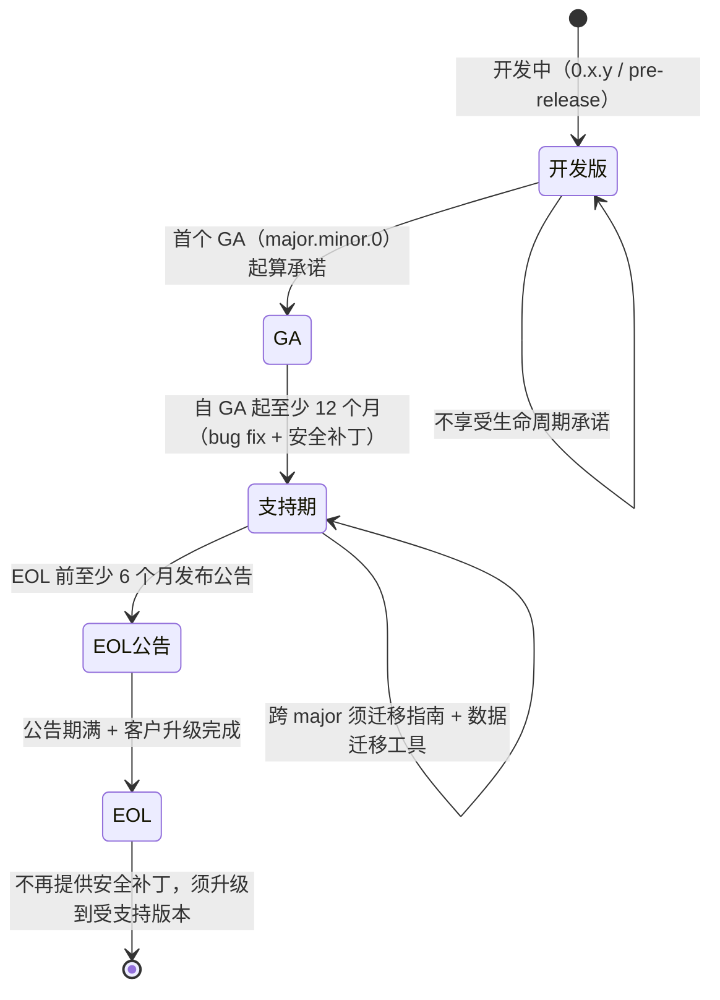

# In-house IMS Application Server（文档暂用名）—— 版本生命周期、EOL 与接口兼容策略

> **状态块（阅读本文前先看这里）**
>
> - **产品名**：**In-house IMS Application Server（文档暂用名）**，首现处标注 3GPP Third-Party AS role，下文简称 in-house AS。该名称**不是已正式批准的产品名**（`docs/product-packaging-plan.md` §4.3；命名决策落点待补）。
> - **git repo 名**拟改为 `inhouse-ims-as`，**仅涉及 git 仓库名与 remote URL**；chart name（`3rdparty-as`，`deploy/helm/Chart.yaml:2`）、镜像名、OTel 服务名**保持 `3rdparty-as` 不变**。
> - **本文件归属**：`docs/product-packaging-plan.md` §1 第三批交付物 **3.5（版本生命周期与 EOL 策略）** + 第四批交付物 **4.3（API 版本兼容策略）**，合并成一份文档。
> - **§3 的决策已落地**：版本生命周期与 EOL 的决定已由 **REQ-NF-16**（`docs/requirements/prd.md:459-470`）+ **ADR-0027**（`docs/architecture/adr/0027-version-lifecycle-and-eol.md`，**accepted，2026-10-09**，已注册于 `docs/architecture/adr/README.md:43`）承载。本文是**面向评审与运维的说明文档**，只忠实转述 ADR-0027 已接受的决定，**不改写、不扩写**其结论。
> - **§7（交付物 4.3）尚无 ADR**：API 与接口版本兼容策略**尚无决策落点**。本文只给「现状盘点 + 候选方案 + 需要决策的点」，**任何表述都不得被引用为已确认承诺**。出口条件见 §7.4。
> - **本文尚未评审**：按 `AGENT.md` §3.3，评审必须留下独立 review record；本文当前**没有** review record，待维护者评审。
> - **本文不含任何容量/性能数字**：O1（容量目标）**未裁决**（`docs/plan.md` §5.1）；`AGENT.md` §2 在 M6 真实 socket 实测与维护者裁决前禁止发布任何 CPS / CAPS / BHCA / 并发 / 吞吐 / 时延数字。本文因此不给任何容量结论。
> - **本文不含发布状态声明**：M8 现状是「**RC 产物就绪，退出签字仍搁置**」（`docs/plan.md` §4 M8 行）；本文不把任何 RC 产物写成已发布，也不把任何未验收项写成已验收。

---

## 1. 为什么需要这份文档

运营商评审最容易被问到的两类问题只有两个：

1. **「你的版本会不会乱？」** —— 客户拿到手的是一个系统，不是一堆组件版本号；他们要知道对外报的是哪个号、装的是哪个镜像、chart 说的是哪个版本。
2. **「升级会不会中断业务？」** —— 运维团队要知道当前版本还能用多久、EOL 什么时候到、升级窗口有多长、需不需要停业务。

这两类问题此前由两份不同的东西回答，而且都不完整：

- **ADR-0018** 只解决了「一个 release 号从哪里来」：根 `VERSION` 是唯一源头、组件接口版本在各自 `pyproject.toml`、任何成员不得拥有 `VERSION` 文件（ADR-0018 §Decision）。它**没有**回答"一个版本发布后支持多久、什么时候停止支持、怎么升级"——这正是 review 结论 **G-P1-4**（`docs/reviews/product-packaging-plan-review-2026-10-09.md:250-252`、`:360`）指出的缺口：**SLA/EOL 缺口未区分 ADR-0018 只覆盖版本号**。
- 同一 review 的 **G-P1-9**（`:365`）进一步要求 §3.5「先补 requirement + ADR」。**该条已关闭**：已新增 REQ-NF-16（`prd.md:459-470`）与 ADR-0027，并在 ADR 注册表登记（`README.md:43`）。本文是该关闭动作的**面向客户的说明**，不是新的决策。

本文的边界：解释**现状是什么**、**已接受的决定是什么**、**哪些还没决定**。不新建承诺，不替 ADR 说话。

---

## 2. 版本号语义（现状）

### 2.1 唯一源头与守卫

| 事实 | 位置 |
|---|---|
| 产品 release 版本唯一源头是根 `VERSION`，当前值 **`0.2.0`** | `VERSION:1`；规则见 `AGENT.md` §8、`ADR-0018` §Decision |
| `VERSION` 必须是可读 SemVer（比 PEP 440 更严） | `tests/test_version_consistency.py:33-37`、`:56-60` |
| `CHANGELOG.md` 最新标题必须等于 `VERSION` | `tests/test_version_consistency.py:63-70` |
| 每个成员的 `version` 字段必须是 SemVer（成员清单取自 `pyproject.toml` 的 `tool.uv.workspace.members`） | `tests/test_version_consistency.py:50-53`、`:73-78` |
| **任何成员不得拥有 `VERSION` 文件** | `AGENT.md` §8；由 `tests/test_workspace_layout.py` 强制（`docs/plan.md:89`） |

### 2.2 组件接口版本与产品 release 版本的关系

组件接口版本是**各成员 `pyproject.toml` 的 `version` 字段**（`[project]` 下），与产品 release 版本**相互独立**：接口 `0.3.1` 可以出现在产品 release `1.2.0` 中（ADR-0018 §Decision）。当前仓库的实际取值：

| 成员 | `[project] name` | `version` | 位置 |
|---|---|---|---|
| `platform/` | `as-platform` | `0.1.0` | `platform/pyproject.toml:3` |
| `apps/anti-fraud/` | `as-anti-fraud` | `0.1.0` | `apps/anti-fraud/pyproject.toml:3` |
| `apps/translation/` | `as-translation` | `0.1.0` | `apps/translation/pyproject.toml:3` |
| `services/config-service/` | `as-config-service` | `0.1.0` | `services/config-service/pyproject.toml:3` |
| `services/console/` | `as-console` | `0.1.0` | `services/console/pyproject.toml:3` |
| `testbed/load/` | `as-load` | `0.1.0` | `testbed/load/pyproject.toml:3` |
| `testbed/simulators/` | `as-simulators` | `0.1.0` | `testbed/simulators/pyproject.toml:3` |

`VERSION`（`0.2.0`）与各成员接口版本（`0.1.0`）**不同值是设计如此，不是漂移**；守卫拦的是"格式非法"与"CHANGELOG 头不一致"，不是"两者必须相等"（`tests/test_version_consistency.py:7-14`）。

### 2.3 口径纪律：文档里的 v1 / v1.1 不是发行版本

> **原文**（`docs/plan.md:16`，产品决策记录「版本称呼」行）：
> **「没有 v1 / v1.1 定义（2026-10-07，维护者）。产品版本号只看根目录 `VERSION`。其他文档里的「v1」「v1.1」不是发行版本，不能当作范围依据。要定义，须写在本文并经维护者确认。」**

因此本文、以及其它任何交付物中出现的「v1」「v1.1」字样都**不是发行版本**，不得当作交付范围或版本承诺引用。ADR-0027 §Context 也据此把当前状态记为「尚未正式发布 GA 版本」（`0027:19`）。

### 2.4 已知缺口：chart 版本与 `VERSION` 不同步（如实记录，本文只给建议）

| 项 | 实际值 | 位置 |
|---|---|---|
| chart `version` | `0.0.0-skeleton` | `deploy/helm/Chart.yaml:5` |
| chart `appVersion` | `"0.0.0"` | `deploy/helm/Chart.yaml:6` |
| 产品 release 版本 | `0.2.0` | `VERSION:1` |
| `image.tag` 为空时回落到 `Chart.appVersion` | — | `deploy/helm/templates/_helpers.tpl:38-41` |
| `app.kubernetes.io/version` 标签同样取 `image.tag` 或 `appVersion` | — | `deploy/helm/templates/_helpers.tpl:53`、`:69` |

**缺口的准确表述**：chart 的 `version` / `appVersion` 目前是骨架占位值，**与根 `VERSION` 不同步**；由于 `image.tag` 为空时回落到 `appVersion`，**镜像 tag 与 `app.kubernetes.io/version` 标签当前也不反映产品 release 版本**。`tests/test_version_consistency.py` **不覆盖** chart（它只检查 `VERSION`、`CHANGELOG.md` 与成员 `pyproject.toml`）。

**建议修法（建议，本文不改任何 chart/代码）**：把「发布时 chart `version` / `appVersion` 与 `VERSION` 对齐」写成发布检查清单的一条，并在 `make chart-check` 之外增加一致性断言；`VERSION` 仍是唯一源头，chart 值是它的**派生物**，不构成第二个家。

---

## 3. 支持周期与 EOL（逐条转述 ADR-0027 已接受的决定）

以下是 ADR-0027 §Decision 的**全部内容**（`0027:21-35`，共 6 项决定，其中「升级路径」含相邻 minor 与跨 major 两条；下表按行拆开），**不增不减**。第二列是原文口径，第三列是给客户看的解释，第四列指回 ADR 的行号。

| # | 已接受的决定（ADR-0027 原文口径） | 客户视角的含义 | 依据 |
|---|---|---|---|
| 1 | **支持周期**：每个 minor 版本从 GA 起**至少支持 12 个月**；支持期内提供 **bug fix 与安全补丁** | 拿到一个 GA 版本，可以据此规划至少一年的变更节奏；这一年内的缺陷与安全风险由我们补 | `0027:23` |
| 2 | **EOL 提前通知期**：版本 EOL 前**至少 6 个月**发布 EOL 公告 | 不会"突然被通知停止支持"；任何一次 EOL 都有半年以上的缓冲期用于安排升级 | `0027:25` |
| 3 | **升级路径（相邻 minor）**：相邻 minor 版本（如 1.0 → 1.1 → 1.2）**必须支持直接升级，不中断业务**（ISSU，见 ADR-0009） | 日常小版本升级不需要换架构、不需要停业务；口径的准确边界见 §4.2 | `0027:28` |
| 4 | **升级路径（跨 major）**：跨 major 版本（如 1.x → 2.0）**须提供迁移指南与数据迁移工具** | 大版本不是"自己换个镜像"的事：会有书面的迁移步骤与工具，需要单独排期 | `0027:29` |
| 5 | **LTS 版本**：**当前不定义 LTS**。如未来运营商客户明确要求 LTS，**须新增 ADR** 定义（支持周期、升级路径、维护成本分摊） | 现在没有 3–5 年长期支持版本可签；这是已知的、ADR-0027 明确接受的缺口 | `0027:31`、`0027:48`、`0027:55` |
| 6 | **安全补丁**：**EOL 后不再提供安全补丁**，客户必须升级到受支持版本 | EOL 是一个真实的截止线，不是"慢慢来"；安全敏感客户必须在 EOL 前完成升级 | `0027:33`、`0027:49` |
| 7 | **适用范围**：本策略**仅适用于 GA 版本（major.minor.0）**；开发版（0.x.y）与 pre-release **不享受**生命周期承诺 | 当前 `VERSION` 的 `0.2.0` 属开发版，**本文给出的 12 个月 / 6 个月等承诺对它不生效**；承诺从第一个 GA 版本起算 | `0027:35`、`:19` |

**已接受的负面后果**（ADR-0027 §Consequences，售前必须如实告知）：

- 每个 minor 发布后至少 12 个月内的维护负担对小团队是实打实的成本（`0027:47`）。
- 部分运营商可能要求 LTS，当前策略**不满足**（`0027:48`、`0027:55`）。
- EOL 后无安全补丁对安全敏感客户可能不可接受，**须在售前阶段明确沟通**（`0027:49`）。

---

## 4. 发布与升级流程

### 4.1 一次版本发布要落的东西

| 项 | 现状与做法 | 依据 |
|---|---|---|
| 产品 release 号 | bump 根 `VERSION` | `AGENT.md` §8、§14；`ADR-0018` |
| 变更记录 | `CHANGELOG.md`，遵循 [Keep a Changelog](https://keepachangelog.com/en/1.1.0/)，版本遵循 SemVer；标题层级为 `## [x.y.z] - 未发布（Unreleased）`（当前首条为 `## [0.2.0] - 未发布（Unreleased）`，`CHANGELOG.md:6`），其下按 `### 新增（Added）` / `### 变更（Changed）` 分节（`:8`） | 格式说明 `CHANGELOG.md:3-4`；标题与分节结构 `:6`、`:8`、`:20`、`:29`、`:67` |
| 一致性 | `CHANGELOG.md` 最新标题必须等于 `VERSION`，否则守卫失败 | `tests/test_version_consistency.py:63-70` |
| chart 版本 | **现状缺口**：chart `version` / `appVersion` 与 `VERSION` 不同步（见 §2.4）；发布时应对齐，本文只作建议 | `deploy/helm/Chart.yaml:5-6` |
| 镜像 tag | `image.tag` 为空时回落到 `Chart.appVersion`；仓库地址为占位值 `registry.example.com/3rdparty-as`，安装时由客户内网 registry 指定 | `deploy/helm/values.yaml:76-82`；`deploy/helm/templates/_helpers.tpl:38-41` |
| 发布 / 打 tag | **tag 是维护者的步骤**，agent 不打 tag、不 push | `AGENT.md` §10.4 结束仪式、§11 |

**工具现状（如实记录）**：`Makefile` 中**没有** bump / release / version 类 target —— 现有 target 只有 `lint` / `type` / `test*` / `chart-check` / `alert-check` / `m2-*` / `m5-*` / `m7-*` / `demo-*` / `gate` / `gate-native` / `gate-strict`。版本 bump 与 chart 对齐目前是**人工步骤**，无自动化。

### 4.2 升级语义（ISSU = draining）

ISSU 的准确语义由 **ADR-0009**（accepted）定义，**不是**在途状态迁移：① 停止接收新请求（摘流）；② 存量呼叫继续在原进程上跑完；③ `active_calls` 归零后退出（ADR-0009 §Decision ①、`0009:18-20`、`:26`）。缩容走同一条路径（ADR-0009 §Decision ③；ADR-0010）。

**因此 ADR-0027 第 3 条「不中断业务」的准确含义必须写清，不得夸大**：

- 成立的：摘流后**不再接新呼叫**，存量呼叫在原进程上**无损跑完**（状态外置 Redis，见 ADR-0002）。「不迁移状态」**不等于**「可以立刻杀进程」——进程上仍有在途呼叫，其事务机、定时器与 socket 都在本进程（ADR-0009 §Context、`:14`）。
- 不成立的 / 不在承诺内的：升级期间的**无损只覆盖「不接新呼叫」这一侧**；摘流期间新呼叫如何处置，**依赖 S-SBC / S-CSCF 侧 iFC 触发停用的配合**——iFC 触发逻辑属于 S-CSCF/HSS、**不在 AS 侧**，这是**跨域依赖**，我方不能单方面承诺（`docs/product-packaging-plan.md` §2.4，`:82`：按号段 / 百分比的 iFC 触发需 S-SBC/HSS 侧配合配置，真实集群演练受 M8 7.2d 阻塞）。
- 兜底与代价：draining 有**硬超时**，超时后强制退出即掉呼叫，因此**必须告警**；升级窗口下限 ≈ 存量呼叫最长剩余时长（ADR-0009 §Decision ④、§Consequences；`docs/architecture/新系统整体架构.md:360`、风险 R3 `:614`）。具体超时值是运维参数，本文不给任何时间数值。

### 4.3 升级窗口纪律

| 组件 | 升级方式 | 依据 |
|---|---|---|
| AS 镜像（各 use case Deployment） | 走 `helm upgrade`（RollingUpdate + `preStop` + 延长 `terminationGracePeriodSeconds` + PDB）；配置与证书走热更新不重启进程 | ADR-0009 §Decision ②；`docs/architecture/新系统整体架构.md:363` |
| PostgreSQL / Redis（`stateStores`，ADR-0026） | 有状态组件，升级走**维护窗口**，不随 AS 镜像一起滚；`stateStores.migrateJob` 只做一次性 schema 迁移（owner DSN），运行时启动**不做** DDL / 迁移 / 授权 | `deploy/helm/templates/state-migrate-job.yaml:1-6`、`:52`；`docs/product/ne-datasheet.md` 升级纪律行 |
| 回退 | 见 [`../operations/rollback-playbook.md`](../operations/rollback-playbook.md) —— **该文件已落盘**；但其 iFC / 摘流部分**依赖 S-CSCF / HSS 侧配合配置与真实集群演练**，当前仍 blocked（G-P1-10） | — |

---

## 5. 版本生命周期状态流转（示意，非数值化）

图中的时长来自 ADR-0027（`0027:23`、`:25`、`:33`、`:35`），是**策略下限**，不是排期表；本文不给出任何日历日期。

---

## 6. 弃用与公告

| 项 | 内容 | 依据 |
|---|---|---|
| 公告内容 | 版本 EOL 公告：哪个版本、何时 EOL、升级路径 | `0027:25` |
| 最低提前期 | **至少 6 个月**（与 §3 第 2 条一致） | `0027:25` |
| 弃用（deprecation）本身的提前期 | **尚无决策** —— 「功能/接口弃用公告的最低提前期」与「版本 EOL 公告」是否同一套机制，属交付物 4.3 待决项（§7.3 Q3） | 本文判断，无 ADR |
| 通知责任方 | 版本 EOL 公告由**我方（维护者 / 架构）**向客户发布；变更窗口协商与 iFC / S-SBC 侧的停用配合由**客户运维 + S-CSCF/S-SBC 侧**执行，边界见 [`responsibility-matrix.md`](responsibility-matrix.md) | ADR-0027；`AGENT.md` §1 |
| 渠道 | 本文不裁决渠道（发行说明 / 客户通知 / 公告页）；**待决项见 §7.3 Q3** | 本文判断，无 ADR |

---

## 7. API 与接口版本兼容策略（交付物 4.3 —— **待决策**）

> **本节状态：候选，不是承诺。** 交付物 4.3 尚无 REQ / ADR / HLD / 验收链。按 `docs/product-packaging-plan.md` §1 第四批表格与 §3.2 B 类表，4.3 依赖 ADR-0018 之上的**新决策**，与 3.5 同源（G-P1-9）。本节只做三件事：盘点现状（§7.1）、列候选（§7.2）、列需要谁来裁的点（§7.3）。**任何一条都不得被引用为已确认策略。**

### 7.1 现状盘点

| 接口面 | 版本标识方式 | 现状（已核实） | 兼容性风险点 |
|---|---|---|---|
| AS 内部 HTTP API（config-service / console 共用） | **URL 路径前缀 `/internal/v1`** | 路由以 `prefix="/internal/v1"` 注册（`services/config-service/src/as_config_service/api.py:682-714`）；console 在 `/` 提供静态资源、API 位于同一前缀（`services/console/README.md:34`） | 版本只在路径里；**没有**弃用期机制、**没有**旧前缀保留策略。破坏性变更只有契约测试（`contract` marker）被动发现 |
| SIP trunk（对 S-SBC） | **无版本号可版本** | 标准 ISC 触发、S-SBC 透明桥接（ADR-0003）；行为基线 `testbed/contracts/sip-baseline/` | 靠**行为基线契约**与对端兼容，不靠版本号；我方不能单方面升级对端能力 |
| 决策契约用例 | 用例文件名 + `case_id` | `testbed/contracts/decision/cases.json` + `README.md`（字段表 `README.md:31-44`） | 改用例集 = **接口变更**，需要 ADR 且所有实现 gate 重跑（`README.md:101-106`）。这一条已有硬规则，**不需要新决策** |
| PostgreSQL 配置 / 审计 schema | **schema 名 + 环境变量**，非数字版本 | 默认 `as_config` / `console_audit`（`deploy/helm/values.yaml:122-123`；`AS_CONFIG_SCHEMA` / `AS_AUDIT_SCHEMA`，`services/config-service/src/as_config_service/migrate.py:119`、`:165`） | schema **没有版本号**；迁移由 `as-config-migrate` 一次性 Job 执行（`state-migrate-job.yaml:52`）。滚动升级期间新旧版本并存时，schema 必须双向兼容（`新系统整体架构.md:361`、风险 R4 `:615`） |
| 组件接口版本 | 各成员 `pyproject.toml` 的 `version` | 全部 `0.1.0`（见 §2.2） | 仅 SemVer 格式受守卫；**语义化与向后兼容的承诺尚未定义** |
| 告警 / 指标标签契约 | **指标名 + 标签名即契约** | 命名规则（`as_` 前缀、snake_case、counter 带 `_total`、秒类带基础单位后缀）与标签（`severity` + `component`，指标带 `use_case`）见 `deploy/alerts/README.md:39-40`；指标契约表在 `:45-62` | **规则依赖指标名：改名即静默失效**（告警不再触发而无任何报错）。README 明确要求改名时同步更新契约表并跑 `promtool check rules`（`:87-93`） |

### 7.2 候选兼容策略（**候选，未决策**）

1. **语义化 + 向后兼容承诺**：以 §2.2 的组件接口版本为锚，声明同一 major 内向后兼容、破坏性变更必须 bump major。*候选*，未定。
2. **两阶段废弃（deprecated → removed）**：新增能力先标 deprecated、保留至少一个兼容窗口、再移除。窗口长度**未裁决**（与 §3 的 6 个月 EOL 通知期是否复用同一数值，待决）。*候选*，未定。
3. **版本号放 URL 路径 vs Header**：现状是路径（`/internal/v1`）。改 Header 的收益是路径稳定，代价是代理 / 路由 / 审计动作字符串全要改（审计记录里存的就是 `GET /internal/v1/{unmatched_path:path}` 这类 action）。两条路都可行，**取哪种未裁决**。
4. **配置 schema 的向前 / 向后兼容**：架构文档已把「规则 schema 双向兼容」列为 **ISSU 的硬前置**（`新系统整体架构.md:361`）—— 因此这条**不是纯候选，而是已被架构文档约束的前提**；仍缺的是：schema 版本号怎么表达、`as-config-migrate` 如何做多版本共存。
5. **指标标签破坏性变更的处理**：由于改名静默失效，候选做法是「先双写新旧指标名 → 通知 → 再删旧名」，并把契约表更新纳入发布检查清单。*候选*，未定。

### 7.3 需要决策的点

| # | 待决问题 | 候选 | 影响面 | 建议决策层级 | 阻塞的交付物 |
|---|---|---|---|---|---|
| Q1 | 组件接口版本是否给出**向后兼容承诺**，承诺边界是 major 还是 minor | ① 同 major 向后兼容 ② 不承诺，仅标 SemVer ③ 按组件分别定 | 组件边界、`apps/` 第三方接入 | 架构（涉 ADR-0018 补充） | 4.3 主体 |
| Q2 | 内部 API 的版本标识载体：保持 URL 路径前缀 vs 改 Header | ① 保持 `/internal/v1` ② 改 Header ③ 双轨 | config-service / console 路由、审计 action 字符串、Ingress | 架构 | 4.3、`/internal/v1` 契约文档 |
| Q3 | 弃用（deprecation）公告的**最低提前期**与**发布渠道**；是否与 §3 的 6 个月 EOL 通知期同一套机制 | ① 复用 EOL 机制 ② 独立且更长 ③ 独立且更短 | 客户沟通、售前 | 维护者 + 架构 | 4.3、§6 |
| Q4 | 配置 schema 的**版本号表达方式**与多版本共存策略（`as_config` / `console_audit` 现无版本号） | ① schema 名带版本 ② 表/列级版本列 ③ 仅靠 `as-config-migrate` 单次迁移 | 配置治理、ISSU、data migration | 架构 | 4.3、跨 major 迁移指南（§3 第 4 条） |
| Q5 | 指标 / 标签**破坏性变更**的正式流程（双写窗口长度、是否需要 ADR） | ① 双写 + 通知 ② 直接改并同步告警文档 ③ 指标改名一律要 ADR | 告警（REQ-NF-14）、客户既有 Grafana 看板 | 架构 + 运维 | 4.3、`deploy/alerts/README.md` 契约表维护 |
| Q6 | SIP 侧无版本号，靠什么承载兼容承诺 | ① 只靠行为基线契约 ② 对端能力协商 ③ 由 S-SBC 侧版本约束 | 跨域协同（客户 S-SBC） | 架构 + 客户 | 4.3 中的北向/南向章节 |

### 7.4 出口条件

把本节从「候选」转为「承诺」必须同时满足：

1. 新增 **REQ**（承接 §7.3 的待决问题，当前**不存在**对应 REQ 条目；REQ-NF-16 只覆盖版本生命周期，不覆盖 API 兼容）；
2. 新增 **ADR**（在 ADR-0018 之上，不得改写 ADR-0018 的既有决定），并在 `docs/architecture/adr/README.md` 注册；
3. 补 **HLD/LLD 设计与验收项**，走完 `AGENT.md` §3 的整条文档链；
4. 取得独立 **review record**（`AGENT.md` §3.3），本文随之更新并去掉「待决策」标注。

在此之前，本文 §7 的任何表述都不得写进对外承诺、SLA 或招标文件。

---

## 8. 与其它文档的关系

| 主题 | 权威文档 | 说明 |
|---|---|---|
| 版本号语义（唯一源头、组件接口版本、无成员 VERSION 文件） | [`ADR-0018`](../architecture/adr/0018-release-versioning.md) | accepted 2026-09-28，回应 REQ-NF-11 |
| 版本生命周期与 EOL | [`ADR-0027`](../architecture/adr/0027-version-lifecycle-and-eol.md) | accepted 2026-10-09，回应 REQ-NF-16；本文 §3 只转述 |
| 需求条目 | [`prd.md`](../requirements/prd.md) REQ-NF-16（`:459-470`）、REQ-NF-11（`:419-423`） | REQ 是设计与验收的唯一标准 |
| ISSU / draining / 缩容排空 | [`ADR-0009`](../architecture/adr/0009-issu-draining.md) | accepted；§4.2 的语义来源 |
| 集群内状态存储（PG / Redis、migrateJob） | [`ADR-0026`](../architecture/adr/0026-in-cluster-state-stores-proposal.md) | accepted |
| Helm 参数与 chart 结构 | [`deploy/helm/README.md`](../../deploy/helm/README.md) | chart 参数的权威说明 |
| 告警与指标契约 | [`deploy/alerts/README.md`](../../deploy/alerts/README.md) | 指标名 / 标签契约表 |
| 升级回退 | [`../operations/rollback-playbook.md`](../operations/rollback-playbook.md) | **已落盘**；真实集群演练仍 blocked（G-P1-10） |
| 责任边界（RACI） | [`responsibility-matrix.md`](responsibility-matrix.md) | 已存在；客户配合项的分工依据 |
| 命名（暂用名 / repo 名） | [`docs/product-packaging-plan.md`](../product-packaging-plan.md) §4.3 | 待补正式决策落点 |
| 版本称呼纪律（无 v1 / v1.1 定义） | [`docs/plan.md`](../plan.md) §0「版本称呼」行（`:16`） | 维护者 2026-10-07 确认 |

---

## 9. 未决与阻塞

| 项 | 状态 | 阻塞源 | 何时可闭合 |
|---|---|---|---|
| 4.3 API 版本兼容策略无 ADR | **未决** | 无 REQ / 无 ADR（§7.3 Q1–Q6） | 走 §7.4 四步出口条件 |
| chart `version` / `appVersion` 与 `VERSION` 不同步 | **未决**（已知缺口，本文 §2.4 只给建议） | 无人拥有发布对齐动作；无自动化 | 发布检查清单落地 + 一致性断言（需维护者决策） |
| 摘流期间新呼叫的停用配合 + 升级演练证据 | 依赖客户侧；**暂无真实集群证据** | 需 S-CSCF / S-SBC 侧 iFC 停用配合；真实集群演练受 M8 7.2d 阻塞 | 真实 S-SBC / 客户 K8s 环境具备后（M8 7.2d 解锁） |
| 发布 tag | 由维护者执行 | `AGENT.md` §10.4 / §11：agent 不打 tag、不 push | 维护者执行 |
| M8 退出签字 | **搁置** | `docs/plan.md` §4 M8 行：RC 产物就绪但退出签字待维护者 | 维护者签字；本文不把 RC 当作已发布 |
| EOL 后无安全补丁这一后果 | **已在 ADR-0027 接受**（`0027:33`、`:49`） | 非阻塞，但**必须在售前说明** | 售前材料补入即可 |
| LTS | **当前不定义** | 运营商明确要求时须新增 ADR（`0027:31`） | 客户提出需求后 |

---

## 10. 追溯

| 项 | 依据 |
|---|---|
| 交付物 **3.5** 版本生命周期与 EOL 策略 | `docs/product-packaging-plan.md` §1 第三批（L95）、§3.2 B 类表（L183）；决策落点 REQ-NF-16 + ADR-0027 |
| 交付物 **4.3** API 版本兼容策略 | `docs/product-packaging-plan.md` §1 第四批（L105）；**本文 §7 标为待决策，无 ADR** |
| review **G-P1-4**（SLA/EOL 缺口未区分 ADR-0018 只覆盖版本号） | `docs/reviews/product-packaging-plan-review-2026-10-09.md:250-252`、`:360` —— **关闭方式**：新增 REQ-NF-16 + ADR-0027，§3 据此成文 |
| review **G-P1-9**（§3.5 需先补 REQ + ADR） | 同文件 `:365` —— **已关闭**：REQ-NF-16（`prd.md:459-470`）+ ADR-0027（`adr/README.md:43` 注册，accepted 2026-10-09） |
| 引用的 REQ | REQ-NF-16（版本生命周期与 EOL）、REQ-NF-11（版本单一来源） |
| 引用的 ADR（状态以各文件头为准） | ADR-0002（状态外置 / 一用例一进程，accepted）、ADR-0003（S-SBC 透明桥接，accepted）、ADR-0009（ISSU = draining，accepted）、ADR-0010（缩容保护，accepted）、ADR-0018（版本号语义，accepted）、ADR-0026（集群内状态存储，accepted）、ADR-0027（版本生命周期与 EOL，accepted）。**ADR-0023（Redis checkpoint）与 ADR-0025（托管规则运行时 bundle）均为 draft，尚未通过**，本文不据其作结论（`docs/architecture/adr/README.md:39`、`:41`） |
| 本文引用的主要代码 / 配置依据 | `VERSION:1`；`tests/test_version_consistency.py:56-78`；`deploy/helm/Chart.yaml:5-6`；`deploy/helm/templates/_helpers.tpl:38-41`、`:53`、`:69`；`deploy/helm/values.yaml:76-82`、`:122-123`；`deploy/helm/templates/state-migrate-job.yaml:52`；`deploy/alerts/README.md:39-62`、`:87-93`；`services/config-service/src/as_config_service/api.py:682-714`；`services/config-service/src/as_config_service/migrate.py:119`、`:165`；`services/console/README.md:34`；`testbed/contracts/decision/README.md:31-44`、`:101-106` |
| 本文不做的事 | 不发布容量数字；不写产品正式命名决策；不打 tag / 不 commit；不改 `deploy/helm/Chart.yaml` 或任何代码；不把 M8 RC 或任何未验收项写成已发布 / 已验收 |