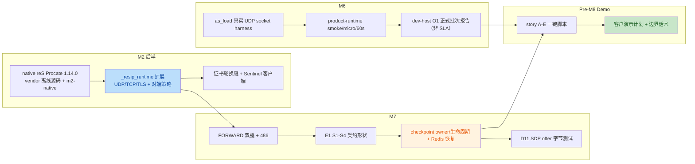

# callload 分支评审记录 — M2 后半 / M6 / M7 / Pre-M8 Demo

## 当前状态（Current Status）

| 项 | 结论 |
|---|---|
| 评审日期 | 2026-10-05 |
| 评审对象 | 分支 `callload`（初评 HEAD `e283538`；合入准备时 HEAD `dc3c951`），范围 merge-base `2318f9c` 起至评审修复提交 |
| 覆盖工作 | M2 后半（native reSIProcate 产品 runtime / TLS / TCP / 证书轮换 / Sentinel 客户端）、M6（真实 socket 容量 harness + dev-host O1 批次）、M7（E1 契约 / FORWARD 双腿 / D10 checkpoint 恢复 / D11 SDP）、Pre-M8 客户 demo 脚本与计划 |
| **总体结论** | **有条件复审（Conditional re-review）。** P0/P1 工程修复已落地（见 [`callload-remediation-adjudication-2026-10-05.md`](callload-remediation-adjudication-2026-10-05.md)）；**F8（结构化日志）仍开放**；**F6 仅部分闭合**（无 native transport close 回调）。客户全量 Demo 仍须遵守故事 C M5 对账与 NF-1 边界。 |
| Gap 状态 | 18 条：**已修复 15**；**部分修复 1**（F6）；**未闭合 1**（F8）；**维护者项 1**（F11，非工程队列）。 |
| 门禁状态 | 本机实测 `make gate`（修复后）：**964 passed, 2 skipped**（仅剩 derived-baseline 待 M2 probe）；E1/恢复契约在 CI `m2-platform-resip` 下 `AS_REQUIRE_NATIVE_EXTENSIONS=1` 阻塞。 |
| 主干分歧 | `master` 领先本分支 1 个提交 `04afc5a`（M5 全链评审，结论「不通过」）；**F10 内容面**已在 pre-m8 / story-c 收窄；merge 前须 `merge master` 拉入该评审文件（见 [`../handoff/2026-10-06-callload-merge-to-master.md`](../handoff/2026-10-06-callload-merge-to-master.md)）。 |
| 合入 master | **已完成（2026-10-06）** — `master` @ `764aa75`；见 [`../handoff/2026-10-06-callload-merge-to-master.md`](../handoff/2026-10-06-callload-merge-to-master.md)。**不等于**里程碑签收。 |
| 维护者签收 | 无。本记录不构成 M2/M6/M7 里程碑退出，也不构成 REQ/test-plan 验收。 |

---

## 1. 评审元信息

- **评审对象（commit range）**：`2318f9c..e283538`（`master` 与 `callload` 的 merge-base 起）。
  - `6778030` M6 pause, to finish M2 at first
  - `6f64f91` M2 handoff
  - `900d1f0` M2 handoff -2
  - `b5a81dd` Merge branch 'master' into callload（合入 M5 关门 `2318f9c`）
  - `e283538` m7 done（单提交 165 文件、+14670 行）
- **评审日期**：2026-10-05
- **评审人**：AI agent（TRAE，维护者指派的独立分支评审）
- **评审方法**：只读核查源码/测试/脚本 + `make gate` 本机实测 + 两个独立验证 subagent 对全部发现逐条交叉验证（共识门槛 2/2 或主审复核后保留）。
- **证据排除声明**：按维护者要求，本次评审**未采信、未引用** `docs/reviews/` 下任何既有切片评审作为证据；全部结论来自源码、测试、`docs/plan.md`、`docs/acceptance/test-plan.md`、handoff 原文与实测输出。F10 仅陈述「主干存在未合并评审」这一分支事实。

## 2. 分支做了什么（变更概览）



| 区域 | 主要新增 |
|---|---|
| 产品 runtime | `platform/native/resip_runtime/`（C++ 1486 行）、`platform/native/resip_two_leg/`、`platform/native/resip_recovery/`；Python 绑定层 `sip/resip_runtime.py`、`sip/call_controller.py`、`runtime/sip_stack_service.py` |
| 状态/恢复 | `state/call_checkpoint.py`（owner + generation CAS）、`sip/recovery*.py`、Redis 集成与 D10 harness |
| M6 | `testbed/load/`（harness.py 1219 行、1353 行测试、5 个测量脚本、REQ-NF-15） |
| Demo | `scripts/demo-review/`（story-a…e、lib、run-all、bundle fixtures）、`docs/handoff/pre-m8-demo-review-plan.md` |
| 构建 | vendor 离线 reSIProcate 源码包（30 MB）+ Ubuntu20.04 预构建包（6 MB）、`make m2-native` |

## 3. 正面确认（应予保留）

1. **门禁实测绿**：`make gate` 四步通过，951 passed；决策层保持纯函数、marker 分层未被破坏。
2. **M6 方法学合规**：harness 走真实 UDP socket（ADR-0014 / REQ-NF-15），产出 `summary.json`/`resources.json`，O1 报告反复标注「dev-host、非对外 SLA」，与 AGENT.md §2 容量红线一致。
3. **M2 离线构建路径可复现**：vendor 源码按上游 commit `632e215c` 固定并附 `SHA256SUMS`，`make m2-native` 不依赖网络 clone。
4. **Demo 边界纪律好**：`pre-m8-demo-review-plan.md` §7 主动声明 S-SBC/运营商 PKI、US-3 live trace、主叫/正则 v1.1、HPA/CPS 不承诺、CDR/LI/媒体非目标；脚本统一 `set -euo pipefail`、artifact 落盘、环境缺失显式 SKIP。
5. **checkpoint 提交安全有工程纵深**：owner 语义 + generation CAS（`save_if_generation`）与生命周期切片均带测试。

## 4. 问题清单

> 严重级别：blocker（阻断合并/客户演示）> major（M8 前必须关闭）> minor > note。
> 每条均经两个独立验证者读码确认（F13 主审按事实修正措辞后保留）。

### F1【blocker】产品 native runtime 监听地址与 Contact 全部硬编码 127.0.0.1，无法接收外部 S-SBC 流量

- **证据**：`platform/native/resip_runtime/runtime_module.cxx:1048`（UDP）、`:1063`（TCP）、`:1087-1093`（TLS）三处 `stack.addTransport(..., Data("127.0.0.1"))`；Contact 硬编码于 `:1147`；LISTENING 日志 `:1175-1185`；SDP 模板 `:618-620` 的 `o=/c=` 也是 127.0.0.1。transport config 解析中无任何 bind/interface 字段。
- **为什么是问题**：容器/Pod 中只能接收环回流量，产品形态下 S-SBC 不可达，直接使 REQ-S-2（TLS 对端服务）、REQ-NF-9（独立部署可达）失去验收前提。所有 runtime 集成测试因只打 loopback 而无法暴露。
- **修复建议**：从 transport config 注入监听地址（Python 侧 env，如 `AS_SIP_BIND_ADDRESS` 默认 `0.0.0.0` + `AS_SIP_ADVERTISED_ADDRESS`），C++ 读取后绑定并生成 Contact/SDP；补非环回绑定集成测（docker network/双地址）。

### F2【major】Recovery TU 转发上游 BYE 时 Contact 硬编码 127.0.0.1，且不回放 checkpoint 中的 route_set

- **证据**：`platform/native/resip_recovery/recovery_module.cxx:241-258`（`handleUpstreamBye` 拼 `sip:as@127.0.0.1:<port>`）；checkpoint 明明解析了 `routeSet`（`:42`、`:150`）但 BYE 不写 Route 头。
- **为什么是问题**：重启后 Pod IP 不是环回；带 Record-Route 的对话 BYE 将 misroute，后续 in-dialog 请求按错误 Contact 回来。直接削弱 REQ-NF-1「kill 后上游 BYE 仍正确路由」的 M8 验收。
- **修复建议**：Contact 用实际/通告地址；出腿 BYE 携带 checkpoint route_set；新增「带 Record-Route 的恢复 BYE」集成测试。

### F3【major】写入 Redis 的 UAC leg checkpoint 是硬编码占位，不是真实出腿对话状态

- **证据**：`platform/src/as_platform/runtime/sip_stack_service.py:227-246`，`_on_dialog_established` 自行编造 `local_tag="as-uac-local"`、`remote_tag="peer-remote"`、`route_set=()`、`local_cseq=3`、`remote_cseq=1` 与随机 call_id。
- **为什么是问题**：真实出腿 Call-ID/tag/CSeq 应由 DUM UAC dialog 产生。恢复后下游按 tag/CSeq 无法关联，预期 481/丢包；D10 harness 证明的是「机制链」而非真实对话恢复。
- **修复建议**：FORWARD UAC dialog 建立后经回调把真实出腿标识与 route set 回传 Python 再落 checkpoint；恢复集成测断言下游真实接受 BYE，而非仅日志匹配。

### F4【major】下游非 486 失败一律映射 502，违反 REQ-F-10（480/408 须透传）

- **证据**：`runtime_module.cxx:838`（`downstreamStatus == 486 ? 486 : 502`）；`platform/src/as_platform/sip/call_controller.py:19-20,97-103` 同一逻辑，且 `platform/tests/test_call_controller.py:133` 的 `test_outbound_non486_final_maps_to_502` 把错误行为固化。
- **为什么是问题**：test-plan §REQ-F-10 明确要求 486/480/408 等向上游原样转发，不得改成其他码。
- **修复建议**：透传可安全转发的 4xx/5xx/6xx（至少 408/480/486/503/504），仅对真正无对应语义的内部错误用 502；同步改写该单测并补契约用例。

### F5【major】TLS peer fingerprint 缓存只增不清，长期运行无界增长

- **证据**：`runtime_module.cxx:94-130`（`peerFingerprints` / `peerFingerprintsByEndpoint` 仅在 `storePeerFingerprint` 写入）、`:180-220` 每次握手写入；无 close 回调、TTL 或容量上限。
- **为什么是问题**：S-SBC 长会话频繁重连时 map 持续膨胀，lookup 退化；M6/O1 的长稳压测没有观测目标侧内存，不会暴露。
- **修复建议**：connection 关闭时回调查删；过渡期加容量上限/LRU；加一条长跑内存断言。

### F6【major】connection_id 只注册不注销，证书轮换 overlap 的 legacy 集合语义失真且无界

- **证据**：`platform/src/as_platform/sip/resip_runtime.py:251` 每个 INVITE 调 `register_connection`，全仓库无任何 `unregister_connection` 调用方（`sip/ingress.py:128-132` 提供了注销入口却无人调用）；`_registered_connection_ids`/`_legacy_connection_ids`（`ingress.py:47-48,91,151-153`）。
- **为什么是问题**：legacy 集合本应表示「轮换窗口开始前已存在的连接」，实际累积为「历史上所有连接」，REQ-S-3 双证重叠期的旧证宽限判定会错误地长期放行；集合本身无界。
- **修复建议**：C++ transport 关闭/销毁时回调 Python 注销；短期改为按 peer endpoint 的滑动窗口并加上限。

### F7【major】SipStackService.from_env 不加载任何生产 TLS/peer-policy/监听配置，默认 seam 证书为空且只信环回

- **证据**：`runtime/sip_stack_service.py:63-75`（`_default_transport_seam`：cert/key 路径空串、allowed_addresses 仅本机）、`:136-165` `from_env` 不解析任何相关环境变量。
- **为什么是问题**：Helm/Secret 注入的证书与运营商 trunk 白名单在产品进程里无处读取；外部流量按 fail-closed 全部拒绝。与 F1 共同构成「runtime 只能在演示机 loopback 工作」的根因。
- **修复建议**：增加 `AS_TLS_CERT_PATH/KEY_PATH/CA_PATH`、`AS_PEER_ALLOWED_ADDRESSES`、`AS_PEER_ALLOWED_CERT_FINGERPRINTS`、bind/advertised address 的 env 解析与校验；空证书 + TLS 启用时 fail-closed 启动失败并给清晰日志。

### F8【major】C++ 诊断全部 std::cout/cerr 文本输出，不满足 REQ-NF-13 结构化日志

- **证据**：`runtime_module.cxx` 约 20 处，如 `:784,815,827,842,866,923,1175-1194`（cout）与 `:535,594,791,871,928,1014`（cerr）。
- **为什么是问题**：无 timestamp/level/trace_id/call_id/direction 字段（REQ-NF-13 要求 JSON 且可与 metrics/trace 关联）；客户日志平台无法解析。
- **修复建议**：经回调把事件交还 Python 侧统一结构化日志，或封装含级别与 call_id 的 C++ 日志宏并定义字段契约；M8 前补字段断言。

### F9【major】CI 与 make gate 不构建 native 扩展，核心产品 SIP 路径测试静默 skip，门禁不守门

- **证据**：`.github/workflows/` 全目录 grep 无 resip/native/cmake 步骤；本机 `make gate` 实测 **10 skipped**：`test_e1_contract_resip_runtime.py` 3、`test_e1_contract_resip_runtime_full.py` 4（S1–S4）、`test_sip_recovery.py` 1 均因 `_resip_runtime`/`_resip_recovery` 未构建跳过（跳过语句见 `test_e1_contract_resip_runtime_full.py:44-48`）。
- **为什么是问题**：M2 后半/M7 的主要交付（产品栈 S1–S4、TLS、恢复）在没有 .so 时一律 skip，门禁照样全绿——AGENT.md §9 要求首个引入某层测试的里程碑把该层改阻塞；当前等于核心能力无阻塞验证。
- **修复建议**：CI 增加 native build job（或独立 required check），关键 E1/恢复测试在扩展缺失时按里程碑策略 fail 而非 skip；demo 冒烟前打印扩展版本/sha。

### F10【major】分支未合入主干 `04afc5a` 的 M5 全链「不通过」评审即继续叠加 M6/M7，客户故事 C 未对账

- **证据**：`git log callload..master` 仅 `04afc5a M5 review`（merge-base `2318f9c`）；该提交新增 `docs/reviews/m5-full-chain-review-2026-10-05.md`，结论为「不通过，建议撤销/降级 M5 工程关门签字」。本分支的客户 Demo 计划 §3.5/故事 C 仍把告警规则集、缩容判据、Helm 生产形态作为交付能力演示（`scripts/demo-review/story-c.sh:62-70`）。
- **为什么是问题**：在该评审未合并、未裁决前，对客户演示同一批 M5 工件存在「演示被独立评审判定为不生效能力」的实质风险；长期分叉也会在合并时丢评审记录。
- **修复建议**：先合入/ Rebase 主干，对该 M5 评审逐条对账（接受/驳回/修复），再决定故事 C 的话术与演示范围；合并前保持分支不得删除该文件。

### F11【major】提交粒度与提交信息违反 AGENT.md §11，评审/bisect/回滚不可行

- **证据**：`e283538 m7 done` 单提交携带 165 文件 +14670 行，混合 M2/M6/M7/demo 四条工作线；5 个提交信息（`m7 done`、`M2 handoff -2`、`M6 pause, to finish M2 at first` 等）均不符合 Conventional Commits（`feat/fix/...` + scope）。
- **为什么是问题**：无法按 ADR/REQ 追溯单个行为改动，无法 revert 单一能力，本次评审只能整体读 diff；AGENT.md §11 要求一次 commit 一个逻辑改动。
- **修复建议**：后续提交严格拆分并写 conventional message + REQ/ADR 引用；既有历史的处理（是否在合并前重组）由维护者逐次显式决定，agent 不擅自改写历史、不 force-push。

### F12【minor】as_load CLI 只要 1 通 established 即返回 0，压测高失败率被退出码掩盖

- **证据**：`testbed/load/src/as_load/__main__.py:57`（`return 0 if summary["counts"]["established_sessions"] else 1`）。
- **为什么是问题**：60000 尝试只成功 1 通也返回 0；作为 REQ-NF-15 证据工具，自动化消费方会被误导（现有 M6 shell 脚本另作了 `>=1` 判断，属部分缓解）。
- **修复建议**：增加 `--min-success-rate`/`--max-unresolved` 判定并在错误计数非零时非零退出；summary 中显式输出成功率。

### F13【minor】run-all-automated 收尾统一输出 OK，不区分 通过/跳过/失败

- **证据**：`scripts/demo-review/run-all-automated.sh:27-36`（Redis 不可达 SKIP story-d 后仍 `run-all-automated: OK`；kind 缺失的 SKIP 在 story-c.sh:30-37 内同理）。
- **为什么是问题**：办方会前冒烟可能把「D/C 整场没跑」误读为全绿；plan §4 所称「A/B/D/E 全自动路径已跑通」依赖本机恰好具备 Redis/native 工具链。
- **修复建议**：增加严格模式参数（`--require-redis/--require-kind/--require-native`），结尾汇总 `PASS n / SKIP m(列名) / FAIL f` 并写入 artifact summary。

### F14【minor】M6 测量脚本输出目录硬编码 /tmp，不可配置、无保留策略

- **证据**：`testbed/load/scripts/m6-product-runtime-smoke.sh:72`、`m6-o1-formal-report.sh:259`。
- **修复建议**：支持 `AS_M6_OUTPUT_ROOT`（默认 /tmp），启动前校验可写；正式批次归档/防覆盖。

### F15【minor】VERSION/CHANGELOG 未随本批产品交付更新，DoD 未闭合

- **证据**：`git diff master..callload -- VERSION CHANGELOG.md` 无变更；唯一 pyproject 改动是 ruff exclude 注释。
- **为什么是问题**：AGENT.md §14 DoD 要求「有 CHANGELOG 条目；交付内容变化则产品版本号 bump」。本分支首次交付可运行产品 SIP runtime、恢复能力与容量 harness。
- **修复建议**：M8 候选打包前统一补 CHANGELOG 与 VERSION bump，并与 `tests/test_version_consistency.py` 对齐。

### F16【minor】CallController 恢复方法缺单元层覆盖

- **证据**：`platform/tests/test_call_controller.py` 10 个用例（`:37-209`）不覆盖 `restore_from_checkpoint` / `route_in_dialog_bye`；目前仅由集成/恢复切片间接覆盖。
- **修复建议**：补 unit：恢复后双腿关联可查、重复恢复幂等/报错、未知 call_id 路由返回 None。

### F17【note】vendor 预构建包可移植性窄且携带作者机构建路径，36 MB 二进制入库

- **证据**：`testbed/simulators/resip-probe/vendor/`（源码 tar 30 MB、prebuilt 6 MB、`SHA256SUMS`）；handoff `docs/handoff/2026-10-04-m2.md` 记载 prebuilt 含绝对 RUNPATH `/tmp/as-resiprocate-m2-build-20261004`、CMake cache 绝对路径，仅 Ubuntu20.04/OpenSSL 1.1。
- **修复建议**：保留源码包（离线构建价值明确）；评估 prebuilt 改走 release artifact/对象存储而非长期 git 历史；或在 vendor/README 标注保质期与重建命令（当前已有部分说明，需加失效日期）。

### F18【minor】Demo 计划承诺 487 场景但五个一键故事均不执行 S4

- **证据**：`pre-m8-demo-review-plan.md` §3.1/§5「信令半天：…486/487」；`test_e1_contract_resip_runtime_full.py:185` 存在真实 UDP 的 `test_e1_s4_caller_cancel_returns_487`，但 story-a…e 脚本均不调用它。
- **修复建议**：在故事 B 或新增信令半场脚本中加入 S4 一键步骤，或从场次表中删除 487 承诺，避免现场无证据。

## 5. M8 前处置优先级

| 优先级 | 条目 | 理由 |
|---|---|---|
| P0（客户 Demo / 合并前） | F1、F7、F10 | 决定产品进程能否离开 loopback 被 S-SBC 访问；决定故事 C 是否可对客户讲 |
| P1（M8 验收硬门槛） | F2、F3、F4、F9、F6、F5 | REQ-NF-1、REQ-F-10、REQ-S-3 的证据真实性，以及门禁对产品路径的实际覆盖 |
| P2（打包前） | F8、F11、F15、F12、F13、F14、F16、F18、F17 | 可观测性、工程卫生、证据链与 demo 可重复性 |

## 6. 实测记录（2026-10-05，本机）

```text
$ make gate
ruff format --check .   OK
ruff check              OK
mypy                    OK
pytest -m 'unit or contract'
951 passed, 10 skipped, 194 deselected, 11 warnings in 8.84s
SKIP 原因分布：
  test_e1_contract_resip_runtime.py        ×3  _resip_runtime 未构建
  test_e1_contract_resip_runtime_full.py   ×4  _resip_runtime 未构建（含 S1–S4）
  test_sip_recovery.py                     ×1  _resip_recovery 未构建
  test_derived_baseline.py                 ×2  Route/Record-Route 待 M2 probe 补
```

本结果是本地门禁证据，不是 CI 结果（AGENT.md §9）；未运行 `make m2-platform-resip-build` 后的集成层，未运行 PG/Redis/kind/性能批次。

## Adjudication

| ID | 来源 | 问题摘要 | 裁决 | 修改方案 | 状态 | 验证方式 | 备注 |
|---|---|---|---|---|---|---|---|
| F1 | 本评审；runtime_module.cxx | native runtime 监听/Contact/SDP 硬编码 127.0.0.1 | 采纳 | `bind_address`/`advertised_address` 配置化 | **已修复** | `transport_env.py` + C++ transport config | blocker |
| F2 | 本评审；recovery_module.cxx | 恢复 BYE Contact/route_set | 采纳 | Contact 从 checkpoint URI；Route 回放 | **已修复** | recovery_module.cxx | major |
| F3 | 本评审；sip_stack_service.py | UAC checkpoint 占位 | 采纳 | FORWARD 路径 `uac_leg` native 回传 | **已修复** | accept-all harness 仍可有占位腿 | major |
| F4 | 本评审；runtime + call_controller | 非 486 → 502 | 采纳 | REQ-F-10 透传集 | **已修复** | `test_call_controller.py` | major |
| F5 | 本评审；runtime_module.cxx | fingerprint 无界 | 采纳 | 2048 上限淘汰 | **已修复** | C++ storePeerFingerprint | major |
| F6 | 本评审；ingress/resip_runtime | connection 只注册不注销 | 采纳 | 上限 + 终止注销 | **部分修复** | 缺 transport close 回调 | major |
| F7 | 本评审；sip_stack_service | from_env 不加载 TLS/peer | 采纳 | `transport_env.py` | **已修复** | `test_transport_env.py` | major |
| F8 | 本评审；runtime_module.cxx | cout/cerr 非结构化 | 采纳 | Python JSON 回调或宏 | **未闭合** | M8 前 | major |
| F9 | 本评审；CI/gate skip | native 不测仍绿 | 采纳 | CI job + `AS_REQUIRE_NATIVE_EXTENSIONS` | **部分修复** | `native_extensions.py`；origin workflow 未变 | major |
| F10 | 本评审；story-c / M5 评审 | Demo 与 M5 未对账 | 采纳（内容） | 故事 C L1 话术 | **已修复** | pre-m8 + story-c 横幅 | major |
| F11 | 本评审；提交粒度 | Conventional Commits | 维护者 | 历史不重组 | **维护者** | — | major |
| F12 | 本评审；as_load | 退出码误导 | 采纳 | `--min-success-rate` 等 | **已修复** | `as_load/__main__.py` | minor |
| F13 | 本评审；run-all-automated | SKIP 仍 OK | 采纳 | PASS/SKIP/FAIL + `--strict` | **已修复** | `run-all-automated.sh` | minor |
| F14 | 本评审；m6 scripts | /tmp 硬编码 | 采纳 | `AS_M6_OUTPUT_ROOT` | **已修复** | m6-*.sh | minor |
| F15 | 本评审；VERSION | 未 bump | 采纳 | 0.2.0 + CHANGELOG | **已修复** | VERSION/CHANGELOG | minor |
| F16 | 本评审；CallController | 恢复缺单测 | 采纳 | restore/route_bye 用例 | **已修复** | `test_call_controller.py` | minor |
| F17 | 本评审；vendor | prebuilt 保质期 | 部分采纳 | vendor README 段 | **已修复（文档）** | 迁出 git 维护者决策 | note |
| F18 | 本评审；487 / S4 | demo 未跑 S4 | 采纳 | story-b 步骤 4 | **已修复** | `story-b.sh` | minor |
